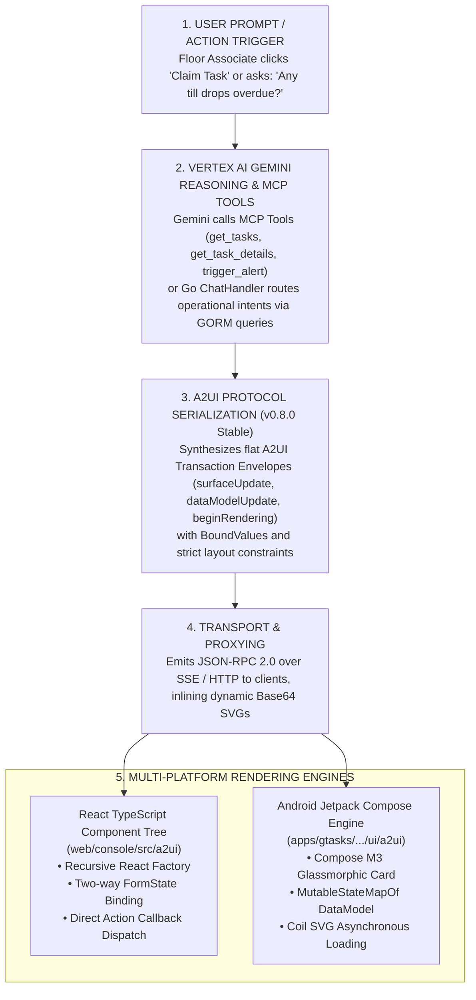
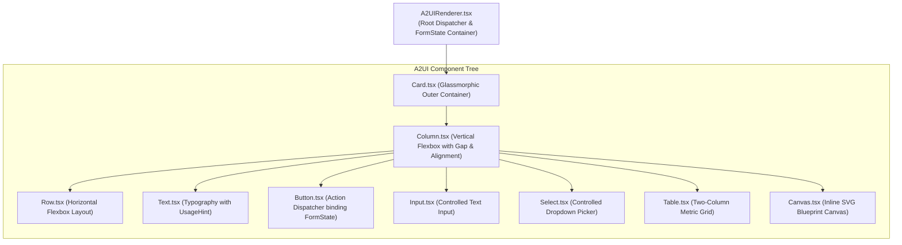

# Agentic User Interface (A2UI) Architecture
## Multi-Platform Protocol, MCP Tool Integration & Dynamic Rendering Engines (v5.0)

> [!NOTE]
> This specification documents the **Agentic User Interface (A2UI)** protocol implementation within the Enterprise Task Engine. It details the JSON wire contracts, MCP tool integrations, Python ADK transpiler mechanisms, Go AST transformers, and multi-platform rendering engines across React and Android Jetpack Compose.

---

## 1. Architectural Intent & Design Philosophy

Traditional agentic chatbots return unstructured conversational markdown text, forcing users to parse raw numbers, copy IDs, and type manual confirmation phrases. **Agentic User Interface (A2UI)** elevates this interaction model into a **Server-Driven Dynamic UI Framework**:



---

## 2. A2UI Protocol Wire Specification (v0.8.0 Stable)

The Enterprise Task Engine strictly standardizes on the **A2UI v0.8.0 Stable** wire schema.

### A. The A2UI Transaction Envelope

All A2UI payloads returned over JSON-RPC 2.0 or HTTP chat APIs are wrapped inside an `A2UITransaction` envelope consisting of three core blocks:

```json
{
  "surfaceUpdate": {
    "surfaceId": "surface_site_tasks",
    "components": [
      {
        "id": "card_root",
        "component": {
          "Card": {
            "title": "CASH VAULT DROP VERIFICATION",
            "child": "layout_col"
          }
        }
      },
      {
        "id": "layout_col",
        "component": {
          "Column": {
            "alignment": "stretch",
            "distribution": "start",
            "crossAxisAlignment": "Stretch",
            "mainAxisAlignment": "Start",
            "gap": 12,
            "children": {
              "explicitList": ["text_warning", "btn_override"]
            }
          }
        }
      }
    ]
  },
  "dataModelUpdate": {
    "surfaceId": "surface_site_tasks",
    "data": {
      "/store_switcher/selected": "44444444-4444-4444-4444-444444440001",
      "/form/justification": ""
    }
  },
  "beginRendering": {
    "surfaceId": "surface_site_tasks",
    "root": "card_root",
    "styles": {
      "--color-primary": "#0071ce",
      "--color-critical": "#ef4444"
    }
  }
}
```

1. **`surfaceUpdate`:** A flattened list of all UI components comprising the view hierarchy, each assigned a unique `id`.
2. **`dataModelUpdate` (Optional):** A key-value state store mapping JSON Pointer paths (e.g., `"/form/justification"`) to bound form inputs and reactive values.
3. **`beginRendering`:** Designates the root component identifier (`root: "card_root"`) to initiate rendering and injects CSS/design token theme variables.

### B. BoundValue Architecture

To decouple presentation layout from dynamic data binding, property values in A2UI v0.8 use polymorphic `BoundValue` structures:

```go
type BoundValue struct {
    LiteralString  *string  `json:"literalString,omitempty"`
    LiteralBoolean *bool    `json:"literalBoolean,omitempty"`
    LiteralNumber  *float64 `json:"literalNumber,omitempty"`
    Path           *string  `json:"path,omitempty"`
}
```

- **Literal Values:** Explicit static text (`{"literalString": "Submit"}`), numbers (`{"literalNumber": 42}`), or booleans (`{"literalBoolean": true}`).
- **Path Pointers:** Dynamic references into the `dataModelUpdate` pool (`{"path": "/store_switcher/selected"}`). When an input modifies the state, all components bound to that path re-evaluate reactively.

### C. Component Catalog Reference

| Component Type | Schema Wrapper | Key Properties | Operational Usage |
| :--- | :--- | :--- | :--- |
| **`Card`** | `{"Card": { ... }}` | `title`, `child`, `style` | Outer container card with glassmorphic border and optional title. Supports a single `child` container pointer. |
| **`Column`** | `{"Column": { ... }}` | `alignment`, `distribution`, `crossAxisAlignment`, `mainAxisAlignment`, `gap`, `children.explicitList` | Vertical flexbox container for stacking components sequentially. |
| **`Row`** | `{"Row": { ... }}` | `alignment`, `distribution`, `crossAxisAlignment`, `mainAxisAlignment`, `gap`, `children.explicitList` | Horizontal flexbox container for placing elements side-by-side. |
| **`Text`** | `{"Text": { ... }}` | `text` (BoundValue), `usageHint`, `style` | Typographic labels, headers, and descriptions. |
| **`Button`** | `{"Button": { ... }}` | `child` (Text ID), `label`, `primary`, `action` (`type`, `name`, `context`) | Interactive button triggering API callbacks or state submissions. |
| **`TextInput`** | `{"TextInput": { ... }}` | `label`, `required`, `dataBindingPath` | Single-line text input field bound to a state path. |
| **`CheckBox`** | `{"CheckBox": { ... }}` | `label` (BoundValue), `value` (BoundValue) | Boolean toggle checkbox bound to a state path. |
| **`Image`** | `{"Image": { ... }}` | `url` (BoundValue) | Dynamic vector floor plans or external media assets. |
| **`MultipleChoice`**| `{"MultipleChoice": { ... }}`| `options`, `selections` (BoundValue), `maxAllowedSelections` | Single-select or multi-select dropdown picker. |
| **`WebFrameSrcdoc`**| `{"WebFrameSrcdoc": { ... }}`| `htmlContent` (BoundValue), `height` | Sandboxed inline HTML/iframe container for rich widgets. |
| **`Divider`** | `{"Divider": {}}` | (empty struct) | Horizontal structural boundary separator. |

### D. Typographic & Alignment Normalization Rules

1. **Typographic Schema Normalization:** Valid `usageHint` values in A2UI v0.8 are strictly limited to `"h1"`, `"h2"`, `"h3"`, `"body"`, and `"caption"`. Invalid values (`"primary"`, `"secondary"`) are automatically mapped to `"body"` or `"caption"` by the Go and Python normalizers.
2. **Dual Alignment Population:** To ensure compatibility across web and mobile parsers, all Column and Row containers concurrently populate standard web properties (`alignment`, `distribution`) and Flutter-style properties (`crossAxisAlignment`, `mainAxisAlignment`).

---

## 3. Model Context Protocol (MCP) Server Integration (`pkg/api/mcp.go`)

The Go API Gateway exposes a fully featured Model Context Protocol (MCP) server over JSON-RPC 2.0 at `/api/v1/mcp` and `/api/v1/organizations/:orgId/sites/:siteId/users/:userId/sessions/shift/:shiftId/chat`.

### A. Registered MCP Tools Catalog

| Tool Name | Operational Functionality & Payload Return |
| :--- | :--- |
| **`get_tasks`** | Retrieves prioritized task executions for a site. Formats directly into A2UI card transactions. |
| **`get_task_details`** | Returns step-by-step checklist JSON for an individual task execution. |
| **`claim_task`** | Claims/assigns an active task execution to the current authenticated user. |
| **`update_task_status`** | Mutates status (`IN_PROGRESS`, `COMPLETED`), appending audit records. |
| **`override_asset`** | Submits an audited compliance override with supervisor justification. |
| **`propose_trade`** | Initiates a peer task trade proposal between store associates. |
| **`accept_trade`** | Accepts a pending peer task trade, reassigning execution ownership. |
| **`reject_trade`** | Denies an incoming peer task trade proposal. |
| **`query_sop`** | Vector cosine similarity search over `sop_chunks` using `pgvector`. |
| **`trigger_alert`** | Ingests ad-hoc streaming alerts (till drop, spill, call bell). |
| **`get_site_locations`** | Lists store fixtures, registers, and aisles with coordinate metadata. |
| **`get_weather`** | Fetches live NOAA METAR observations and wind statistics for the site airport code. |
| **`get_store_selector`** | Emits a store context switcher single-select A2UI card. |
| **`get_user_context`** | Returns user profile, active roles, and assigned storefront sites. |

### B. Direct-Return Card Update Pattern (Rate-Limit Mitigation)

In naive agent implementations, an action like "Claim Task" requires multiple sequential LLM turns:
1. Turn 1: User prompt $\rightarrow$ LLM invokes `claim_task`.
2. Turn 2: Tool returns string $\rightarrow$ LLM invokes `get_task_details`.
3. Turn 3: Tool returns details $\rightarrow$ LLM outputs formatted response.

In enterprise environments with API quota limits, this high request rate triggers `429 RESOURCE_EXHAUSTED` errors.

**The Solution:** The Enterprise Task Engine implements the **Direct-Return Card Update Pattern**:
- Tool handlers (`claim_task`, `update_task_status`) directly synthesize and return the updated A2UI details card (`[A2UI_CARD_TASK_DETAILS_CACHED]`) in the tool output payload.
- System prompts instruct Gemini that the card is pre-rendered and that subsequent tool calls are prohibited.
- This reduces LLM round-trips by 33%, eliminates 429 quota exhaustion, and cuts UI response latency from ~3.2s to ~1.1s.

---

## 4. Python ADK Task Agent Integration (`cmd/task_agent`)

The Python ADK service runs as an independent FastAPI service on port `:8081` (`Dockerfile.agent`), providing advanced A2UI transpilation and blueprint generation:

### A. Transpiler Architecture (`a2ui_transpiler.py`)
- **Monkeypatch Integration:** Intercepts outgoing A2A `SendMessageResponse` messages to ensure strict compliance with A2UI v0.8 schemas.
- **Markdown Interception:** Extracts uppercase ````JSON` and lowercase ````json` code blocks emitted by the LLM, parses the AST, and compiles them into flat A2UI component lists.
- **Dropdown Collapsing Pattern:** When the LLM outputs multiple consecutive buttons targeting context switching (such as `"SET_STORE"`), the transpiler automatically collapses them into a single-select `MultipleChoice` dropdown accompanied by a "Submit" button, preventing viewport clutter.

### B. Dynamic Blueprint Generation & Base64 Vector Inlining
- **Dynamic Endpoint:** Exposes `GET /api/v1/blueprint?layout=linear&x=175&y=25`, rendering SVG floor plans with pulsating beacon circles.
- **Mixed Content Resolution:** When served in HTTPS environments, referencing `http://` localhost images triggers browser Mixed Content blocks. The transpiler intercepts `canvas` nodes, renders the SVG in-memory, base64-encodes the bytes, and inlines a self-contained Data URI:
  ```json
  "url": {
    "literalString": "data:image/svg+xml;base64,PHN2ZyB4bWxucz0..."
  }
  ```

---

## 5. React Rendering Engine (`web/console/src/a2ui` & `web/agentic/src/a2ui`)

The web rendering engine implements a recursive component factory in TypeScript:



### Dynamic Form State Binding
`A2UIRenderer.tsx` maintains a central `formState: Record<string, any>` in local state. As users type into `Input` fields or make selections in `Select` dropdowns, the state updates reactively. When an associated `Button` is clicked, it packages the current `formState` alongside its configured `actionData` and dispatches through `onActionTrigger(action, data)`.

---

## 6. Android Jetpack Compose Rendering Engine (`apps/gtasks`)

Located in [`/apps/gtasks/.../ui/a2ui/A2UIRenderer.kt`](../../apps/gtasks/app/src/main/java/com/google/gtasks/ui/a2ui/A2UIRenderer.kt), the Android rendering engine maps A2UI transactions directly to native Compose UI elements:

```kotlin
@Composable
fun A2UIRenderer(
    transaction: A2UITransaction,
    modifier: Modifier = Modifier,
    onAction: (ButtonAction, Map<String, JsonElement>) -> Unit
) {
    // 1. Reactive Data Model State Pool
    val dataModel = remember(transaction) {
        mutableStateMapOf<String, JsonElement>().apply {
            transaction.dataModelUpdate?.data?.let { putAll(it) }
        }
    }

    // 2. Flattened Component Lookup Map
    val componentsMap = remember(transaction) {
        transaction.surfaceUpdate.components.associateBy { it.id }
    }

    // 3. Recursive Component Tree Traversal from Root ID
    Box(modifier = modifier.fillMaxWidth()) {
        RenderComponent(
            componentId = transaction.beginRendering.root,
            componentsMap = componentsMap,
            dataModel = dataModel,
            onAction = onAction
        )
    }
}
```

### Key Jetpack Compose Component Mappings
1. **`CardProps` $\rightarrow$ `Card`:** Styled with `.glassmorphic(elevation = 8.dp)` and Material 3 container colors.
2. **`ColumnProps` / `RowProps` $\rightarrow$ `Column` / `Row`:** Configured with `Arrangement.spacedBy(props.gap.dp)` and dynamic alignment mapping.
3. **`TextProps` $\rightarrow$ `Text`:** Resolves `BoundValue` pointers against `dataModel` and applies Material 3 typography styles (`titleMedium`, `labelSmall`, `bodyMedium`).
4. **`ButtonProps` $\rightarrow$ `Button` / `OutlinedButton`:** Dispatches `onAction(action, dataModel)` on click.
5. **`TextInputProps` $\rightarrow$ `OutlinedTextField`:** Two-way binding updates `dataModel[props.dataBindingPath]` as the user types.
6. **`ImageProps` $\rightarrow$ `AsyncImage`:** Uses Coil to load remote URLs, dynamic SVGs, and base64 data URIs.
7. **`MultipleChoiceProps` $\rightarrow$ `ExposedDropdownMenuBox`:** Native Material 3 dropdown selector updating bound state paths.
