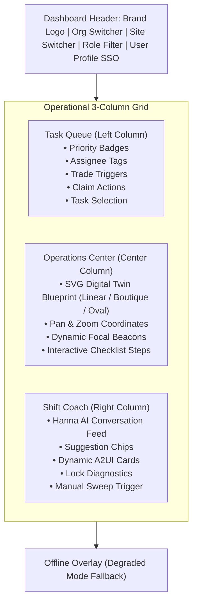
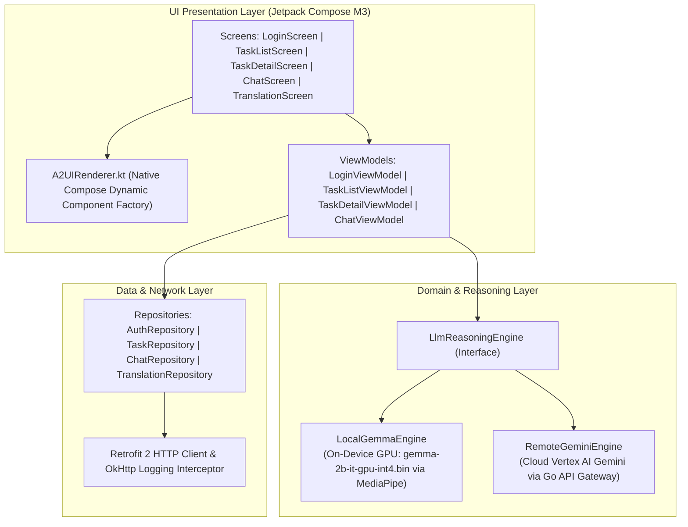
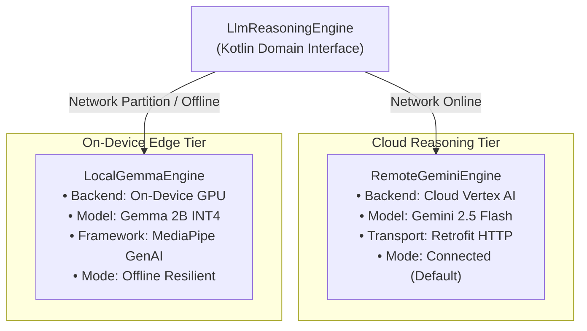
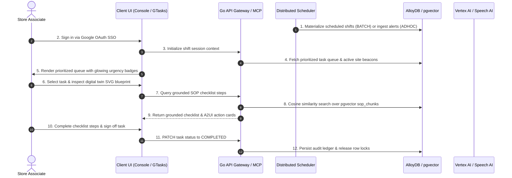

# Frontend Applications & User Interface Workflows
## Enterprise Task Engine: User Experience Architecture & State Specification (v5.0)

> [!NOTE]
> This specification details the user experience architecture, component hierarchies, state management flows, and interaction lifecycles implemented across the web and native mobile client applications of the Enterprise Task Engine.

---

## 1. Client Applications Ecosystem Overview

The Enterprise Task Engine monorepo encompasses four primary frontend client applications and development workbenches, each tailored to distinct operational and validation roles:

| Application | Technology Stack | Operational Scope |
| :--- | :--- | :--- |
| **Admin & Operations Console** (`web/console`) | React 19, TypeScript, Vite, Tailwind CSS, A2UI Component Factory | Store supervisor cockpit, MDM administration, task queue dispatching, workforce analytics |
| **GTasks Mobile App** (`apps/gtasks`) | Kotlin, Jetpack Compose M3, Retrofit, Coil SVG, MediaPipe Gemma / GenAI | Storefront floor associate portal, task execution, real-time voice translation, chat |
| **Agentic Voice & Map Cockpit** (`web/agentic`) | React 19, TypeScript, Vite, Web Speech API, A2UI Dynamic Engine | Standalone speech-enabled agentic sandbox with live digital twin spatial mapping |
| **A2UI Render Test Workbench** (`web/render-test`) | React 19, TypeScript, Vite, A2UI Test Suite | Visual regression testing and JSON schema contract verification workbench |

---

## 2. Admin & Operations Console (`web/console`)

The **Admin & Operations Console** is the primary desktop web cockpit used by store supervisors, department leads, and system administrators. It integrates real-time task queues, an interactive spatial digital twin of the retail store floor, a conversational AI coach, and comprehensive Master Data Management (MDM) tooling.

### A. Architectural Layout & Component Tree

The main dashboard is organized in a responsive glassmorphic 3-column operational grid (`App.tsx`):

### B. Core UI Workflows

#### 1. Authentication & Single Sign-On (SSO) Workflow (`components/SSOPortal.tsx`)
- **Identity Provider:** Google Identity Services (GIS) OAuth 2.0 with JWT token signing.
- **Workflow Steps:**
  1. Unauthenticated users are intercepted by the `SSOPortal` component.
  2. The Google GIS SDK renders the standard Google One-Tap or Sign-In button.
  3. Upon successful credential issuance, the raw JWT credential is validated by the client (`AppContext.tsx`) and decoded to extract email, name, picture, and OAuth UID.
  4. The client queries `GET /api/v1/organizations/{orgId}/me` (or `GET /api/v1/admin/users`) to hydrate the associate's authorized roles, assigned retail sites, and active tenant boundaries.
  5. If the user possesses the `ROLE_ADMIN` role, the global navigation exposes the **Admin Panel** and **Workforce Analytics** entry points.

#### 2. Prioritized Task Queue Dispatching (`components/TaskQueue.tsx` & `hooks/useTaskManagement.ts`)
- **Queue Hydration:** Fetches active task executions from `GET /api/v1/organizations/{orgId}/sites/{siteId}/tasks`.
- **Filtering Capabilities:**
  - **By Storefront Site:** Scopes tasks to the active physical location (e.g., Dallas Store #1000, Volt & Vine Seattle).
  - **By Associate Assignee:** Filters by authenticated associate, specific coworkers, or unassigned tasks (`ALL`).
  - **By Operational Role:** Filters by target role requirements (`Cashier`, `Manager`, `Associate`, `Vault Custodian`).
- **Interactive Queue Actions:**
  - **Task Selection:** Clicking a task updates `selectedTask` in global state, which simultaneously focuses the center digital twin blueprint on the task's location coordinates and loads its checklist steps.
  - **Claim / Take Task:** Unassigned tasks or tasks assigned to other roles expose a "Claim Task" button, invoking `POST /api/v1/organizations/{orgId}/sites/{siteId}/tasks/{id}/claim`.
  - **Propose Peer Trade:** Clicking "Trade" opens a conversational trade draft in the Shift Coach feed.

#### 3. Spatial Digital Twin Operations Center (`components/OperationsCenter.tsx`)
- **Store Blueprint Rendering:** Dynamically generates SVG floor layouts based on store footprint architecture:
  - `linear`: Standard supermarket / discount layout (OmniMart Store #1000, Dallas).
  - `boutique`: Open luxury appliance showroom layout (Volt & Vine, San Francisco).
  - `racetrack`: High-density department loop layout (Volt & Vine, Los Angeles).
- **Pan & Zoom Canvas:** Users can drag the canvas and adjust zoom levels (`1.0x` to `2.5x`) for floor inspection.
- **Focal Beacon Coordinate Engine:** The component dynamically computes target `(x, y)` coordinates for the active task's first incomplete checklist step:
  - If a cashier drawer drop task is selected, the beacon pulses at the Back-Office Cash Vault coordinates (`x: 175, y: 25`).
  - If a produce freshness task is selected, the beacon shifts to the Cool Wall display rack (`x: 45, y: 25`).
- **Interactive SOP Checklist:** Associates check off completed steps in real time, triggering optimistic state updates and persisting checklist JSON state to the backend.

#### 4. Shift Coach Conversational Cockpit (`components/ShiftCoach.tsx` & `hooks/useChatOrchestrator.ts`)
- **Persona & Intelligence:** Powered by Vertex AI Gemini and the Go backend's `ChatHandler` / MCP server.
- **Interaction Model:**
  - Associate submits queries or commands via the prompt box (e.g., `"check drawer drops"`, `"propose task trade for task exec-123"`, `"weather observation for KDFW"`).
  - The backend evaluates intent, executes database queries or vector similarity searches, and returns conversational guidance alongside **dynamic A2UI v0.8 card structures**.
  - Interactive buttons embedded inside A2UI cards (such as "Accept Trade", "Force Vault Compliance Verify & Override", or "Fetch METAR") dispatch directly through `onA2UIActionTrigger`, invoking backend APIs without requiring raw prompt text input.

#### 5. Master Data Management Admin Panel (`components/AdminPanel.tsx` & `pages/*`)
- **Role-Based Protection:** Non-admin users attempting to open the Admin Panel are blocked by a security protocol shield.
- **Managed Entity Domains:**
  - **Users:** Create, update, delete employee profiles, assign Google OAuth IDs, link preferred languages and voice preferences.
  - **Roles:** Define RBAC operational roles (`ROLE_SITE_MANAGER`, `ROLE_SITE_ASSOCIATE`, `ROLE_ADMIN`).
  - **Organizations:** Multi-tenant corporate boundaries.
  - **Sites:** Physical retail stores, altitude, address, coordinates, and regional ICAO airport codes.
  - **Locations:** Store fixtures, registers, aisles, backroom shelves, coordinate offsets.
  - **Assets:** Heavy machinery, tools, POS registers, security vaults, status flags.
  - **Tasks & Templates:** Master SOP templates, checklist JSON matrices, required certifications, maker/checker approval schemas.
  - **Task Executions:** Real-time state inspection of active, in-progress, and dead-letter tasks.
  - **Shift Sessions:** Active conversational context memory inspection.
  - **RAG SOP Resources & Ingestion Processes:** Manage SOP source URLs, trigger vector re-indexing, inspect embedding status.
  - **Distributed Scheduler Controls:** Inspect active Leader node ID, worker metrics, and force immediate batch sweeps.

#### 6. Workforce Analytics Dashboard (`components/WorkforceAnalytics.tsx`)
- Visualizes task completion velocities, overdue SLA breaches, priority distributions (Critical vs High vs Standard), and role workload balance across active store shifts.

---

## 3. Native Android Handset App (`apps/gtasks`)

The **GTasks Android Application** is a native mobile portal built with **Kotlin, Jetpack Compose, Material 3, and Retrofit 2**, designed for store associates operating handheld Android devices (such as Zebra or Google Pixel terminals).

### A. Core Android Screens & User Workflows

#### 1. Login Screen (`ui/screens/login/LoginScreen.kt` & `LoginViewModel.kt`)
- **Authentication:** Authenticates with Google OAuth 2.0 using the client credentials and developer certificate SHA-1 fingerprint registered in the Google Cloud Console.
- **Auto-Routing:** Validates existing session tokens in `AuthRepository`. On success, navigates the user to the `TaskListScreen`.

#### 2. Task List Screen (`ui/screens/tasks/TaskListScreen.kt` & `TaskListViewModel.kt`)
- **Layout:** Displays a scrollable, prioritized list of active store task cards.
- **Visual Badging:**
  - Priority 1: Glowing Critical Red border and badge.
  - Priority 2: High Warning Amber badge.
  - Priority 3: Standard Blue badge.
- **Interactions:**
  - Pull-to-refresh triggers asynchronous synchronization with `GET /api/v1/organizations/{orgId}/sites/{siteId}/tasks`.
  - Filter chips toggle between All Tasks, My Tasks, and Role-specific queues.
  - Tapping a task card navigates to `TaskDetailScreen`.

#### 3. Task Detail Screen (`ui/screens/detail/TaskDetailScreen.kt` & `StoreMap.kt`)
- **Store Map Visualization:** Embeds the custom Compose `StoreMap` component, drawing the store floor plan vector canvas with target fixture beacons.
- **Checklist Step Execution:** Associates toggle checklist items sequentially. Each toggle updates local Compose state and dispatches a patch request to the Go backend.
- **Asset Constraint Override:** If a task is blocked due to an unavailable asset (e.g., forklift broken), associates tap "Override Constraint", enter a justification, and submit a GORM-audited supervisor override.

#### 4. Shift Coach Chat Screen (`ui/screens/chat/ChatScreen.kt` & `ChatViewModel.kt`)
- **Conversational Interface:** Associate chats directly with the Shift Coach assistant.
- **A2UI Rendering:** Message responses containing structured A2UI payloads are rendered natively via `A2UIRenderer.kt`, transforming JSON card envelopes into Compose `Card`, `Column`, `Row`, `Button`, `Text`, `OutlinedTextField`, and `AsyncImage` components.

#### 5. Real-Time Voice Translation Screen (`ui/screens/translate/TranslationScreen.kt`)
- **Multilingual Operational Support:** Facilitates real-time voice translation between store associates and non-English-speaking customers.
- **Operational Modes:**
  - **Translate Talk:** Associate holds the microphone button and speaks in English. The app captures 16kHz PCM audio, transmits it to `POST /api/v1/translate/talk`, receives translated audio (in Spanish, French, German, etc.) synthesized in the associate's cloned or chosen HD voice, and plays it via Android `MediaPlayer`.
  - **Translate Listen:** Customer speaks into the device in their native language. The app transmits audio to `POST /api/v1/translate/listen`, which transcribes, translates to English, synthesizes audio, and displays the translated text transcription on screen.
- **Voice Profile Setup:** Associates record an official consent phrase to generate a Google Cloud Chirp 3 instant voice clone key, enabling the system to speak foreign languages in their own voice.

### B. Dual-Engine LLM Reasoning Architecture (`domain/llm/`)

To guarantee operational resilience in retail environments with intermittent connectivity (e.g., deep warehouse basements or metal-shielded stockrooms), GTasks implements a dual-tier LLM engine:

1. **`RemoteGeminiEngine` (Cloud Default):** Routes reasoning requests through the Go API Gateway and Vertex AI Gemini models, accessing full real-time database grounding and pgvector SOP retrieval.
2. **`LocalGemmaEngine` (On-Device Fallback):** When network connectivity is lost, the app switches to the on-device `LocalGemmaEngine`. Powered by Google MediaPipe Tasks GenAI (`com.google.mediapipe:tasks-genai`), it loads the quantized `gemma-2b-it-gpu-int4.bin` model directly on the device GPU, enabling offline conversational reasoning and procedure lookup.

---

## 4. Standalone Agentic Voice & Map Cockpit (`web/agentic`)

Located in [`/web/agentic`](../../web/agentic), this application serves as a dedicated, full-screen agentic cockpit featuring:
- **Continuous Speech Recognition:** Uses the Web Speech API (`webkitSpeechRecognition`) for hands-free voice commands.
- **Voice Feedback & Synthesis:** Speech synthesis reads coaching responses back to the user.
- **Dual-Pane Digital Twin:** The left pane houses the conversational chat timeline and A2UI card renderer; the right pane renders an interactive SVG floor blueprint with live coordinate tracking.
- **Direct A2A SSE Streaming:** Connects directly to the Python ADK Task Agent (`/a2a/task_agent`) over Server-Sent Events (SSE).

---

## 5. A2UI Render Test Workbench (`web/render-test`)

Located in [`/web/render-test`](../../web/render-test), this application provides an isolated testing workbench for:
- Verifying A2UI v0.8 component rendering across different browser viewports.
- Stress-testing nested Column/Row layout constraints and button stretching behavior.
- Validating dynamic form state binding and input dispatch contracts without backend dependencies.

---

## 6. End-to-End User Interaction Lifecycles

