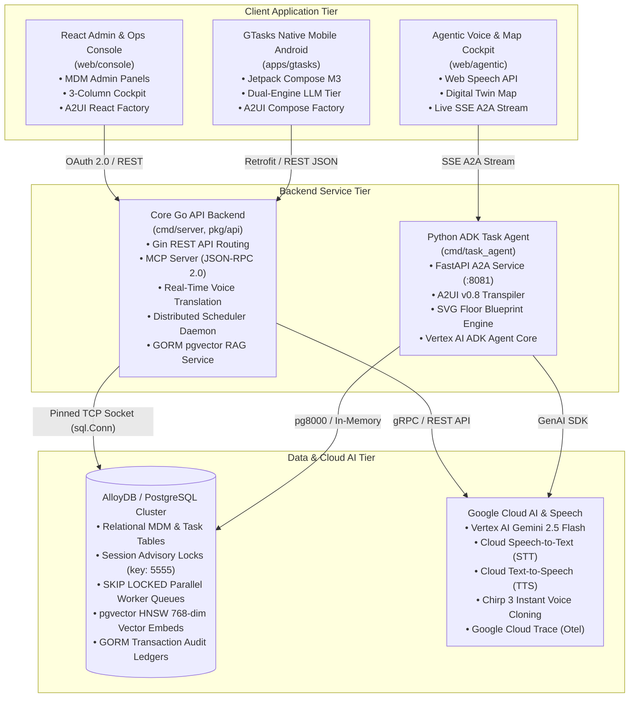

# Architectural Design Document
## Enterprise Task Engine: Master Specifications Manual (v5.0)

> [!NOTE]
> This master architectural specifications document catalogues the topological design patterns, multi-tier services, database schemas, and platform integrations implemented across the Enterprise Task Engine monorepo.

---

## 1. Executive Summary & System Topology

The Enterprise Task Engine is a multi-node, horizontally scalable operational platform designed to coordinate, automate, and verify physical retail operations in real-time. The system bridges core administrative configuration layers (Master Data Management) with standard dynamic workforce execution pipelines, backed by Google GenAI Vertex AI models (Gemini), on-device SLMs (Gemma 2B), Google Cloud Speech Intelligence, and interactive Agentic User Interfaces (A2UI).



The system addresses five primary operational domains:
1. **Master Data Management (MDM):** Provides robust administrative APIs and UI forms for defining structural retail boundaries: Organizations, Sites, Spatial Locations (fixtures/shelves/registers coordinate maps), Roles, Assets, Certifications, and SOP templates.
2. **Intelligent Shift Initialization:** Automatically provisions a shift session context pool (`shift_agent_sessions`) upon user clock-in, backing the associate's Gemini ADK live preview agent coach session.
3. **Task Auto-Generation & Prioritized Queues:** Coordinates scheduled business calendar materialization sweeps (**BATCH** chron cycles) and dynamic streaming alert ingestions (**ADHOC** sensor alarms, till out alerts, register call bells). Enforces strict asset certifications constraint checks.
4. **Grounded AI-Assisted Operations & RAG:** Real-time dynamic alerts calculate vector embeddings, query database-indexed SOP text chunks utilizing `pgvector` HNSW cosine similarity algorithms, and inject grounded SOP instructions directly inside active task checklists. Exposes rich structured layouts dynamically using Agentic UI cards (A2UI).
5. **Speech Intelligence & Multilingual Operations:** Real-time voice translation across associate-customer dialogs, high-fidelity Studio/Journey TTS speech synthesis, and Google Cloud Chirp 3 instant custom voice cloning.

---

## 2. System Technology Stack

The platform is designed to run hermetically across containerized environments under GKE, Cloud Run, and local developer sandboxes using the following stacks:

| Architectural Tier | Selected Technology & Platform |
| :--- | :--- |
| **Backend Platform** | Go (Golang) Gin API Server Engine, GORM postgres ORM |
| **AI Intelligence** | Model Context Protocol (MCP) Server, Vertex AI Gemini |
| **Agent Framework** | Google Agent Development Kit (ADK), FastAPI, Python 3.13 |
| **Speech & Voice** | Google Cloud STT, Neural Translation, TTS, Chirp 3 Clone |
| **Database Tier** | AlloyDB / PostgreSQL Cluster, `pgvector` HNSW indexes |
| **Mobile Handset** | Kotlin, Jetpack Compose M3, Retrofit 2, MediaPipe Gemma |
| **User Interfaces** | React 19 Frontend Dashboard SPA, Vite TypeScript, A2UI |
| **Build & CI/CD** | Bazel 8 (bzlmod), Docker Distroless, OpenTelemetry Traces |

---

## 3. High-Performance Concurrency & Distributed State Locking

To support dozens of active horizontal microservice replicas without requiring complex external cache coordinators (Redis, ZooKeeper), the database cluster serves as the unified system lock voter and scheduling state manager.

### A. Distributed Leader Election & Advisory Locking
Leader election limits chron sweeps, document updates scans, and lock timeout watchdogs to a single active server replica, avoiding double sweeps:
* **PostgreSQL Advisory Locks:** Cluster replicas bid for leadership on startup and check loops by requesting a session-bound Postgres advisory lock on key `5555`.
* **TCP Connection Pinned Sockets (`sql.Conn`):** Standard pooled database clients recycle net connections, causing session locks to be dropped. The scheduler prevents this by reserving a single dedicated TCP socket directly from the driver pool context (`sqlDB.Conn`), pinning the advisory lock exclusively to this dedicated connection loop context.
* **Self-Healing Failover:** If the active leader node crashes, Postgres automatically drops the TCP pool after standard keep-alive intervals, releasing the advisory lock key instantly so worker nodes bid on leadership in their next `15s` check sweep.

### B. Concurrency-Safe SKIP LOCKED Parallel Workers
To allow replica worker nodes to pull and complete checklist tasks in parallel with zero lock contention or duplicate executions:
* **SKIP LOCKED transaction boundaries:** Workers claim pending operations under GORM transactions executing row-level locks pings:
  `SELECT * FROM task_executions WHERE status = 'PENDING' AND ... LIMIT ? FOR UPDATE SKIP LOCKED`
* **Logical Lock Tagging:** Claimed task rows are updated inside the transaction to `IN_PROGRESS` and tagged with the node's unique ID (`locked_by = node-ID`) and locked timestamp. Once transaction locks release on commit, the logical lock keeps the rows isolated until execution is marked `COMPLETED`.

### C. Watchdog Dead Letter Recovery Loops
A periodic watchdog sweep (Leader node only, every `30s`) scans task rows stuck in `IN_PROGRESS` state longer than standard lock timeout boundaries (`5m`):
* **Lock Recovery:** If the task's `RetryCount` is less than `MaxRetries` (default: 3), the watchdog logs the error, increments `RetryCount`, resets locks (`locked_at = NULL`, `locked_by = NULL`), and enqueues the row back to the queue under a `PENDING` status.
* **Dead Letter Routing:** If the task fails 3 times, it is permanently isolated by moving the status to the terminal `'DEAD_LETTER'` queue, alerting administrative operations diagnostics channels.

---

## 4. API Endpoints Architecture

### A. Administrative Data Management (CRUD Targets)
Administrative endpoints fall under `/api/v1/admin/*` and require elevated supervisor or system manager credentials.

**Organizations, Users, and RBAC**
* `GET /api/v1/admin/users` - Query user details and compliance certifications status.
* `POST /api/v1/admin/roles` - Seed standard organizational roles.
* `PUT /api/v1/admin/users/{id}/roles` - Map user identities to roles.
* `POST /api/v1/admin/organizations` - Register organizational tenants.
* `GET /api/v1/admin/organizations` - List active tenant organizations.
* `PUT /api/v1/admin/organizations/{id}/users` - Map user to corporate organizations boundary.

**Spatial Nodes, Fixtures, and Assets**
* `POST /api/v1/admin/sites` - Register retail sites (Store #1000 - Dallas Texas).
* `POST /api/v1/admin/locations` - Register fixtures, registers, or backroom rack coordinate points.
* `POST /api/v1/admin/assets` - Register physical machinery and tools.
* `PATCH /api/v1/admin/assets/{id}/status` - Update asset status states (`AVAILABLE`, `BROKEN`, `MAINTENANCE`).

**SOP Documents & Scheduling**
* `POST /api/v1/admin/sops` - Intake standard SOP files (DOCX, PDF, HTML, XLSX). Triggers RAG chunking embeds pipelines.
* `POST /api/v1/admin/tasks/templates` - Create task definitions, including checklist JSON matrices.
* `POST /api/v1/admin/tasks/templates/{id}/rules` - Map Maker/Checker supervisor approval schemas.
* `POST /api/v1/admin/availabilities` - Map employee availability calendars and RFC 5545 RRULE shift patterns.

**Background Job Scheduler Diagnostics**
* `GET /api/v1/admin/scheduler/status` - Exposes multi-node leader state, active worker counts, processed/failed task metrics, and last error diagnostics.
* `POST /api/v1/admin/scheduler/trigger` - Force materializes scheduled batch sweeps calendar checks.

### B. Operational Tasking & Agent Interface
Operational routes are used by floor associates, client dashboards, and Vertex AI ADK MCP servers.

* `GET /health/readiness` - Diagnostic target to verify active AlloyDB pools connectivity.
* `GET /static/*` - Served natively by the Go server filesystem engine to resolve static SOP documents templates.
* `POST /api/v1/mcp` - Global Model Context Protocol (MCP) JSON-RPC 2.0 endpoint.
* `POST /api/v1/sessions/shift/{shiftId}/chat` - Primary Vertex AI Gemini MCP JSON-RPC conversational endpoint.
* `POST /api/v1/organizations/{orgId}/sites/{siteId}/users/{userId}/sessions/shift/{shiftId}/message` - Conversational agent orchestrator chat endpoint.
* `GET /api/v1/organizations/{orgId}/sites/{siteId}/tasks` - Fetches prioritized, active site queues.
* `PATCH /api/v1/organizations/{orgId}/sites/{siteId}/tasks/{id}/status` - Mutates checklist task statuses, executing GORM hook ledgers.
* `POST /api/v1/organizations/{orgId}/sites/{siteId}/tasks/{id}/override` - Bypasses constraints by submitting supervisor justification tags.
* `POST /api/v1/organizations/{orgId}/sites/{siteId}/tasks/{id}/claim` - Claims/takes ownership of active tasks.
* `POST /api/v1/organizations/{orgId}/sites/{siteId}/trades` - Initiates peer-to-peer shift and task trades.
* `GET /api/v1/organizations/{orgId}/sites/{siteId}/trades` - Lists pending trade proposals.
* `POST /api/v1/organizations/{orgId}/sites/{siteId}/trades/{tradeId}/accept` - Accepts a pending trade.
* `POST /api/v1/organizations/{orgId}/sites/{siteId}/trades/{tradeId}/reject` - Rejects a pending trade.
* `POST /api/v1/organizations/{orgId}/sites/{siteId}/alerts` - Ingests ad-hoc streaming alerts (till drop, spill, stockout).

### C. Voice Translation & Profile Routes
* `GET /api/v1/profile/:id` - Retrieves associate language and voice profile.
* `POST /api/v1/profile/:id` - Initializes associate voice profile.
* `PUT /api/v1/profile/:id` - Updates language/voice preferences.
* `POST /api/v1/profile/:id/voice/clone` - Uploads consent recording and generates Chirp 3 voice clone key.
* `POST /api/v1/translate/talk` - Transcribes associate speech, translates, and synthesizes target language audio.
* `POST /api/v1/translate/listen` - Transcribes customer speech, translates, and synthesizes associate language audio.
* `GET /api/v1/translate/voices` - Lists available Google Cloud HD Studio and Journey voices.
* `POST /api/v1/translate/preview` - Synthesizes voice model audio preview.

---

## 5. PostgreSQL/AlloyDB Relational Database Schema

### Database Extensions
```sql
CREATE EXTENSION IF NOT EXISTS "pgcrypto";
CREATE EXTENSION IF NOT EXISTS "vector"; -- pgvector extension mapping
```

### Key Relational Tables Summary
- **Identity & Organization:** `organizations`, `users`, `user_organizations`, `roles`, `user_roles`, `sites`, `user_sites`, `locations`.
- **Assets & Certifications:** `assets`, `certifications`, `user_certifications`.
- **Grounded SOP Documents & Vectors:** `sops`, `sop_processes`, `sop_chunks` (`embedding VECTOR(768)` with HNSW cosine index `hnsw (embedding vector_cosine_ops)`), `task_sops`.
- **Workforces & Shifts:** `events`, `user_event_schedules`, `user_event_instances`.
- **Task Execution & Audits:** `tasks`, `task_assets`, `task_approval_rules`, `task_executions` (`locked_at`, `locked_by`, `retry_count`, `max_retries`, `last_error`, `description`), `task_execution_audits`, `task_trades`.
- **Agent Sessions Context:** `shift_agent_sessions` (`assignee_id`, `shift_instance_id`, `message_history`, `session_context`).

---

## 6. Comprehensive Topic Specifications

For deep dives into specialized subsystems, refer to the following dedicated manuals:
- **[App & UI Workflows]():** Complete guide to React Console, GTasks Android app, and Dual LLM reasoning.
- **[A2UI Architecture & Engine]():** A2UI v0.8 protocol, MCP tools, and multi-platform rendering engines.
- **[Voice Translation & Speech Intelligence]():** Google Cloud STT, Translation, TTS, and Chirp 3 voice cloning.
- **[Event-Driven Operations Specification]():** ARTS XML and Schema.org event taxonomies and streaming triggers.
- **[Background Job Scheduler Daemon Guide]():** Distributed leader election, advisory locks, and watchdog recovery.
- **[Workspace Directory & Store Mapping Specifications]():** Google Workspace OU tree and 109-store test identity matrix.
- **[Google Cloud & OAuth Setup Guide]():** GCP project provisioning, OAuth consent screens, and credentials.
- **[Android Handset App Guide]():** Gradle, ADB reverse port forwarding, and handset deployment.
- **[Governance, Licensing & Design Decisions]():** Apache 2.0 licensing, authorship, and architectural decision trade-offs.
