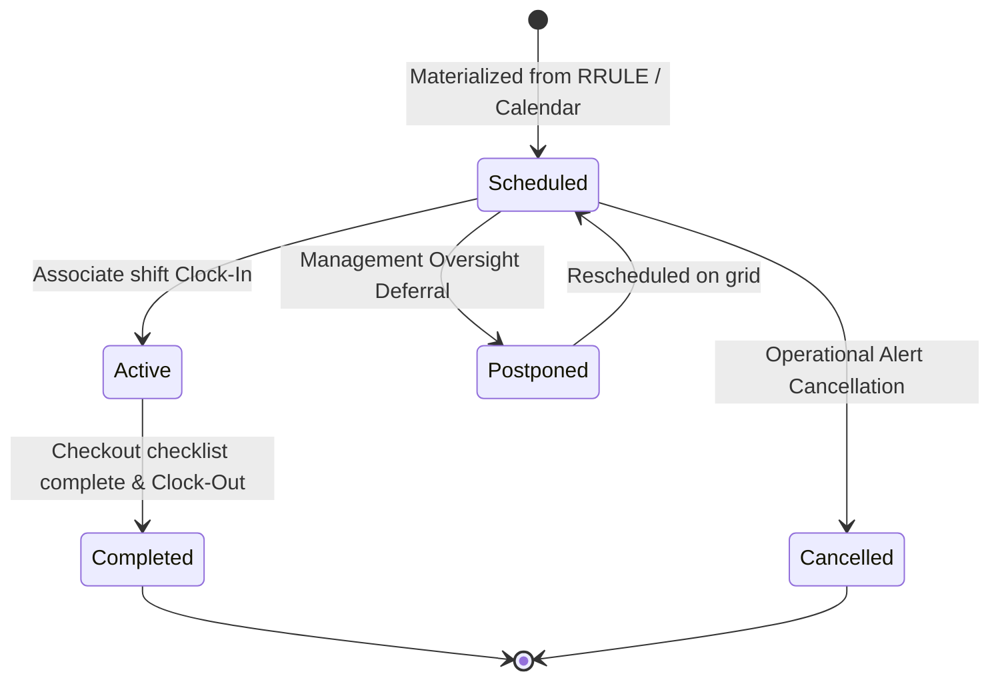
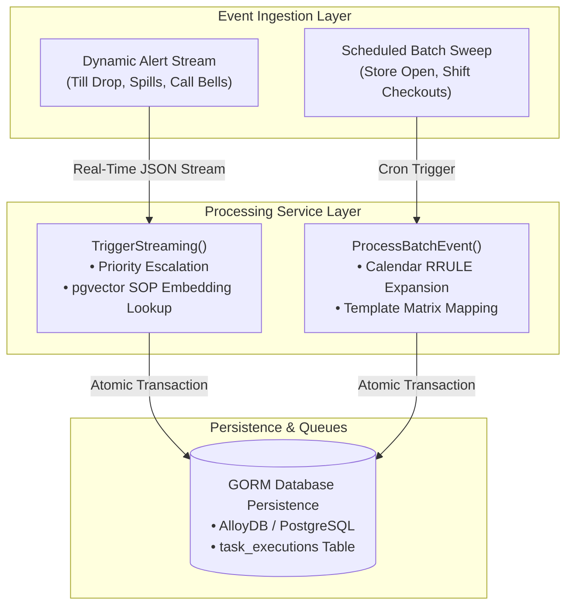

# Retail Operational Event Mapping Specifications
## Alignment with ARTS XML and Schema.org Taxonomies

This specification document outlines the standard operational event taxonomies, temporal styles, and platform trigger architectures mapped in the Enterprise Task Engine database schema under [event.go](../../pkg/model/event.go). These event configurations bridge physical store operations with the agentic tasking layer using standardized descriptors designed by the **Association for Retail Technology Standards (ARTS)** and **Schema.org**.

---

## 1. Taxonomic Mapping Catalog

The platform registers standard categorizations (`model.EventType`) to classify operational store activities and drive targeted checklists.

| Event Type Constant | DB Serialized Value | Schema.org Type Map | ARTS XML Reference Context | Operational Scope & Target |
| :--- | :--- | :--- | :--- | :--- |
| **`EventRetailShift`** | `"RetailShift"` | [BusinessEvent](https://schema.org/BusinessEvent) | **Store Operations:** Shift Activity | clock-in/out boundaries of a store associate shift. (Batch) |
| **`EventStoreBreak`** | `"StoreBreak"` | [Action](https://schema.org/Action) | **Labor Scheduling:** Rest Period | Meal or rest breaks. Sets temporary employee unavailability. (Batch) |
| **`EventTrainingSession`** | `"TrainingSession"` | [EducationEvent](https://schema.org/EducationEvent) | **Labor Management:** Training Event | Scheduled training modules, physical drills, or SOP walkthroughs. (Batch) |
| **`EventStoreOpen`** | `"StoreOpenEvent"` | [BusinessEvent](https://schema.org/BusinessEvent) | **Store Operations:** Business Day Open | Register drawer loading, vault reconciliation, door unlocking. (Batch) |
| **`EventStoreClose`** | `"StoreCloseEvent"` | [BusinessEvent](https://schema.org/BusinessEvent) | **Store Operations:** Business Day Close | Register cash drop sweeps, security sweeps, door locking, power down. (Batch) |
| **`EventTillDrawerDrop`** | `"TillDrawerDropEvent"` | [Action](https://schema.org/Action) | **Tender Operations:** Till Drop / Till Out | Triggered dynamically when drawer totals exceed security limits. (Adhoc) |
| **`EventRegisterAudit`** | `"RegisterAuditEvent"` | [Action](https://schema.org/Action) | **Tender Operations:** Cashier Balancing | Register audits verifying till balances at shift end or audits. (Batch/Adhoc) |
| **`EventCurbsidePickup`** | `"CurbsidePickupEvent"` | [DeliveryEvent](https://schema.org/DeliveryEvent) / `pickup` | **Fulfillment:** Click and Collect | Drive-up or curbside customer pickup order handling. (Batch) |
| **`EventHomeDelivery`** | `"HomeDeliveryEvent"` | [DeliveryEvent](https://schema.org/DeliveryEvent) / `delivery` | **Fulfillment:** Delivery Dispatch | Local home delivery route packing and courier dispatch workloads. (Batch) |
| **`EventReturnProcess`** | `"ReturnProcessEvent"` | [ReturnAction](https://schema.org/ReturnAction) | **Customer Service:** Returns Processing | Parsing, auditing, restock-grading, and refunding returned items. (Adhoc) |
| **`EventReceivingArrival`** | `"ReceivingArrivalEvent"` | [ReceiveAction](https://schema.org/ReceiveAction) | **Inventory Operations:** Goods Receipt | Dock check-ins, unloading trucks, logging purchase orders. (Batch) |
| **`EventShelvingStock`** | `"ShelvingStockEvent"` | [OrganizeAction](https://schema.org/OrganizeAction) | **Inventory Operations:** Replenishment | Stocking floor displays, endcaps, and display shelves from backroom cages. (Batch) |
| **`EventStockoutCorrect`** | `"StockoutCorrectEvent"` | [Action](https://schema.org/Action) | **Inventory Control:** Out of Stock | Corrective replenishments triggered automatically by camera/system out alarms. (Adhoc) |
| **`EventInventoryCount`** | `"InventoryCountEvent"` | [Action](https://schema.org/Action) | **Inventory Operations:** Physical Count | Scheduled cycles and audits verifying digital inventory alignment. (Batch) |
| **`EventPriceMarkdown`** | `"PriceMarkdownEvent"` | [UpdateAction](https://schema.org/UpdateAction) | **Store Operations:** Price Audit | Updating physical/electronic tags under systemic Markdown rules. (Batch) |
| **`EventCustomerAssistance`** | `"CustomerAssistanceEvent"` | [ContactAction](https://schema.org/ContactAction) | **Customer Service:** Assistance Call | Spill cleanups, shopping cart retrieval runs, key calls, floor queries. (Adhoc) |
| **`EventAssetMaintenance`** | `"AssetMaintenanceEvent"` | [ControlAction](https://schema.org/ControlAction) | **Facilities Management:** Equipment Service | Scheduled or corrective sweeps (cooler calibration checks, trash compactor runs). (Batch/Adhoc) |
| **`EventShowroomRefresh`** | `"ShowroomRefreshEvent"` | [OrganizeAction](https://schema.org/OrganizeAction) | **Merchandising:** Showcase Swaps | **Volt & Vine Brand Specific:** Showcase swapping premium appliances; display smart hub calibrations. (Batch) |
| **`EventWhiteGloveDispatch`** | `"WhiteGloveDispatchEvent"` | [DeliveryEvent](https://schema.org/DeliveryEvent) / `delivery` | **Fulfillment:** White Glove Delivery | **Volt & Vine Brand Specific:** Luxury appliance installation preparations and route audits. (Batch) |
| **`EventApplianceDemo`** | `"ApplianceDemoEvent"` | [BusinessEvent](https://schema.org/BusinessEvent) | **Store Operations:** Appliance Testing | **Volt & Vine Brand Specific:** Premium smart induction range or double-oven demonstration appointments. (Batch/Adhoc) |
| **`EventPerishableFreshness`** | `"PerishableFreshnessEvent"` | [Action](https://schema.org/Action) | **Inventory Control:** Shelf Rotation | **OmniMart Brand Specific:** High-frequency checks on dairy, deli, meat, and produce; temp sweeps. (Batch) |
| **`EventHotFoodTransition`** | `"HotFoodTransitionEvent"` | [Action](https://schema.org/Action) | **Operations:** Kitchen Transition | **OmniMart Brand Specific:** Resetting kitchen prep lines (Deli Breakfast-to-Lunch-to-Dinner food transitions). (Batch) |
| **`EventDirectStoreDelivery`** | `"DirectStoreDeliveryEvent"` | [ReceiveAction](https://schema.org/ReceiveAction) | **Receiving Operations:** Direct Delivery | **OmniMart Brand Specific:** Ingesting direct store vendor delivery checks (local soda, bread). (Adhoc) |

---

## 2. Event Execution Classifications: BATCH vs ADHOC

The platform segregates events into two discrete temporal models mapped using the `model.EventStyle` parameter.

### A. Batch Operations (`StyleBatch = "BATCH"`)
Batch events are systematically aligned with shifts, logistical delivery schedules, and the standard store business day clock.
* **Recurrence:** Follows structural calendar rules (`Rrule` specifications mapping to RFC 5545).
* **Workload Ingestion:** Automatically processed in periodic background sweeps.
* **Target Mappings:** Creates checklist task allocations (e.g. register setups, display swaps, scheduled physical cycle counts) pointing back to shift instances.

### B. Dynamic Streaming alerts (`StyleAdhoc = "ADHOC"`)
Adhoc events reflect the real-time, streaming nature of dynamic store change, capturing physical drift, on-floor emergencies, and customer demands.
* **Recurrence:** Instanced, unscheduled, and spontaneous.
* **Workload Ingestion:** Emitted dynamically in real-time streams from terminals, department buttons, and visual sensor arrays.
* **Target Mappings:** Bypass chronological schedulers to instantly generate pending, high-priority tasks in active associate queues under a virtual stream boundary instance (`00000000-0000-0000-0000-ffffffffffff`).

---

## 3. Lifecycle States (`model.EventStatus`)

Event materializations follow standard Schema.org `EventStatusType` mapping, supplemented by operational runtime status changes:



* **`EventScheduled`**: Workload mapped on schedule.
* **`EventCancelled`**: Workload cancelled under operational alerts.
* **`EventPostponed`**: Target deferred under management oversight.
* **`EventRescheduled`**: Instance relocated on schedule grids.
* **`EventActive`**: Event/shift currently in progress.
* **`EventCompleted`**: Tasks completed and shift clock-out logged.

---

## 4. Platform Architectural Integrations



1. **Automation Pipeline ([automation.go](../../pkg/service/automation.go))**: Coordinates batch materializations and dynamic alert priority overrides:
   * `TillDrawerDropEvent` / `CustomerAssistanceEvent` -> **Priority 1 (Critical Drawer/Register Floor Alert)**
   * `StockoutCorrectEvent` -> **Priority 2 (High Replenishment Alert)**
   * All other standard operations -> **Priority 3 (Standard Operational Target)**
   * **Grounded SOP Task Enrichment (Intelligence Tier):** Ingests real-time alert text parameters, dynamically extracts its 768-dimensional vector embedding using the configured [EmbeddingGenerator](../../pkg/service/rag.go#L19-L22) dialers, and queries standard `sop_chunks` using PostgreSQL pgvector Cosine similarity `<=>` operator looking up the highest matching chunk. On match, GORM dynamically injects and appends the compliance instructions block into the generated `TaskExecution.Description` column natively!
2. **Model Context Protocol Integration ([mcp.go](../../pkg/api/mcp.go))**: Integrates tools for AI model sessions:
   * **`trigger_alert`:** Programmatically triggers dynamic alerts and task executions, automatically executing GORM pgvector RAG searches and attaching grounded context instructions in real time.
   * **`get_tasks`:** Retrieves prioritized active task execution queues. Enriched to dynamically parse and display the execution's `Description` (exposing the grounded compliance SOP chunk instructions block to floor associates and backing shift agent coach Hanna).
3. **Database Migration ([db_loader.go](../../cmd/db_loader.go))**: System auto-migration adds fields seamlessly during service starts:
   * Adds `event_type VARCHAR(100) NOT NULL DEFAULT 'RetailShift'` to `events` table.
   * Adds `event_style VARCHAR(20) NOT NULL DEFAULT 'BATCH'` to `events` table.
   * Adds `description TEXT DEFAULT NULL` to `task_executions` table, enabling persistent dynamic compliance descriptions.
   * Upgrades `event_status` field configuration dynamically to strongly-typed enums.
   * Expands schemas dynamically with lock tracking parameters (`locked_at`, `locked_by`, `retry_count`, `max_retries`, `last_error`).
4. **Distributed Background Scheduler Daemon ([scheduler.go](../../pkg/service/scheduler.go))**: Coordinates multi-node leader election and background execution loops natively over GORM database states:
   * **Leader Election (Split-Brain Proof):** Cluster nodes attempt to claim a PostgreSQL session-level advisory lock on key `5555`. Pinned to a dedicated connection socket wrapper, the node holding the lease acts as the active **Scheduler Leader** (driving cron-updating, SOP url refresh checking, and calendar events sweeps), while other nodes act as **Workers**. Lease automatically self-heals if the Leader socket drops.
   * **Parallel SKIP LOCKED workers queue:** Concurrently claim pending task executions and SOP indexing process jobs using database row-level locking `SELECT ... FOR UPDATE SKIP LOCKED`, allowing workers to pull concurrently in parallel without double-processing.
   * **Dead Letter Watchdog:** Scans executions locked longer than `5m` in `IN_PROGRESS` state. Resets locks and status to `PENDING` for retry runs, incrementing the retry register, and routes the ticket to the terminal `DEAD_LETTER` queue context upon exceeding limit checks.
   * **API Controllers Status & Controls ([admin.go](../../pkg/api/admin.go)):** Admin endpoints expose diagnostic leader/worker load parameters (`GET /api/v1/admin/scheduler/status`) and enable administrative manual cron sweeps triggers (`POST /api/v1/admin/scheduler/trigger`).

---

## 5. Verification & Validation Metrics

To guarantee absolute operational reliability, standard testing sweeps have been implemented across the layers, running hermetically inside the Bazel sandbox.

### A. Model Constraint Verification ([event_test.go](../../pkg/model/event_test.go))
Asserts GORM string serialization, verifying the base type-aliases map to standard string records with zero drift.

### B. Automation Workload Verification ([automation_test.go](../../pkg/service/automation_test.go))
* **Batch Verification:** Assures ProcessBatchEvent resolves scheduled shifts and maps checkout templates.
* **Streaming Ingestion Verification:** Confirms TriggerStreamingEvent maps custom dynamic alerts, registers ad-hoc context ranges, and enforces correct priority overrides (Critical alert priority = 1 for `TillDrawerDropEvent`, High alert priority = 2 for `StockoutCorrectEvent`).

### C. JSON-RPC Integration Verification ([mcp_test.go](../../pkg/api/mcp_test.go))
To prevent Bazel test hangs, the MCP tool callbacks are refactored into public, receiver-level methods on the [MCPHandler](../../pkg/api/mcp.go) structure. External test suites can query tools programmatically directly in-memory, bypassing long-lived SSE transport channel read blocks.
* **Alert Trigger Ingest Verification:** Verifies the `HandleTriggerAlert` tool callback dynamically creates adhoc task executions, correctly maps priorities, and formats matching text responses.
* **Queue Lookup Verification:** Assures `HandleGetTasks` retrieves prioritized tasks.
* **Prompt Registration Validation:** Asserts the backing `shift_agent` prompt matches standard instructions.

### D. Relational Ingestion & Drift Verification ([seed_test.go](../../pkg/model/seed_test.go))
Performs high-fidelity static validation on the relational seed SQL script [dev_events.sql](../../scripts/dev_events.sql) under the Bazel sandbox runfiles tree:
* **Relational Safety:** Asserts that all materialized shift instances and schedules map onto correct parent site IDs and worker identities, verifying that UUID layouts adhere strictly to standard constraints.
* **EventType / EventStyle Enum Alignment:** Isolates the raw SQL inserts block context in-memory, resolving and verifying that all seeded strings match backing Go constants precisely without case mutations, preventing configuration-code drift.

### E. Operational RAG Pipeline Ingestion & Verification ([rag_test.go](../../pkg/service/rag_test.go))
Performs robust, synchronous verification of the asynchronous RAG document parsing and indexing pipeline under the Bazel sandbox:
* **Async Ingestion Verification:** Confirms [IngestSOPAsync](../../pkg/service/rag.go#L102-L138) registers base database records and launches background processing runs safely.
* **HTML/Binary Parsing Audits:** Validates that HTML file ingestions cull markup tags (such as `<html>`, `<body>`) successfully and extract valid caching metadata (ETags, Effective Date headers), and verifies binary files (PDFs, DOCX, XLSX) extract accurate SHA-256 fingerprint checks.
* **Periodic Check / Relational Refresh Verification:** Assures [CheckSOPUpdates](../../pkg/service/rag.go#L140-L230) tracks ETag/cache modifications, dynamically detects index drifts, and launches new active background ingestion refreshes atomically under new `PENDING` states.

### F. Distributed Cluster Scheduler & Workers Verification ([scheduler_test.go](../../pkg/service/scheduler_test.go) & [server_test.go](../../pkg/api/server_test.go))
Validates distributed leader leases, locking state transfers, concurrency safety, dead letter recoveries, and scheduler REST controller APIs synchronously in the Bazel sandbox:
* **Self-Healing Leader Lease Handovers:** Asserts that only the elected leader holds the active lease, verifies that concurrent nodes fail to acquire the lock, and validates that a worker node automatically claims the leader lease (self-healing) when the active leader drops.
* **SKIP LOCKED Claims Concurrency:** Validates that parallel workers concurrently pick up and process isolated pending tasks from queues, verifying that claimed tasks are flagged to the node's unique ID under database transactions.
* **Dead Letter Watchdog Recovery:** Verifies the watchdog watchdog recovering loops reset expired progress locks back to `PENDING` within max retries limits, and routes stale tickets exceeding threshold checking into the `DEAD_LETTER` terminal state context, registering diagnostic error footprints.
* **HTTP Admin Diagnostic API Controllers:** Asserts `GET /api/v1/admin/scheduler/status` returns correct node load parameters, and `POST /api/v1/admin/scheduler/trigger` force initiates cron sweeps triggers.

### G. Executing Sandboxed Tests
Verify and execute the tests using the hermetic Bazel sandbox target:
```bash
bazel test //test/...
```
All targets build, analyze, and test pass with 100% success.
