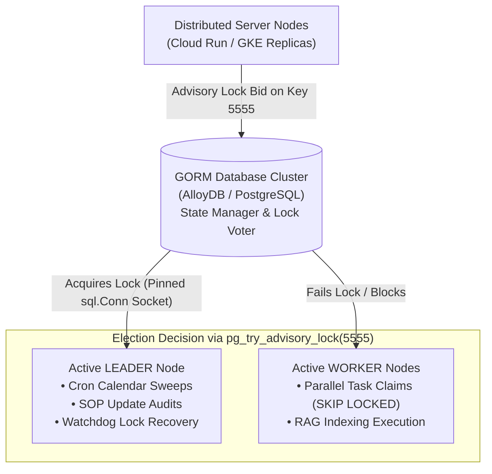
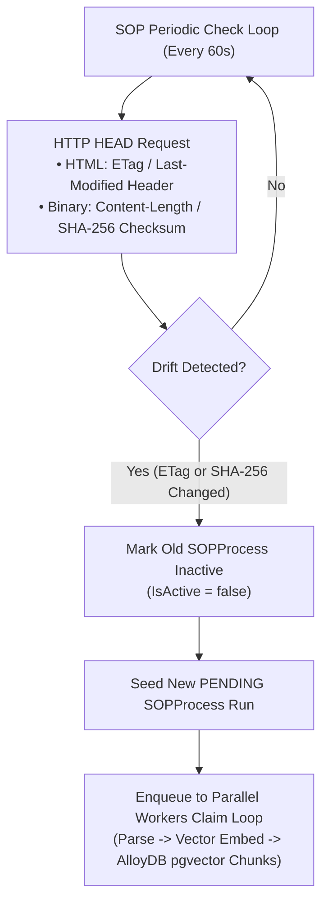

# Distributed Background Scheduler & Job Manager Specification
## Architecture, Intent, and Operational Functionality (v1.0)

This manual outlines the architectural intent, concurrency-safe designs, and execution loops implemented inside the Enterprise Task Engine background scheduling tier under [scheduler.go](../../pkg/service/scheduler.go).

---

## 1. Overview & Architectural Intent

The background scheduler coordinates scheduled **BATCH** sweeps (materializing workforce shifts and checklist event allocations) and parallel **ADHOC** process queues (indexing RAG documents, extracting text chunks, and embedding vectors).



The system is designed for horizontal scaling across dozens of microservice replicas. It leverages the underlying PostgreSQL database cluster as the single source of truth for leader status, lock leases, and job state coordination:
* **Zero External Dependencies:** Relies natively on PostgreSQL dialers, eliminating the operational overhead of managing external lock managers like Redis, Consul, or ZooKeeper.
* **Split-Brain Prevention:** Ensures that exactly one node acts as the Scheduler Leader to drive chronological sweeps, while all nodes (including the Leader) act as concurrent parallel Workers to process task payloads.
* **Self-Healing Failover:** If the active leader node crashes or suffers network partitioning, the database cluster automatically drops the socket lease, allowing worker nodes to transparently claim leadership on the next check block.

---

## 2. Core Functional Components

### A. Distributed Leader Election & Lease Maintenance
Leader election restricts recurring calendar sweeps, SOP update checks, and watchdog locks recovery to a single active server node, protecting against race conditions.

#### 1. PostgreSQL Advisory Locks
The node bids for leadership by attempting to acquire a session-level advisory lock on a unique key `5555`:
```sql
SELECT pg_try_advisory_lock(5555);
```
Advisory locks are session-bound. The lock is tied directly to the database TCP connection socket and is automatically released if the socket is closed or dropped.

#### 2. Dedicated Connection Pinning (`sql.Conn`)
Standard database client pools (like GORM's standard wrapping connection pools) dynamically recycle sockets across queries, causing session-bound advisory locks to be silently lost. To guarantee lock lease stability, the scheduler allocates a single, dedicated TCP socket directly from the driver pool context on start:
```go
sqlDB, _ := db.DB()
conn, _ := sqlDB.Conn(ctx) // Pinned net connection socket
```
All advisory lock operations (attempts, verification checking, and releases) are executed exclusively over this pinned connection socket wrapper.

#### 3. Automatic failovers Lease Handover
Nodes check the leader lock status periodically (every `15s` by default, configurable):
* The active leader verifies it still holds the lock using the GORM checker:
  ```sql
  SELECT pg_advisory_lock_keys() @> ARRAY[5555::bigint];
  ```
* If a node fails to verify its lease, it releases the stale connection, marks its leader status as `false`, and returns to a worker role.
* If a leader crashes, PostgreSQL drops the TCP connection pool after standard keep-alive intervals, making the advisory lock key available for the remaining cluster nodes to bid on during their next election tick.

---

## 3. Parallel SKIP LOCKED Concurrent Workers
Multiple worker nodes concurrently claim and process pending task executions and SOP indexing process records without double-claiming.

#### 1. Concurrency-Safe claims
Each worker node routinely polls the database (every `5s` by default, configurable) to claim task executions (up to 5 records) and SOP indexing process runs (up to 2 records) under GORM transaction loops:
```sql
SELECT * FROM task_executions 
WHERE status = 'PENDING' 
AND (locked_at IS NULL OR locked_at < ?) 
ORDER BY priority ASC, created_at ASC 
LIMIT ? 
FOR UPDATE SKIP LOCKED;
```
* **`FOR UPDATE`:** Places a database row lock on the claimed matches, blocking concurrent transactions from editing the selected rows.
* **`SKIP LOCKED`:** Instructs concurrent query executions to automatically bypass already locked rows rather than blocking. This allows worker nodes to divide and conquer the queue in parallel with zero lock contention.

#### 2. Atomic Lock Tagging
Inside the same transaction, claimed rows are immediately flagged to prevent other workers from selecting them once row locks release:
```go
tx.Model(&model.TaskExecution{}).
    Where("id IN ?", claimedIDs).
    Updates(map[string]interface{}{
        "status":    "IN_PROGRESS",
        "locked_at": time.Now(),
        "locked_by": s.nodeID, // Unique string node identifier
    })
```
Once the transaction commits, row locks release but the logical lock (flagged via `locked_at` and `locked_by` parameters) persists until the worker completes the payload execution and marks status to `COMPLETED`.

---

## 4. Lock Timeout Recovery & Dead Letter Watchdog
The watchdog recovery routine runs periodically (every `30s` by default, Leader node only, configurable) to automatically self-heal stalled or crashed worker pipelines.

#### 1. Timeout Auditing
If a worker node crashes mid-execution, the logical lock on the task remains active, stalling execution. The watchdog queries for tasks and SOP processes stuck in `IN_PROGRESS` longer than the lock timeout threshold (`5m` by default, configurable):
```sql
SELECT * FROM task_executions WHERE status = 'IN_PROGRESS' AND locked_at < ?;
```

#### 2. Retry Boundaries & Dead Letter Routing
For each stalled task execution detected:
* **Retry Under Limit:** If the `RetryCount` is less than `MaxRetries` (default: 3), the watchdog resets the lock columns, logs the error, and reverts the status to `PENDING`:
  * `status = 'PENDING'`
  * `locked_at = NULL`
  * `locked_by = NULL`
  * `retry_count = retry_count + 1`
  * `last_error = "lock timeout error..."`
  * The task is returned to the active queue context for other worker nodes to claim.
* **Retry Limit Exceeded:** If the task fails 3 times, it is flagged as a high-risk operational barrier. The watchdog isolates the task permanently by moving it into a terminal state queue:
  * `status = 'DEAD_LETTER'`
  * `locked_at = NULL`
  * `locked_by = NULL`
  * Increments system failure counts to alert administrative monitoring channels.

For each stalled SOP process run detected, it is similarly reverted back to `PENDING` for a retry attempt, or permanently marked as `FAILED` if maximum retry boundaries are exceeded, cleanly preserving structural integrity across workers.

---

## 5. SOP Metadata Verification & Ingestion Sweeper
The leader node monitors active Standard Operating Procedure (SOP) targets periodically (every `60s` by default, configurable) to detect external document updates and refresh embedding pools dynamically.



* **HTML Caching Audit:** Emits HTTP `HEAD` checks. Compares the returned HTTP `ETag` or `Last-Modified` headers against the values saved inside the `SOP.Metadata` JSONB column.
* **Binary Checksum Audit:** Compares HTTP `Content-Length`. If unchanged, emits a deep verification HTTP `GET` call, hashes the downloaded byte stream using SHA-256, and compares the resulting hex checksum against the saved fingerprint.
* **Refreshed Ingestion Trigger:** If a drift is detected:
  * The old GORM `SOPProcess` record is flagged as inactive (`IsActive = false`).
  * A new process tracking row is enqueued in GORM (`Status = 'IN_PROGRESS'`) locked under `DIRECT_INGEST` to guarantee atomic concurrency protection, preventing concurrent worker picking sweeps during active downloads.
  * The immediately-dispatched goroutine parses, semantic-chunks, extracts vector embeddings, and registers the new chunks in AlloyDB, completing execution by marking status to `COMPLETED`.

---

## 6. Administrative REST Controller Interface

The scheduler exposes JSON controllers mapped under [admin.go](../../pkg/api/admin.go) to provide cluster observability and direct manual controls:

### 1. Diagnostic Status Lookup
* **Route:** `GET /api/v1/admin/scheduler/status`
* **Response Body:** Returns a [SchedulerStatus](../../pkg/service/scheduler.go#L20-L29) diagnostic structure:
  ```json
  {
    "node_id": "node-484af84c",
    "is_leader": true,
    "active_workers": 2,
    "tasks_claimed": 142,
    "tasks_completed": 140,
    "tasks_failed": 2,
    "last_leader_election": "2026-05-22T10:08:00Z",
    "last_error": "advisory lock query failed..."
  }
  ```

### 2. Manual Sweep Trigger
* **Route:** `POST /api/v1/admin/scheduler/trigger`
* **Intent:** Bypasses standard cron time clocks. Instantly forces leader-only sweeps to compile calendar recurrence rules and materialize event workload checklists inside AlloyDB. Only accepted when executed against the active leader node.

---

## 7. Verification & Testing Mappings

Comprehensive testing configurations are registered inside [scheduler_test.go](../../pkg/service/scheduler_test.go) and [server_test.go](../../pkg/api/server_test.go):

* **Database-Independent locking Tests:** Mocks standard advisory lock bid connections and row-level skips programmatically using the mockable `sqlAdvisoryLockClient` interface inside test loops, allowing tests to run hermetically without requiring PostgreSQL pools.
* **GORM Dry-Run Connection Pools:** Leverages a custom mock `gorm.ConnPool` connection pool structure passed into GORM Configs in dry-run mode. This completely bypasses local host Postgres Port 5432 SASL authentication password checks, enabling test suites to run safely inside hermetic Bazel build sandboxes.
* **Watchdog & Watchdog Recovery Checks:** Verifies that stale progress locks recover to PENDING, increment the retry counter, and correctly route to the terminal `DEAD_LETTER` state queue upon exceeding limit checks. Also verifies that stalled background process runs are successfully retried or failed.
