# Real-Time Voice Translation & Speech Intelligence Architecture
## Google Cloud Speech-to-Text, Neural Translation & Chirp 3 Voice Cloning (v5.0)

> [!NOTE]
> This specification documents the real-time voice translation, speech synthesis, and custom voice cloning pipeline implemented inside the Enterprise Task Engine under `pkg/service/translation.go` and `pkg/api/voice_translation.go`.

---

## 1. Operational Overview & Retail Business Use Case

In multi-regional retail storefronts (e.g., Dallas, Miami, San Francisco, Los Angeles), floor associates frequently interact with customers who speak different primary languages (Spanish, French, Mandarin, Vietnamese, Tagalog, German). 

The Enterprise Task Engine integrates a **bidirectional neural voice translation and speech synthesis pipeline** that bridges customer-associate communication in real time while maintaining brand dignity and personal identity:

```mermaid
flowchart TD
    subgraph TalkWorkflow["A. TRANSLATE TALK WORKFLOW (Associate Speaks -> Customer Listens)"]
        A_Voice["Associate Voice (e.g., English)"]
        A_STT["Speech-to-Text (LINEAR16 16kHz)"]
        A_Trans["Cloud Translation (English -> Spanish)"]
        A_TTS["Text-to-Speech (Chirp 3 Voice Clone)"]
        A_Out["Customer Hears Spanish Audio"]

        A_Voice --> A_STT --> A_Trans --> A_TTS --> A_Out
    end

    subgraph ListenWorkflow["B. TRANSLATE LISTEN WORKFLOW (Customer Speaks -> Associate Listens)"]
        C_Voice["Customer Voice (e.g., Spanish)"]
        C_STT["Speech-to-Text (LINEAR16 16kHz)"]
        C_Trans["Cloud Translation (Spanish -> English)"]
        C_TTS["Text-to-Speech (HD Studio Voice matched to user)"]
        C_Out["Associate Hears English Audio + Reads Screen"]

        C_Voice --> C_STT --> C_Trans --> C_TTS --> C_Out
    end
```



---

## 2. Platform Architecture & Google Cloud Services

The voice subsystem leverages four core Google Cloud Speech and AI APIs:

| Google Cloud Service | Technical Integration & Operational Role |
| :--- | :--- |
| **Cloud Speech-to-Text** (STT v1 API) | Transcribes 16-bit signed PCM (LINEAR16) 16kHz mono audio streams with enhanced noise-resilient models. |
| **Cloud Translation** (v3 API) | Translates transcriptions dynamically across any BCP-47 language pair (e.g., `en-US` $\leftrightarrow$ `es-ES`). |
| **Cloud Text-to-Speech** (TTS v1 / Journey / HD) | Synthesizes translated text into high-fidelity Studio, Journey, and Neural2 MP3 audio streams. |
| **Cloud Chirp 3 Instant Voice Cloning** (v1beta1) | Generates synthetic voice cloning keys from a short consent audio sample to speak in associate voice. |

---

## 3. Speech Processing & Signal Quality Diagnostics

Under [`pkg/service/translation.go`](../../pkg/service/translation.go), incoming audio payloads pass through diagnostic inspection before reaching the Google Cloud STT API:

### A. 16-Bit Linear PCM Sample Analysis
Audio recorded on mobile handsets (or emulators) is ingested as raw little-endian 16-bit signed PCM at 16,000 Hz. The server calculates peak amplitude and average signal strength across all samples:

```go
for i := 0; i < len(audioBytes)-1; i += 2 {
    val := int16(audioBytes[i]) | (int16(audioBytes[i+1]) << 8)
    absVal := val
    if absVal < 0 { absVal = -absVal }
    if absVal > maxVal { maxVal = absVal }
    sumAbs += int64(absVal)
    sampleCount++
}
```

### B. Heuristic Warnings & Silence Detection
- **Absolute Silence:** If `maxVal == 0`, the server logs a warning indicating that the payload is completely silent, alerting the developer to check Android emulator microphone permissions or audio routing.
- **Weak Signal Warning:** If `maxVal < 300` (on a 0 to 32,767 integer scale), the system warns that the signal is essentially background hiss, preventing false-positive transcription failures.

---

## 4. Google Cloud Chirp 3 Instant Custom Voice Cloning

To allow store associates to communicate with international customers using their **own natural vocal tone and timbre in a foreign language**, the system implements Google Cloud Chirp 3 Instant Custom Voice Cloning.

### A. Consent Verification Workflow
1. The associate records an official consent phrase in the mobile app (`TranslationScreen.kt`):
   > *"I am the owner of this voice and I consent to Google using this voice to create a synthetic voice model."*
2. The Go backend (`POST /api/v1/profile/:id/voice/clone`) validates that the consent recording matches the required language-specific verbatim script (English, Spanish, French, German, Italian, Japanese, Korean).
3. The server submits the reference audio and consent script to `https://texttospeech.googleapis.com/v1beta1/voices:generateVoiceCloningKey` using Application Default Credentials (ADC).
4. The generated `voiceCloningKey` is securely persisted in the associate's GORM `users.cloned_voice_key` column.

### B. Self-Healing Voice Fallback
When synthesizing translated speech, if a custom cloned voice key expires or fails to resolve, the service automatically detects the error and gracefully falls back to the associate's selected premium HD Studio voice (`resolveVoiceParams`), preventing failed customer interactions.

---

## 5. Voice & Translation REST API Reference

All voice translation endpoints fall under `/api/v1` and require authenticated user context:

| Route | HTTP Method | Operational Purpose |
| :--- | :--- | :--- |
| `/api/v1/profile/:id` | `GET` | Retrieves associate language and voice preferences. |
| `/api/v1/profile/:id` | `POST` | Initializes a new associate voice profile. |
| `/api/v1/profile/:id` | `PUT` | Updates preferred language, gender, and voice model. |
| `/api/v1/profile/:id/voice/clone` | `POST` | Uploads consent audio and registers a Chirp 3 voice cloning key. |
| `/api/v1/translate/talk` | `POST` | Ingests associate audio, transcribes, translates, and returns MP3 audio. |
| `/api/v1/translate/listen` | `POST` | Ingests customer audio, transcribes, translates, and returns MP3 audio. |
| `/api/v1/translate/voices` | `GET` | Lists available Google Cloud HD Studio, Journey, and Neural2 voices. |
| `/api/v1/translate/preview` | `POST` | Synthesizes preview audio snippet for a selected voice model. |

### Request & Response Headers
- **`X-Translated-Text`:** Both `/translate/talk` and `/translate/listen` emit a URL-encoded `X-Translated-Text` response header containing the raw text transcription, allowing mobile clients to display live captions alongside audio playback.
- **`Content-Type: audio/mpeg`:** Synthesized audio is streamed back as standard MP3 bytes for instant playback in Android `MediaPlayer` or HTML5 `<audio>` elements.
