# Enterprise Task Engine: Master Architectural Specification
> **Unified Single-Page Technical Reference & Specification Manual**
> *Copyright 2026 Google LLC — Distributed under the Apache License, Version 2.0*

---

## Master Table of Contents

- [Chapter 1: Architectural Specification](#chapter-1-architectural-specification)
- [Chapter 2: Google Cloud & OAuth Setup](#chapter-2-google-cloud-oauth-setup)
- [Chapter 3: Android Handset App Setup](#chapter-3-android-handset-app-setup)
- [Chapter 4: Event-Driven Mechanics](#chapter-4-event-driven-mechanics)
- [Chapter 5: App & UI Workflows](#chapter-5-app-ui-workflows)
- [Chapter 6: Distributed Scheduler Daemon](#chapter-6-distributed-scheduler-daemon)
- [Chapter 7: A2UI Architecture & Engine](#chapter-7-a2ui-architecture-engine)
- [Chapter 8: Workspace Directory & Store Mapping](#chapter-8-workspace-directory-store-mapping)
- [Chapter 9: Voice & Speech Intelligence](#chapter-9-voice-speech-intelligence)
- [Chapter 10: A2UI Development Lessons](#chapter-10-a2ui-development-lessons)
- [Chapter 11: Governance & Licensing](#chapter-11-governance-licensing)
- [Chapter 12: Contributing Guide](#chapter-12-contributing-guide)

---

<a id="chapter-1-architectural-specification"></a>
# Chapter 1: Architectural Specification

## Architectural Design Document
## Enterprise Task Engine: Master Specifications Manual (v5.0)

> [!NOTE]
> This master architectural specifications document catalogues the topological design patterns, multi-tier services, database schemas, and platform integrations implemented across the Enterprise Task Engine monorepo.

---

## 1. Executive Summary & System Topology

The Enterprise Task Engine is a multi-node, horizontally scalable operational platform designed to coordinate, automate, and verify physical retail operations in real-time. The system bridges core administrative configuration layers (Master Data Management) with standard dynamic workforce execution pipelines, backed by Google GenAI Vertex AI models (Gemini), on-device SLMs (Gemma 2B), Google Cloud Speech Intelligence, and interactive Agentic User Interfaces (A2UI).

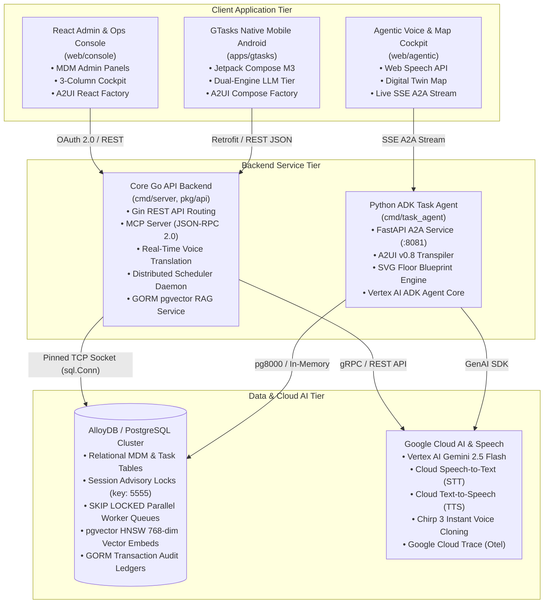

The system addresses five primary operational domains:
1. **Master Data Management (MDM):** Provides robust administrative APIs and UI forms for defining structural retail boundaries: Organizations, Sites, Spatial Locations (fixtures/shelves/registers coordinate maps), Roles, Assets, Certifications, and SOP templates.
2. **Intelligent Shift Initialization:** Automatically provisions a shift session context pool (`shift_agent_sessions`) upon user clock-in, backing the associate's Gemini ADK live preview agent coach session.
3. **Task Auto-Generation & Prioritized Queues:** Coordinates scheduled business calendar materialization sweeps (**BATCH** chron cycles) and dynamic streaming alert ingestions (**ADHOC** sensor alarms, till out alerts, register call bells). Enforces strict asset certifications constraint checks.
4. **Grounded AI-Assisted Operations & RAG:** Real-time dynamic alerts calculate vector embeddings, query database-indexed SOP text chunks utilizing `pgvector` HNSW cosine similarity algorithms, and inject grounded SOP instructions directly inside active task checklists. Exposes rich structured layouts dynamically using Agentic UI cards (A2UI).
5. **Speech Intelligence & Multilingual Operations:** Real-time voice translation across associate-customer dialogs, high-fidelity Studio/Journey TTS speech synthesis, and Google Cloud Chirp 3 instant custom voice cloning.

---

## 2. System Technology Stack

The platform is designed to run hermetically across containerized environments under GKE, Cloud Run, and local developer sandboxes using the following stacks:

| Architectural Tier | Selected Technology & Platform |
| :--- | :--- |
| **Backend Platform** | Go (Golang) Gin API Server Engine, GORM postgres ORM |
| **AI Intelligence** | Model Context Protocol (MCP) Server, Vertex AI Gemini |
| **Agent Framework** | Google Agent Development Kit (ADK), FastAPI, Python 3.13 |
| **Speech & Voice** | Google Cloud STT, Neural Translation, TTS, Chirp 3 Clone |
| **Database Tier** | AlloyDB / PostgreSQL Cluster, `pgvector` HNSW indexes |
| **Mobile Handset** | Kotlin, Jetpack Compose M3, Retrofit 2, MediaPipe Gemma |
| **User Interfaces** | React 19 Frontend Dashboard SPA, Vite TypeScript, A2UI |
| **Build & CI/CD** | Bazel 8 (bzlmod), Docker Distroless, OpenTelemetry Traces |

---

## 3. High-Performance Concurrency & Distributed State Locking

To support dozens of active horizontal microservice replicas without requiring complex external cache coordinators (Redis, ZooKeeper), the database cluster serves as the unified system lock voter and scheduling state manager.

### A. Distributed Leader Election & Advisory Locking
Leader election limits chron sweeps, document updates scans, and lock timeout watchdogs to a single active server replica, avoiding double sweeps:
* **PostgreSQL Advisory Locks:** Cluster replicas bid for leadership on startup and check loops by requesting a session-bound Postgres advisory lock on key `5555`.
* **TCP Connection Pinned Sockets (`sql.Conn`):** Standard pooled database clients recycle net connections, causing session locks to be dropped. The scheduler prevents this by reserving a single dedicated TCP socket directly from the driver pool context (`sqlDB.Conn`), pinning the advisory lock exclusively to this dedicated connection loop context.
* **Self-Healing Failover:** If the active leader node crashes, Postgres automatically drops the TCP pool after standard keep-alive intervals, releasing the advisory lock key instantly so worker nodes bid on leadership in their next `15s` check sweep.

### B. Concurrency-Safe SKIP LOCKED Parallel Workers
To allow replica worker nodes to pull and complete checklist tasks in parallel with zero lock contention or duplicate executions:
* **SKIP LOCKED transaction boundaries:** Workers claim pending operations under GORM transactions executing row-level locks pings:
  `SELECT * FROM task_executions WHERE status = 'PENDING' AND ... LIMIT ? FOR UPDATE SKIP LOCKED`
* **Logical Lock Tagging:** Claimed task rows are updated inside the transaction to `IN_PROGRESS` and tagged with the node's unique ID (`locked_by = node-ID`) and locked timestamp. Once transaction locks release on commit, the logical lock keeps the rows isolated until execution is marked `COMPLETED`.

### C. Watchdog Dead Letter Recovery Loops
A periodic watchdog sweep (Leader node only, every `30s`) scans task rows stuck in `IN_PROGRESS` state longer than standard lock timeout boundaries (`5m`):
* **Lock Recovery:** If the task's `RetryCount` is less than `MaxRetries` (default: 3), the watchdog logs the error, increments `RetryCount`, resets locks (`locked_at = NULL`, `locked_by = NULL`), and enqueues the row back to the queue under a `PENDING` status.
* **Dead Letter Routing:** If the task fails 3 times, it is permanently isolated by moving the status to the terminal `'DEAD_LETTER'` queue, alerting administrative operations diagnostics channels.

---

## 4. API Endpoints Architecture

### A. Administrative Data Management (CRUD Targets)
Administrative endpoints fall under `/api/v1/admin/*` and require elevated supervisor or system manager credentials.

**Organizations, Users, and RBAC**
* `GET /api/v1/admin/users` - Query user details and compliance certifications status.
* `POST /api/v1/admin/roles` - Seed standard organizational roles.
* `PUT /api/v1/admin/users/{id}/roles` - Map user identities to roles.
* `POST /api/v1/admin/organizations` - Register organizational tenants.
* `GET /api/v1/admin/organizations` - List active tenant organizations.
* `PUT /api/v1/admin/organizations/{id}/users` - Map user to corporate organizations boundary.

**Spatial Nodes, Fixtures, and Assets**
* `POST /api/v1/admin/sites` - Register retail sites (Store #1000 - Dallas Texas).
* `POST /api/v1/admin/locations` - Register fixtures, registers, or backroom rack coordinate points.
* `POST /api/v1/admin/assets` - Register physical machinery and tools.
* `PATCH /api/v1/admin/assets/{id}/status` - Update asset status states (`AVAILABLE`, `BROKEN`, `MAINTENANCE`).

**SOP Documents & Scheduling**
* `POST /api/v1/admin/sops` - Intake standard SOP files (DOCX, PDF, HTML, XLSX). Triggers RAG chunking embeds pipelines.
* `POST /api/v1/admin/tasks/templates` - Create task definitions, including checklist JSON matrices.
* `POST /api/v1/admin/tasks/templates/{id}/rules` - Map Maker/Checker supervisor approval schemas.
* `POST /api/v1/admin/availabilities` - Map employee availability calendars and RFC 5545 RRULE shift patterns.

**Background Job Scheduler Diagnostics**
* `GET /api/v1/admin/scheduler/status` - Exposes multi-node leader state, active worker counts, processed/failed task metrics, and last error diagnostics.
* `POST /api/v1/admin/scheduler/trigger` - Force materializes scheduled batch sweeps calendar checks.

### B. Operational Tasking & Agent Interface
Operational routes are used by floor associates, client dashboards, and Vertex AI ADK MCP servers.

* `GET /health/readiness` - Diagnostic target to verify active AlloyDB pools connectivity.
* `GET /static/*` - Served natively by the Go server filesystem engine to resolve static SOP documents templates.
* `POST /api/v1/mcp` - Global Model Context Protocol (MCP) JSON-RPC 2.0 endpoint.
* `POST /api/v1/sessions/shift/{shiftId}/chat` - Primary Vertex AI Gemini MCP JSON-RPC conversational endpoint.
* `POST /api/v1/organizations/{orgId}/sites/{siteId}/users/{userId}/sessions/shift/{shiftId}/message` - Conversational agent orchestrator chat endpoint.
* `GET /api/v1/organizations/{orgId}/sites/{siteId}/tasks` - Fetches prioritized, active site queues.
* `PATCH /api/v1/organizations/{orgId}/sites/{siteId}/tasks/{id}/status` - Mutates checklist task statuses, executing GORM hook ledgers.
* `POST /api/v1/organizations/{orgId}/sites/{siteId}/tasks/{id}/override` - Bypasses constraints by submitting supervisor justification tags.
* `POST /api/v1/organizations/{orgId}/sites/{siteId}/tasks/{id}/claim` - Claims/takes ownership of active tasks.
* `POST /api/v1/organizations/{orgId}/sites/{siteId}/trades` - Initiates peer-to-peer shift and task trades.
* `GET /api/v1/organizations/{orgId}/sites/{siteId}/trades` - Lists pending trade proposals.
* `POST /api/v1/organizations/{orgId}/sites/{siteId}/trades/{tradeId}/accept` - Accepts a pending trade.
* `POST /api/v1/organizations/{orgId}/sites/{siteId}/trades/{tradeId}/reject` - Rejects a pending trade.
* `POST /api/v1/organizations/{orgId}/sites/{siteId}/alerts` - Ingests ad-hoc streaming alerts (till drop, spill, stockout).

### C. Voice Translation & Profile Routes
* `GET /api/v1/profile/:id` - Retrieves associate language and voice profile.
* `POST /api/v1/profile/:id` - Initializes associate voice profile.
* `PUT /api/v1/profile/:id` - Updates language/voice preferences.
* `POST /api/v1/profile/:id/voice/clone` - Uploads consent recording and generates Chirp 3 voice clone key.
* `POST /api/v1/translate/talk` - Transcribes associate speech, translates, and synthesizes target language audio.
* `POST /api/v1/translate/listen` - Transcribes customer speech, translates, and synthesizes associate language audio.
* `GET /api/v1/translate/voices` - Lists available Google Cloud HD Studio and Journey voices.
* `POST /api/v1/translate/preview` - Synthesizes voice model audio preview.

---

## 5. PostgreSQL/AlloyDB Relational Database Schema

### Database Extensions
```sql
CREATE EXTENSION IF NOT EXISTS "pgcrypto";
CREATE EXTENSION IF NOT EXISTS "vector"; -- pgvector extension mapping
```

### Key Relational Tables Summary
- **Identity & Organization:** `organizations`, `users`, `user_organizations`, `roles`, `user_roles`, `sites`, `user_sites`, `locations`.
- **Assets & Certifications:** `assets`, `certifications`, `user_certifications`.
- **Grounded SOP Documents & Vectors:** `sops`, `sop_processes`, `sop_chunks` (`embedding VECTOR(768)` with HNSW cosine index `hnsw (embedding vector_cosine_ops)`), `task_sops`.
- **Workforces & Shifts:** `events`, `user_event_schedules`, `user_event_instances`.
- **Task Execution & Audits:** `tasks`, `task_assets`, `task_approval_rules`, `task_executions` (`locked_at`, `locked_by`, `retry_count`, `max_retries`, `last_error`, `description`), `task_execution_audits`, `task_trades`.
- **Agent Sessions Context:** `shift_agent_sessions` (`assignee_id`, `shift_instance_id`, `message_history`, `session_context`).

---

## 6. Comprehensive Topic Specifications

For deep dives into specialized subsystems, refer to the following dedicated manuals:
- **[App & UI Workflows](#chapter-5-app-ui-workflows):** Complete guide to React Console, GTasks Android app, and Dual LLM reasoning.
- **[A2UI Architecture & Engine](#chapter-7-a2ui-architecture-engine):** A2UI v0.8 protocol, MCP tools, and multi-platform rendering engines.
- **[Voice Translation & Speech Intelligence](#chapter-9-voice-speech-intelligence):** Google Cloud STT, Translation, TTS, and Chirp 3 voice cloning.
- **[Event-Driven Operations Specification](#chapter-4-event-driven-mechanics):** ARTS XML and Schema.org event taxonomies and streaming triggers.
- **[Background Job Scheduler Daemon Guide](#chapter-6-distributed-scheduler-daemon):** Distributed leader election, advisory locks, and watchdog recovery.
- **[Workspace Directory & Store Mapping Specifications](#chapter-8-workspace-directory-store-mapping):** Google Workspace OU tree and 109-store test identity matrix.
- **[Google Cloud & OAuth Setup Guide](#chapter-2-google-cloud-oauth-setup):** GCP project provisioning, OAuth consent screens, and credentials.
- **[Android Handset App Guide](#chapter-3-android-handset-app-setup):** Gradle, ADB reverse port forwarding, and handset deployment.
- **[Governance, Licensing & Design Decisions](#chapter-11-governance-licensing):** Apache 2.0 licensing, authorship, and architectural decision trade-offs.

---

<a id="chapter-2-google-cloud-oauth-setup"></a>
# Chapter 2: Google Cloud & OAuth Setup

## Google Cloud Platform & OAuth 2.0 Identity Configuration

This guide provides step-by-step instructions for configuring the Google Cloud Platform (GCP) resources, OAuth 2.0 Consent Screens, and Client Credentials required to run both the **React Admin Console** and the **GTasks Android Native Application** with secure Google Sign-In.

---

## 1. Google Cloud Project Setup

1. Open the [Google Cloud Console](https://console.cloud.google.com/).
2. Click the project dropdown in the top navigation bar and select **New Project**.
3. Name the project `Gemini-Task-Engine` (or your preferred identifier).
4. Assign an organization/billing account if required and click **Create**.

---

## 2. OAuth Consent Screen Configuration

Before generating credentials, you must configure the consent screen that users see when signing in.

1. Navigate to **APIs & Services** > **OAuth consent screen** in the GCP sidebar.
2. Choose your **User Type**:
   - **Internal:** (Recommended for Enterprise/Testing) Restricts authentication to users within your Google Workspace domain.
   - **External:** Permits any Google account to sign in (requires entering test users before publishing).
3. Click **Create**.
4. Fill in the **App Information**:
   - **App name:** `Gemini Task Engine`
   - **User support email:** Select your administrator email.
   - **Developer contact information:** Enter your email.
5. Click **Save and Continue**.
6. **Scopes:** Click **Add or Remove Scopes** and select:
   - `.../auth/userinfo.email` (View primary email address)
   - `.../auth/userinfo.profile` (View basic profile information)
   - `openid` (Associate identity with Google)
7. Click **Save and Continue**.
8. (If External) **Test Users:** Add the Google Accounts you intend to use for testing on your handset.
9. Review the summary and click **Back to Dashboard**.

---

## 3. Creating OAuth 2.0 Client Credentials

To secure the authentication pipeline, you must provision two separate Client IDs: one for the **React Web Console** (which acts as a Single Page Application) and one for the **Android Handset App** (which signs the request with your developer certificate).

### A. Web Application Credentials (Admin Console)

1. Navigate to **APIs & Services** > **Credentials**.
2. Click **+ Create Credentials** > **OAuth client ID**.
3. Select **Application type:** `Web application`.
4. Name the client: `Gemini Task Engine - Web Console`.
5. Under **Authorized JavaScript origins**, add:
   - `http://localhost:5173` (Vite Admin Console Dev Port)
   - `http://localhost:8080` (Go API Gateway Port)
6. Under **Authorized redirect URIs**, add:
   - `http://localhost:8080/api/v1/auth/callback` (Go oauth callback route)
7. Click **Create**.
8. **CRITICAL:** Copy the **Client ID** and **Client Secret** immediately. You will need these for your environment configuration.

---

### B. Android Application Credentials (GTasks Mobile App)

Google OAuth on Android validates both the application's package name and the cryptographical signature of your developer certificate to prevent client spoofing.

#### Step I: Extract your Developer SHA-1 Fingerprint
To authenticate your local debug builds, you must extract the SHA-1 fingerprint of your local Android debug keystore (created automatically by Gradle or Android Studio).

Run the following command in your terminal:

```bash
keytool -list -v \
  -keystore ~/.android/debug.keystore \
  -alias androiddebugkey \
  -storepass android \
  -keypass android
```

> [!NOTE]
> Under Windows, replace the keystore path with `%USERPROFILE%\.android\debug.keystore`.

Locate the **SHA-1** fingerprint in the terminal output. It will look similar to this:
`SHA1: DE:AD:BE:EF:00:11:22:33:44:55:66:77:88:99:AA:BB:CC:DD:EE:FF`

#### Step II: Register the Android Client in GCP
1. Go back to **APIs & Services** > **Credentials** in the Cloud Console.
2. Click **+ Create Credentials** > **OAuth client ID**.
3. Select **Application type:** `Android`.
4. Name the client: `Gemini Task Engine - Android Client`.
5. Enter the exact **Package name:** `com.google.gtasks` (defined in the app's `AndroidManifest.xml`).
6. Paste the **SHA-1 fingerprint** you extracted in Step I.
7. Click **Create**.
8. Copy the generated **Client ID**.

---

## 4. Environment Variable Configuration

Once you have provisioned your credentials, configure your local environment by copying the example template:

```bash
cp example.env.local.toml .env.local.toml
```

Update the `[server.oauth]` block in **`.env.local.toml`**:

```toml
[server.oauth]
client_id = "PASTE-YOUR-WEB-CLIENT-ID-HERE.apps.googleusercontent.com"
allowed_client_ids = [
    "PASTE-YOUR-ANDROID-CLIENT-ID-HERE.apps.googleusercontent.com"
]
secret = "PASTE-YOUR-WEB-CLIENT-SECRET-HERE"
```

> [!IMPORTANT]
> Keep your `.env.local.toml` out of version control. The root `.gitignore` excludes `.env.*.toml` to prevent leaking enterprise client secrets.

---

## 5. Local Database Seeding
To match Google Sign-In identities to GTasks database records, ensure that the email address associated with your Google account is registered in the `users` table.

You can seed your developer account by editing your local `scripts/dev_events.sql` file and adding:

```sql
INSERT INTO users (id, name, email, o_auth_provider, o_auth_id, created_at, updated_at) 
VALUES (
  '00000000-0000-0000-0000-000000000001', -- Your User UUID
  'Demo Associate',                      -- Your Display Name
  'admin@retail.altostrat.com',          -- Your Google Sign-In Email
  'google',
  '100000000000000000000',               -- Your Google User ID (optional, bound on first login)
  NOW(), NOW()
) ON CONFLICT (email) DO UPDATE SET name = EXCLUDED.name;
```

Reload the database seeds using the loader utility:
```bash
bazel run //cmd/db_loader -- -migrate -file=scripts/dev_env.sql,scripts/time_zones.sql,scripts/icao_codes.sql,scripts/dev_events.sql,scripts/seed_store_tasks.sql
```

---

<a id="chapter-3-android-handset-app-setup"></a>
# Chapter 3: Android Handset App Setup

## Android Native App (GTasks) Setup & Deployment

The **GTasks** application is a native Android associate portal built using **Kotlin, Jetpack Compose, and Retrofit**. It integrates directly with the Go API Gateway and supports real-time task queues, glassmorphic UI components, and peer-to-peer task trading.

This guide details how to set up your local development environment, import the project into Android Studio, compile using Gradle or Bazel, and deploy to emulators or physical handsets.

---

## 1. Prerequisites & Tooling

Ensure you have the following installed on your development machine:
- **Android Studio:** Ladybug (or newer stable release).
- **Android SDK:** API Level 35 (Android 15.0 / Vanilla Ice Cream).
- **Java Development Kit (JDK):** JDK 17 (or JDK 21). Gradle is pre-configured to compile using Java 17.
- **Android Debug Bridge (ADB):** Installed as part of the Android SDK Platform Tools (ensure `adb` is added to your shell `$PATH`).

---

## 2. Importing the Project into Android Studio

To ensure Android Studio indexes the Kotlin source files, layout resources, and Gradle dependencies correctly, you must **import only the `/apps/gtasks` subdirectory** rather than the root monorepo directory.

1. Open Android Studio.
2. Click **Open** (or **File** > **Open**).
3. Navigate to your local `gemini_task_engine` workspace.
4. Select the **`apps/gtasks`** directory and click **OK**.
5. Allow Android Studio to import and sync Gradle. This will download all Jetpack Compose and Retrofit dependencies and compile local indexing caches (takes 1–2 minutes on first load).

---

## 3. Configuring Local SDK Paths

Android Studio automatically creates a `local.properties` file inside `apps/gtasks/` pointing to your local Android SDK location. If you are building via CLI or encountering SDK location errors, verify that `apps/gtasks/local.properties` exists and contains:

```properties
sdk.dir=/Users/YOUR-USERNAME/Library/Android/sdk
```
*(On Windows, replace with `sdk.dir=C\:\\Users\\YOUR-USERNAME\\AppData\\Local\\Android\\Sdk`)*

---

## 4. Connecting the App to the Local Go Backend

The GTasks app communicates with the Go API Gateway on port `:8080`. Depending on whether you are using an Android Emulator or a physical USB-connected handset, use the appropriate network tunnel:

### A. Android Virtual Device (AVD Emulator)
Android Emulators run inside an isolated virtual network. To reach your laptop's `localhost:8080` from the emulator, the app is pre-configured to route API requests to:
`http://10.0.2.2:8080` *(which is the emulator's internal gateway to your host machine)*.

No extra routing configuration is needed.

---

### B. Physical Android Handsets (USB Debugging)
If you are running the app on a physical phone connected via USB, the phone cannot resolve `localhost` or `10.0.2.2` to your laptop.

To bridge this, you must set up **ADB Reverse Port Forwarding**. Run this command in your terminal:

```bash
adb reverse tcp:8080 tcp:8080
```

> [!TIP]
> This command instructs the ADB daemon on your phone to tunnel all outgoing traffic hitting `localhost:8080` on the phone's loopback interface directly over the USB cable to `localhost:8080` on your development laptop! Run this command every time you plug in your device.

---

## 5. Build & Compilation Workflows

We support two compilation pipelines: native **Gradle** (the Android standard) and **Bazel 8** (the monorepo standard).

### Method A: Standard Gradle (CLI)
You can compile the app directly using the root Gradle wrapper:

```bash
## Navigate to the mobile directory
cd apps/gtasks

## Compile the debug APK
./gradlew assembleDebug
```
*The compiled APK will be generated at:*  
`apps/gtasks/app/build/outputs/apk/debug/app-debug.apk`

---

### Method B: Monorepo Bazel (Recommended)
To keep builds hermetic and aligned with your backend pipelines, you can compile the mobile app using Bazel from the workspace root:

```bash
## Compile via Bazel shell target
bazel build //apps/gtasks:build
```
*Bazel will execute the `build.sh` script inside the sandbox and output the compiled APK to the same destination.*

---

## 6. Handset Installation & Deployment

### Step I: Ensure USB Debugging is Enabled
On your physical handset:
1. Go to **Settings** > **About Phone**.
2. Tap **Build Number** 7 times until you see "You are now a developer!".
3. Go back to **Settings** > **System** > **Developer Options**.
4. Enable **USB Debugging**.

---

### Step II: Install the APK
Once your device is recognized (verify by running `adb devices`), push the compiled APK to your phone by running:

```bash
adb install -r apps/gtasks/app/build/outputs/apk/debug/app-debug.apk
```

The `-r` flag tells ADB to replace the existing installation while preserving its local session cache, allowing you to log in once and deploy updates instantly.

---

<a id="chapter-4-event-driven-mechanics"></a>
# Chapter 4: Event-Driven Mechanics

## Retail Operational Event Mapping Specifications
## Alignment with ARTS XML and Schema.org Taxonomies

This specification document outlines the standard operational event taxonomies, temporal styles, and platform trigger architectures mapped in the Enterprise Task Engine database schema under [event.go](../../pkg/model/event.go). These event configurations bridge physical store operations with the agentic tasking layer using standardized descriptors designed by the **Association for Retail Technology Standards (ARTS)** and **Schema.org**.

---

## 1. Taxonomic Mapping Catalog

The platform registers standard categorizations (`model.EventType`) to classify operational store activities and drive targeted checklists.

| Event Type Constant | DB Serialized Value | Schema.org Type Map | ARTS XML Reference Context | Operational Scope & Target |
| :--- | :--- | :--- | :--- | :--- |
| **`EventRetailShift`** | `"RetailShift"` | [BusinessEvent](https://schema.org/BusinessEvent) | **Store Operations:** Shift Activity | clock-in/out boundaries of a store associate shift. (Batch) |
| **`EventStoreBreak`** | `"StoreBreak"` | [Action](https://schema.org/Action) | **Labor Scheduling:** Rest Period | Meal or rest breaks. Sets temporary employee unavailability. (Batch) |
| **`EventTrainingSession`** | `"TrainingSession"` | [EducationEvent](https://schema.org/EducationEvent) | **Labor Management:** Training Event | Scheduled training modules, physical drills, or SOP walkthroughs. (Batch) |
| **`EventStoreOpen`** | `"StoreOpenEvent"` | [BusinessEvent](https://schema.org/BusinessEvent) | **Store Operations:** Business Day Open | Register drawer loading, vault reconciliation, door unlocking. (Batch) |
| **`EventStoreClose`** | `"StoreCloseEvent"` | [BusinessEvent](https://schema.org/BusinessEvent) | **Store Operations:** Business Day Close | Register cash drop sweeps, security sweeps, door locking, power down. (Batch) |
| **`EventTillDrawerDrop`** | `"TillDrawerDropEvent"` | [Action](https://schema.org/Action) | **Tender Operations:** Till Drop / Till Out | Triggered dynamically when drawer totals exceed security limits. (Adhoc) |
| **`EventRegisterAudit`** | `"RegisterAuditEvent"` | [Action](https://schema.org/Action) | **Tender Operations:** Cashier Balancing | Register audits verifying till balances at shift end or audits. (Batch/Adhoc) |
| **`EventCurbsidePickup`** | `"CurbsidePickupEvent"` | [DeliveryEvent](https://schema.org/DeliveryEvent) / `pickup` | **Fulfillment:** Click and Collect | Drive-up or curbside customer pickup order handling. (Batch) |
| **`EventHomeDelivery`** | `"HomeDeliveryEvent"` | [DeliveryEvent](https://schema.org/DeliveryEvent) / `delivery` | **Fulfillment:** Delivery Dispatch | Local home delivery route packing and courier dispatch workloads. (Batch) |
| **`EventReturnProcess`** | `"ReturnProcessEvent"` | [ReturnAction](https://schema.org/ReturnAction) | **Customer Service:** Returns Processing | Parsing, auditing, restock-grading, and refunding returned items. (Adhoc) |
| **`EventReceivingArrival`** | `"ReceivingArrivalEvent"` | [ReceiveAction](https://schema.org/ReceiveAction) | **Inventory Operations:** Goods Receipt | Dock check-ins, unloading trucks, logging purchase orders. (Batch) |
| **`EventShelvingStock`** | `"ShelvingStockEvent"` | [OrganizeAction](https://schema.org/OrganizeAction) | **Inventory Operations:** Replenishment | Stocking floor displays, endcaps, and display shelves from backroom cages. (Batch) |
| **`EventStockoutCorrect`** | `"StockoutCorrectEvent"` | [Action](https://schema.org/Action) | **Inventory Control:** Out of Stock | Corrective replenishments triggered automatically by camera/system out alarms. (Adhoc) |
| **`EventInventoryCount`** | `"InventoryCountEvent"` | [Action](https://schema.org/Action) | **Inventory Operations:** Physical Count | Scheduled cycles and audits verifying digital inventory alignment. (Batch) |
| **`EventPriceMarkdown`** | `"PriceMarkdownEvent"` | [UpdateAction](https://schema.org/UpdateAction) | **Store Operations:** Price Audit | Updating physical/electronic tags under systemic Markdown rules. (Batch) |
| **`EventCustomerAssistance`** | `"CustomerAssistanceEvent"` | [ContactAction](https://schema.org/ContactAction) | **Customer Service:** Assistance Call | Spill cleanups, shopping cart retrieval runs, key calls, floor queries. (Adhoc) |
| **`EventAssetMaintenance`** | `"AssetMaintenanceEvent"` | [ControlAction](https://schema.org/ControlAction) | **Facilities Management:** Equipment Service | Scheduled or corrective sweeps (cooler calibration checks, trash compactor runs). (Batch/Adhoc) |
| **`EventShowroomRefresh`** | `"ShowroomRefreshEvent"` | [OrganizeAction](https://schema.org/OrganizeAction) | **Merchandising:** Showcase Swaps | **Volt & Vine Brand Specific:** Showcase swapping premium appliances; display smart hub calibrations. (Batch) |
| **`EventWhiteGloveDispatch`** | `"WhiteGloveDispatchEvent"` | [DeliveryEvent](https://schema.org/DeliveryEvent) / `delivery` | **Fulfillment:** White Glove Delivery | **Volt & Vine Brand Specific:** Luxury appliance installation preparations and route audits. (Batch) |
| **`EventApplianceDemo`** | `"ApplianceDemoEvent"` | [BusinessEvent](https://schema.org/BusinessEvent) | **Store Operations:** Appliance Testing | **Volt & Vine Brand Specific:** Premium smart induction range or double-oven demonstration appointments. (Batch/Adhoc) |
| **`EventPerishableFreshness`** | `"PerishableFreshnessEvent"` | [Action](https://schema.org/Action) | **Inventory Control:** Shelf Rotation | **OmniMart Brand Specific:** High-frequency checks on dairy, deli, meat, and produce; temp sweeps. (Batch) |
| **`EventHotFoodTransition`** | `"HotFoodTransitionEvent"` | [Action](https://schema.org/Action) | **Operations:** Kitchen Transition | **OmniMart Brand Specific:** Resetting kitchen prep lines (Deli Breakfast-to-Lunch-to-Dinner food transitions). (Batch) |
| **`EventDirectStoreDelivery`** | `"DirectStoreDeliveryEvent"` | [ReceiveAction](https://schema.org/ReceiveAction) | **Receiving Operations:** Direct Delivery | **OmniMart Brand Specific:** Ingesting direct store vendor delivery checks (local soda, bread). (Adhoc) |

---

## 2. Event Execution Classifications: BATCH vs ADHOC

The platform segregates events into two discrete temporal models mapped using the `model.EventStyle` parameter.

### A. Batch Operations (`StyleBatch = "BATCH"`)
Batch events are systematically aligned with shifts, logistical delivery schedules, and the standard store business day clock.
* **Recurrence:** Follows structural calendar rules (`Rrule` specifications mapping to RFC 5545).
* **Workload Ingestion:** Automatically processed in periodic background sweeps.
* **Target Mappings:** Creates checklist task allocations (e.g. register setups, display swaps, scheduled physical cycle counts) pointing back to shift instances.

### B. Dynamic Streaming alerts (`StyleAdhoc = "ADHOC"`)
Adhoc events reflect the real-time, streaming nature of dynamic store change, capturing physical drift, on-floor emergencies, and customer demands.
* **Recurrence:** Instanced, unscheduled, and spontaneous.
* **Workload Ingestion:** Emitted dynamically in real-time streams from terminals, department buttons, and visual sensor arrays.
* **Target Mappings:** Bypass chronological schedulers to instantly generate pending, high-priority tasks in active associate queues under a virtual stream boundary instance (`00000000-0000-0000-0000-ffffffffffff`).

---

## 3. Lifecycle States (`model.EventStatus`)

Event materializations follow standard Schema.org `EventStatusType` mapping, supplemented by operational runtime status changes:

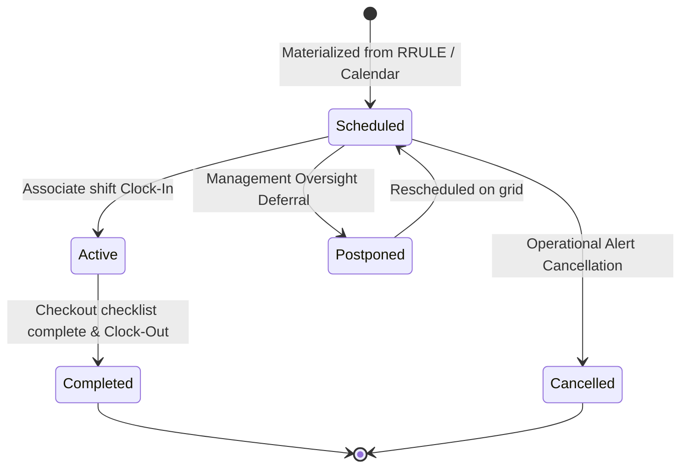

* **`EventScheduled`**: Workload mapped on schedule.
* **`EventCancelled`**: Workload cancelled under operational alerts.
* **`EventPostponed`**: Target deferred under management oversight.
* **`EventRescheduled`**: Instance relocated on schedule grids.
* **`EventActive`**: Event/shift currently in progress.
* **`EventCompleted`**: Tasks completed and shift clock-out logged.

---

## 4. Platform Architectural Integrations

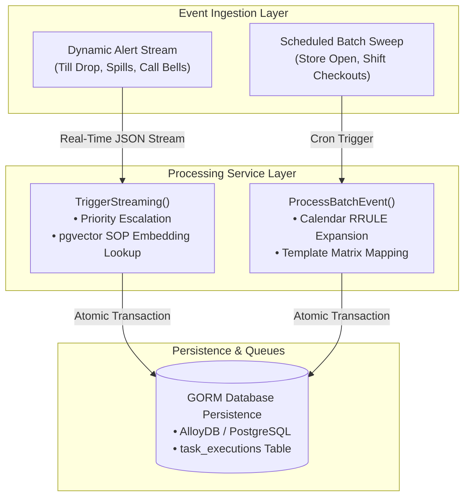

1. **Automation Pipeline ([automation.go](../../pkg/service/automation.go))**: Coordinates batch materializations and dynamic alert priority overrides:
   * `TillDrawerDropEvent` / `CustomerAssistanceEvent` -> **Priority 1 (Critical Drawer/Register Floor Alert)**
   * `StockoutCorrectEvent` -> **Priority 2 (High Replenishment Alert)**
   * All other standard operations -> **Priority 3 (Standard Operational Target)**
   * **Grounded SOP Task Enrichment (Intelligence Tier):** Ingests real-time alert text parameters, dynamically extracts its 768-dimensional vector embedding using the configured [EmbeddingGenerator](../../pkg/service/rag.go#L19-L22) dialers, and queries standard `sop_chunks` using PostgreSQL pgvector Cosine similarity `<=>` operator looking up the highest matching chunk. On match, GORM dynamically injects and appends the compliance instructions block into the generated `TaskExecution.Description` column natively!
2. **Model Context Protocol Integration ([mcp.go](../../pkg/api/mcp.go))**: Integrates tools for AI model sessions:
   * **`trigger_alert`:** Programmatically triggers dynamic alerts and task executions, automatically executing GORM pgvector RAG searches and attaching grounded context instructions in real time.
   * **`get_tasks`:** Retrieves prioritized active task execution queues. Enriched to dynamically parse and display the execution's `Description` (exposing the grounded compliance SOP chunk instructions block to floor associates and backing shift agent coach Hanna).
3. **Database Migration ([db_loader.go](../../cmd/db_loader.go))**: System auto-migration adds fields seamlessly during service starts:
   * Adds `event_type VARCHAR(100) NOT NULL DEFAULT 'RetailShift'` to `events` table.
   * Adds `event_style VARCHAR(20) NOT NULL DEFAULT 'BATCH'` to `events` table.
   * Adds `description TEXT DEFAULT NULL` to `task_executions` table, enabling persistent dynamic compliance descriptions.
   * Upgrades `event_status` field configuration dynamically to strongly-typed enums.
   * Expands schemas dynamically with lock tracking parameters (`locked_at`, `locked_by`, `retry_count`, `max_retries`, `last_error`).
4. **Distributed Background Scheduler Daemon ([scheduler.go](../../pkg/service/scheduler.go))**: Coordinates multi-node leader election and background execution loops natively over GORM database states:
   * **Leader Election (Split-Brain Proof):** Cluster nodes attempt to claim a PostgreSQL session-level advisory lock on key `5555`. Pinned to a dedicated connection socket wrapper, the node holding the lease acts as the active **Scheduler Leader** (driving cron-updating, SOP url refresh checking, and calendar events sweeps), while other nodes act as **Workers**. Lease automatically self-heals if the Leader socket drops.
   * **Parallel SKIP LOCKED workers queue:** Concurrently claim pending task executions and SOP indexing process jobs using database row-level locking `SELECT ... FOR UPDATE SKIP LOCKED`, allowing workers to pull concurrently in parallel without double-processing.
   * **Dead Letter Watchdog:** Scans executions locked longer than `5m` in `IN_PROGRESS` state. Resets locks and status to `PENDING` for retry runs, incrementing the retry register, and routes the ticket to the terminal `DEAD_LETTER` queue context upon exceeding limit checks.
   * **API Controllers Status & Controls ([admin.go](../../pkg/api/admin.go)):** Admin endpoints expose diagnostic leader/worker load parameters (`GET /api/v1/admin/scheduler/status`) and enable administrative manual cron sweeps triggers (`POST /api/v1/admin/scheduler/trigger`).

---

## 5. Verification & Validation Metrics

To guarantee absolute operational reliability, standard testing sweeps have been implemented across the layers, running hermetically inside the Bazel sandbox.

### A. Model Constraint Verification ([event_test.go](../../pkg/model/event_test.go))
Asserts GORM string serialization, verifying the base type-aliases map to standard string records with zero drift.

### B. Automation Workload Verification ([automation_test.go](../../pkg/service/automation_test.go))
* **Batch Verification:** Assures ProcessBatchEvent resolves scheduled shifts and maps checkout templates.
* **Streaming Ingestion Verification:** Confirms TriggerStreamingEvent maps custom dynamic alerts, registers ad-hoc context ranges, and enforces correct priority overrides (Critical alert priority = 1 for `TillDrawerDropEvent`, High alert priority = 2 for `StockoutCorrectEvent`).

### C. JSON-RPC Integration Verification ([mcp_test.go](../../pkg/api/mcp_test.go))
To prevent Bazel test hangs, the MCP tool callbacks are refactored into public, receiver-level methods on the [MCPHandler](../../pkg/api/mcp.go) structure. External test suites can query tools programmatically directly in-memory, bypassing long-lived SSE transport channel read blocks.
* **Alert Trigger Ingest Verification:** Verifies the `HandleTriggerAlert` tool callback dynamically creates adhoc task executions, correctly maps priorities, and formats matching text responses.
* **Queue Lookup Verification:** Assures `HandleGetTasks` retrieves prioritized tasks.
* **Prompt Registration Validation:** Asserts the backing `shift_agent` prompt matches standard instructions.

### D. Relational Ingestion & Drift Verification ([seed_test.go](../../pkg/model/seed_test.go))
Performs high-fidelity static validation on the relational seed SQL script [dev_events.sql](../../scripts/dev_events.sql) under the Bazel sandbox runfiles tree:
* **Relational Safety:** Asserts that all materialized shift instances and schedules map onto correct parent site IDs and worker identities, verifying that UUID layouts adhere strictly to standard constraints.
* **EventType / EventStyle Enum Alignment:** Isolates the raw SQL inserts block context in-memory, resolving and verifying that all seeded strings match backing Go constants precisely without case mutations, preventing configuration-code drift.

### E. Operational RAG Pipeline Ingestion & Verification ([rag_test.go](../../pkg/service/rag_test.go))
Performs robust, synchronous verification of the asynchronous RAG document parsing and indexing pipeline under the Bazel sandbox:
* **Async Ingestion Verification:** Confirms [IngestSOPAsync](../../pkg/service/rag.go#L102-L138) registers base database records and launches background processing runs safely.
* **HTML/Binary Parsing Audits:** Validates that HTML file ingestions cull markup tags (such as `<html>`, `<body>`) successfully and extract valid caching metadata (ETags, Effective Date headers), and verifies binary files (PDFs, DOCX, XLSX) extract accurate SHA-256 fingerprint checks.
* **Periodic Check / Relational Refresh Verification:** Assures [CheckSOPUpdates](../../pkg/service/rag.go#L140-L230) tracks ETag/cache modifications, dynamically detects index drifts, and launches new active background ingestion refreshes atomically under new `PENDING` states.

### F. Distributed Cluster Scheduler & Workers Verification ([scheduler_test.go](../../pkg/service/scheduler_test.go) & [server_test.go](../../pkg/api/server_test.go))
Validates distributed leader leases, locking state transfers, concurrency safety, dead letter recoveries, and scheduler REST controller APIs synchronously in the Bazel sandbox:
* **Self-Healing Leader Lease Handovers:** Asserts that only the elected leader holds the active lease, verifies that concurrent nodes fail to acquire the lock, and validates that a worker node automatically claims the leader lease (self-healing) when the active leader drops.
* **SKIP LOCKED Claims Concurrency:** Validates that parallel workers concurrently pick up and process isolated pending tasks from queues, verifying that claimed tasks are flagged to the node's unique ID under database transactions.
* **Dead Letter Watchdog Recovery:** Verifies the watchdog watchdog recovering loops reset expired progress locks back to `PENDING` within max retries limits, and routes stale tickets exceeding threshold checking into the `DEAD_LETTER` terminal state context, registering diagnostic error footprints.
* **HTTP Admin Diagnostic API Controllers:** Asserts `GET /api/v1/admin/scheduler/status` returns correct node load parameters, and `POST /api/v1/admin/scheduler/trigger` force initiates cron sweeps triggers.

### G. Executing Sandboxed Tests
Verify and execute the tests using the hermetic Bazel sandbox target:
```bash
bazel test //test/...
```
All targets build, analyze, and test pass with 100% success.

---

<a id="chapter-5-app-ui-workflows"></a>
# Chapter 5: App & UI Workflows

## Frontend Applications & User Interface Workflows
## Enterprise Task Engine: User Experience Architecture & State Specification (v5.0)

> [!NOTE]
> This specification details the user experience architecture, component hierarchies, state management flows, and interaction lifecycles implemented across the web and native mobile client applications of the Enterprise Task Engine.

---

## 1. Client Applications Ecosystem Overview

The Enterprise Task Engine monorepo encompasses four primary frontend client applications and development workbenches, each tailored to distinct operational and validation roles:

| Application | Technology Stack | Operational Scope |
| :--- | :--- | :--- |
| **Admin & Operations Console** (`web/console`) | React 19, TypeScript, Vite, Tailwind CSS, A2UI Component Factory | Store supervisor cockpit, MDM administration, task queue dispatching, workforce analytics |
| **GTasks Mobile App** (`apps/gtasks`) | Kotlin, Jetpack Compose M3, Retrofit, Coil SVG, MediaPipe Gemma / GenAI | Storefront floor associate portal, task execution, real-time voice translation, chat |
| **Agentic Voice & Map Cockpit** (`web/agentic`) | React 19, TypeScript, Vite, Web Speech API, A2UI Dynamic Engine | Standalone speech-enabled agentic sandbox with live digital twin spatial mapping |
| **A2UI Render Test Workbench** (`web/render-test`) | React 19, TypeScript, Vite, A2UI Test Suite | Visual regression testing and JSON schema contract verification workbench |

---

## 2. Admin & Operations Console (`web/console`)

The **Admin & Operations Console** is the primary desktop web cockpit used by store supervisors, department leads, and system administrators. It integrates real-time task queues, an interactive spatial digital twin of the retail store floor, a conversational AI coach, and comprehensive Master Data Management (MDM) tooling.

### A. Architectural Layout & Component Tree

The main dashboard is organized in a responsive glassmorphic 3-column operational grid (`App.tsx`):

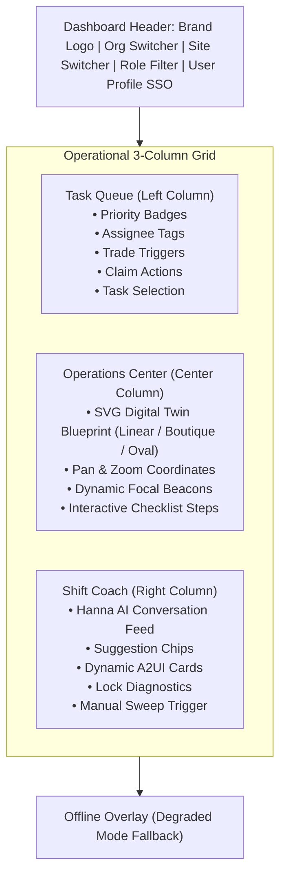

### B. Core UI Workflows

#### 1. Authentication & Single Sign-On (SSO) Workflow (`components/SSOPortal.tsx`)
- **Identity Provider:** Google Identity Services (GIS) OAuth 2.0 with JWT token signing.
- **Workflow Steps:**
  1. Unauthenticated users are intercepted by the `SSOPortal` component.
  2. The Google GIS SDK renders the standard Google One-Tap or Sign-In button.
  3. Upon successful credential issuance, the raw JWT credential is validated by the client (`AppContext.tsx`) and decoded to extract email, name, picture, and OAuth UID.
  4. The client queries `GET /api/v1/organizations/{orgId}/me` (or `GET /api/v1/admin/users`) to hydrate the associate's authorized roles, assigned retail sites, and active tenant boundaries.
  5. If the user possesses the `ROLE_ADMIN` role, the global navigation exposes the **Admin Panel** and **Workforce Analytics** entry points.

#### 2. Prioritized Task Queue Dispatching (`components/TaskQueue.tsx` & `hooks/useTaskManagement.ts`)
- **Queue Hydration:** Fetches active task executions from `GET /api/v1/organizations/{orgId}/sites/{siteId}/tasks`.
- **Filtering Capabilities:**
  - **By Storefront Site:** Scopes tasks to the active physical location (e.g., Dallas Store #1000, Volt & Vine Seattle).
  - **By Associate Assignee:** Filters by authenticated associate, specific coworkers, or unassigned tasks (`ALL`).
  - **By Operational Role:** Filters by target role requirements (`Cashier`, `Manager`, `Associate`, `Vault Custodian`).
- **Interactive Queue Actions:**
  - **Task Selection:** Clicking a task updates `selectedTask` in global state, which simultaneously focuses the center digital twin blueprint on the task's location coordinates and loads its checklist steps.
  - **Claim / Take Task:** Unassigned tasks or tasks assigned to other roles expose a "Claim Task" button, invoking `POST /api/v1/organizations/{orgId}/sites/{siteId}/tasks/{id}/claim`.
  - **Propose Peer Trade:** Clicking "Trade" opens a conversational trade draft in the Shift Coach feed.

#### 3. Spatial Digital Twin Operations Center (`components/OperationsCenter.tsx`)
- **Store Blueprint Rendering:** Dynamically generates SVG floor layouts based on store footprint architecture:
  - `linear`: Standard supermarket / discount layout (OmniMart Store #1000, Dallas).
  - `boutique`: Open luxury appliance showroom layout (Volt & Vine, San Francisco).
  - `racetrack`: High-density department loop layout (Volt & Vine, Los Angeles).
- **Pan & Zoom Canvas:** Users can drag the canvas and adjust zoom levels (`1.0x` to `2.5x`) for floor inspection.
- **Focal Beacon Coordinate Engine:** The component dynamically computes target `(x, y)` coordinates for the active task's first incomplete checklist step:
  - If a cashier drawer drop task is selected, the beacon pulses at the Back-Office Cash Vault coordinates (`x: 175, y: 25`).
  - If a produce freshness task is selected, the beacon shifts to the Cool Wall display rack (`x: 45, y: 25`).
- **Interactive SOP Checklist:** Associates check off completed steps in real time, triggering optimistic state updates and persisting checklist JSON state to the backend.

#### 4. Shift Coach Conversational Cockpit (`components/ShiftCoach.tsx` & `hooks/useChatOrchestrator.ts`)
- **Persona & Intelligence:** Powered by Vertex AI Gemini and the Go backend's `ChatHandler` / MCP server.
- **Interaction Model:**
  - Associate submits queries or commands via the prompt box (e.g., `"check drawer drops"`, `"propose task trade for task exec-123"`, `"weather observation for KDFW"`).
  - The backend evaluates intent, executes database queries or vector similarity searches, and returns conversational guidance alongside **dynamic A2UI v0.8 card structures**.
  - Interactive buttons embedded inside A2UI cards (such as "Accept Trade", "Force Vault Compliance Verify & Override", or "Fetch METAR") dispatch directly through `onA2UIActionTrigger`, invoking backend APIs without requiring raw prompt text input.

#### 5. Master Data Management Admin Panel (`components/AdminPanel.tsx` & `pages/*`)
- **Role-Based Protection:** Non-admin users attempting to open the Admin Panel are blocked by a security protocol shield.
- **Managed Entity Domains:**
  - **Users:** Create, update, delete employee profiles, assign Google OAuth IDs, link preferred languages and voice preferences.
  - **Roles:** Define RBAC operational roles (`ROLE_SITE_MANAGER`, `ROLE_SITE_ASSOCIATE`, `ROLE_ADMIN`).
  - **Organizations:** Multi-tenant corporate boundaries.
  - **Sites:** Physical retail stores, altitude, address, coordinates, and regional ICAO airport codes.
  - **Locations:** Store fixtures, registers, aisles, backroom shelves, coordinate offsets.
  - **Assets:** Heavy machinery, tools, POS registers, security vaults, status flags.
  - **Tasks & Templates:** Master SOP templates, checklist JSON matrices, required certifications, maker/checker approval schemas.
  - **Task Executions:** Real-time state inspection of active, in-progress, and dead-letter tasks.
  - **Shift Sessions:** Active conversational context memory inspection.
  - **RAG SOP Resources & Ingestion Processes:** Manage SOP source URLs, trigger vector re-indexing, inspect embedding status.
  - **Distributed Scheduler Controls:** Inspect active Leader node ID, worker metrics, and force immediate batch sweeps.

#### 6. Workforce Analytics Dashboard (`components/WorkforceAnalytics.tsx`)
- Visualizes task completion velocities, overdue SLA breaches, priority distributions (Critical vs High vs Standard), and role workload balance across active store shifts.

---

## 3. Native Android Handset App (`apps/gtasks`)

The **GTasks Android Application** is a native mobile portal built with **Kotlin, Jetpack Compose, Material 3, and Retrofit 2**, designed for store associates operating handheld Android devices (such as Zebra or Google Pixel terminals).

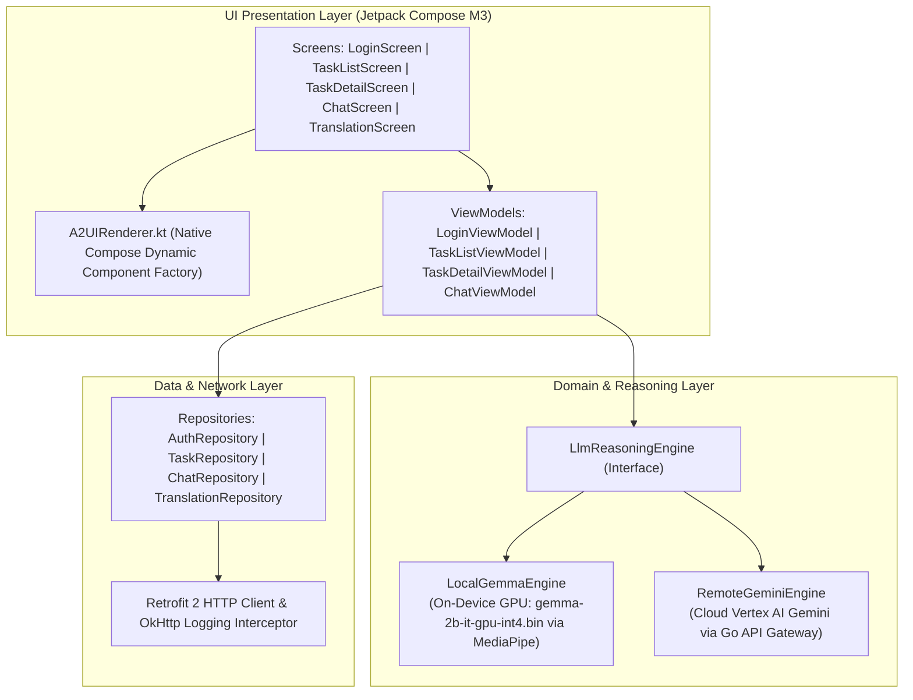

### A. Core Android Screens & User Workflows

#### 1. Login Screen (`ui/screens/login/LoginScreen.kt` & `LoginViewModel.kt`)
- **Authentication:** Authenticates with Google OAuth 2.0 using the client credentials and developer certificate SHA-1 fingerprint registered in the Google Cloud Console.
- **Auto-Routing:** Validates existing session tokens in `AuthRepository`. On success, navigates the user to the `TaskListScreen`.

#### 2. Task List Screen (`ui/screens/tasks/TaskListScreen.kt` & `TaskListViewModel.kt`)
- **Layout:** Displays a scrollable, prioritized list of active store task cards.
- **Visual Badging:**
  - Priority 1: Glowing Critical Red border and badge.
  - Priority 2: High Warning Amber badge.
  - Priority 3: Standard Blue badge.
- **Interactions:**
  - Pull-to-refresh triggers asynchronous synchronization with `GET /api/v1/organizations/{orgId}/sites/{siteId}/tasks`.
  - Filter chips toggle between All Tasks, My Tasks, and Role-specific queues.
  - Tapping a task card navigates to `TaskDetailScreen`.

#### 3. Task Detail Screen (`ui/screens/detail/TaskDetailScreen.kt` & `StoreMap.kt`)
- **Store Map Visualization:** Embeds the custom Compose `StoreMap` component, drawing the store floor plan vector canvas with target fixture beacons.
- **Checklist Step Execution:** Associates toggle checklist items sequentially. Each toggle updates local Compose state and dispatches a patch request to the Go backend.
- **Asset Constraint Override:** If a task is blocked due to an unavailable asset (e.g., forklift broken), associates tap "Override Constraint", enter a justification, and submit a GORM-audited supervisor override.

#### 4. Shift Coach Chat Screen (`ui/screens/chat/ChatScreen.kt` & `ChatViewModel.kt`)
- **Conversational Interface:** Associate chats directly with the Shift Coach assistant.
- **A2UI Rendering:** Message responses containing structured A2UI payloads are rendered natively via `A2UIRenderer.kt`, transforming JSON card envelopes into Compose `Card`, `Column`, `Row`, `Button`, `Text`, `OutlinedTextField`, and `AsyncImage` components.

#### 5. Real-Time Voice Translation Screen (`ui/screens/translate/TranslationScreen.kt`)
- **Multilingual Operational Support:** Facilitates real-time voice translation between store associates and non-English-speaking customers.
- **Operational Modes:**
  - **Translate Talk:** Associate holds the microphone button and speaks in English. The app captures 16kHz PCM audio, transmits it to `POST /api/v1/translate/talk`, receives translated audio (in Spanish, French, German, etc.) synthesized in the associate's cloned or chosen HD voice, and plays it via Android `MediaPlayer`.
  - **Translate Listen:** Customer speaks into the device in their native language. The app transmits audio to `POST /api/v1/translate/listen`, which transcribes, translates to English, synthesizes audio, and displays the translated text transcription on screen.
- **Voice Profile Setup:** Associates record an official consent phrase to generate a Google Cloud Chirp 3 instant voice clone key, enabling the system to speak foreign languages in their own voice.

### B. Dual-Engine LLM Reasoning Architecture (`domain/llm/`)

To guarantee operational resilience in retail environments with intermittent connectivity (e.g., deep warehouse basements or metal-shielded stockrooms), GTasks implements a dual-tier LLM engine:

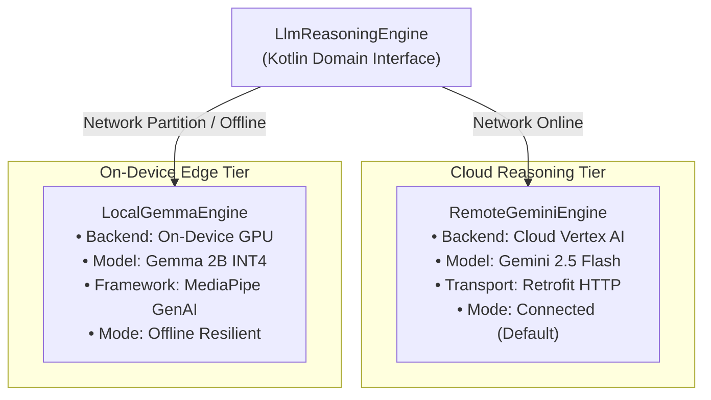

1. **`RemoteGeminiEngine` (Cloud Default):** Routes reasoning requests through the Go API Gateway and Vertex AI Gemini models, accessing full real-time database grounding and pgvector SOP retrieval.
2. **`LocalGemmaEngine` (On-Device Fallback):** When network connectivity is lost, the app switches to the on-device `LocalGemmaEngine`. Powered by Google MediaPipe Tasks GenAI (`com.google.mediapipe:tasks-genai`), it loads the quantized `gemma-2b-it-gpu-int4.bin` model directly on the device GPU, enabling offline conversational reasoning and procedure lookup.

---

## 4. Standalone Agentic Voice & Map Cockpit (`web/agentic`)

Located in [`/web/agentic`](../../web/agentic), this application serves as a dedicated, full-screen agentic cockpit featuring:
- **Continuous Speech Recognition:** Uses the Web Speech API (`webkitSpeechRecognition`) for hands-free voice commands.
- **Voice Feedback & Synthesis:** Speech synthesis reads coaching responses back to the user.
- **Dual-Pane Digital Twin:** The left pane houses the conversational chat timeline and A2UI card renderer; the right pane renders an interactive SVG floor blueprint with live coordinate tracking.
- **Direct A2A SSE Streaming:** Connects directly to the Python ADK Task Agent (`/a2a/task_agent`) over Server-Sent Events (SSE).

---

## 5. A2UI Render Test Workbench (`web/render-test`)

Located in [`/web/render-test`](../../web/render-test), this application provides an isolated testing workbench for:
- Verifying A2UI v0.8 component rendering across different browser viewports.
- Stress-testing nested Column/Row layout constraints and button stretching behavior.
- Validating dynamic form state binding and input dispatch contracts without backend dependencies.

---

## 6. End-to-End User Interaction Lifecycles

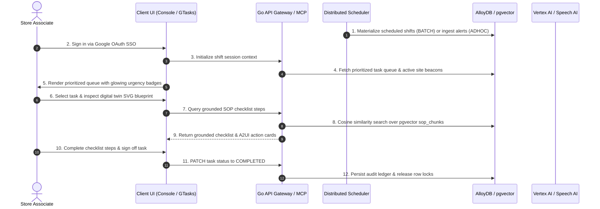

---

<a id="chapter-6-distributed-scheduler-daemon"></a>
# Chapter 6: Distributed Scheduler Daemon

## Distributed Background Scheduler & Job Manager Specification
## Architecture, Intent, and Operational Functionality (v1.0)

This manual outlines the architectural intent, concurrency-safe designs, and execution loops implemented inside the Enterprise Task Engine background scheduling tier under [scheduler.go](../../pkg/service/scheduler.go).

---

## 1. Overview & Architectural Intent

The background scheduler coordinates scheduled **BATCH** sweeps (materializing workforce shifts and checklist event allocations) and parallel **ADHOC** process queues (indexing RAG documents, extracting text chunks, and embedding vectors).

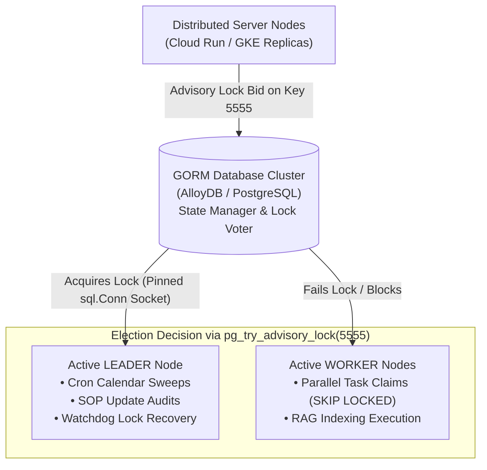

The system is designed for horizontal scaling across dozens of microservice replicas. It leverages the underlying PostgreSQL database cluster as the single source of truth for leader status, lock leases, and job state coordination:
* **Zero External Dependencies:** Relies natively on PostgreSQL dialers, eliminating the operational overhead of managing external lock managers like Redis, Consul, or ZooKeeper.
* **Split-Brain Prevention:** Ensures that exactly one node acts as the Scheduler Leader to drive chronological sweeps, while all nodes (including the Leader) act as concurrent parallel Workers to process task payloads.
* **Self-Healing Failover:** If the active leader node crashes or suffers network partitioning, the database cluster automatically drops the socket lease, allowing worker nodes to transparently claim leadership on the next check block.

---

## 2. Core Functional Components

### A. Distributed Leader Election & Lease Maintenance
Leader election restricts recurring calendar sweeps, SOP update checks, and watchdog locks recovery to a single active server node, protecting against race conditions.

#### 1. PostgreSQL Advisory Locks
The node bids for leadership by attempting to acquire a session-level advisory lock on a unique key `5555`:
```sql
SELECT pg_try_advisory_lock(5555);
```
Advisory locks are session-bound. The lock is tied directly to the database TCP connection socket and is automatically released if the socket is closed or dropped.

#### 2. Dedicated Connection Pinning (`sql.Conn`)
Standard database client pools (like GORM's standard wrapping connection pools) dynamically recycle sockets across queries, causing session-bound advisory locks to be silently lost. To guarantee lock lease stability, the scheduler allocates a single, dedicated TCP socket directly from the driver pool context on start:
```go
sqlDB, _ := db.DB()
conn, _ := sqlDB.Conn(ctx) // Pinned net connection socket
```
All advisory lock operations (attempts, verification checking, and releases) are executed exclusively over this pinned connection socket wrapper.

#### 3. Automatic failovers Lease Handover
Nodes check the leader lock status periodically (every `15s` by default, configurable):
* The active leader verifies it still holds the lock using the GORM checker:
  ```sql
  SELECT pg_advisory_lock_keys() @> ARRAY[5555::bigint];
  ```
* If a node fails to verify its lease, it releases the stale connection, marks its leader status as `false`, and returns to a worker role.
* If a leader crashes, PostgreSQL drops the TCP connection pool after standard keep-alive intervals, making the advisory lock key available for the remaining cluster nodes to bid on during their next election tick.

---

## 3. Parallel SKIP LOCKED Concurrent Workers
Multiple worker nodes concurrently claim and process pending task executions and SOP indexing process records without double-claiming.

#### 1. Concurrency-Safe claims
Each worker node routinely polls the database (every `5s` by default, configurable) to claim task executions (up to 5 records) and SOP indexing process runs (up to 2 records) under GORM transaction loops:
```sql
SELECT * FROM task_executions 
WHERE status = 'PENDING' 
AND (locked_at IS NULL OR locked_at < ?) 
ORDER BY priority ASC, created_at ASC 
LIMIT ? 
FOR UPDATE SKIP LOCKED;
```
* **`FOR UPDATE`:** Places a database row lock on the claimed matches, blocking concurrent transactions from editing the selected rows.
* **`SKIP LOCKED`:** Instructs concurrent query executions to automatically bypass already locked rows rather than blocking. This allows worker nodes to divide and conquer the queue in parallel with zero lock contention.

#### 2. Atomic Lock Tagging
Inside the same transaction, claimed rows are immediately flagged to prevent other workers from selecting them once row locks release:
```go
tx.Model(&model.TaskExecution{}).
    Where("id IN ?", claimedIDs).
    Updates(map[string]interface{}{
        "status":    "IN_PROGRESS",
        "locked_at": time.Now(),
        "locked_by": s.nodeID, // Unique string node identifier
    })
```
Once the transaction commits, row locks release but the logical lock (flagged via `locked_at` and `locked_by` parameters) persists until the worker completes the payload execution and marks status to `COMPLETED`.

---

## 4. Lock Timeout Recovery & Dead Letter Watchdog
The watchdog recovery routine runs periodically (every `30s` by default, Leader node only, configurable) to automatically self-heal stalled or crashed worker pipelines.

#### 1. Timeout Auditing
If a worker node crashes mid-execution, the logical lock on the task remains active, stalling execution. The watchdog queries for tasks and SOP processes stuck in `IN_PROGRESS` longer than the lock timeout threshold (`5m` by default, configurable):
```sql
SELECT * FROM task_executions WHERE status = 'IN_PROGRESS' AND locked_at < ?;
```

#### 2. Retry Boundaries & Dead Letter Routing
For each stalled task execution detected:
* **Retry Under Limit:** If the `RetryCount` is less than `MaxRetries` (default: 3), the watchdog resets the lock columns, logs the error, and reverts the status to `PENDING`:
  * `status = 'PENDING'`
  * `locked_at = NULL`
  * `locked_by = NULL`
  * `retry_count = retry_count + 1`
  * `last_error = "lock timeout error..."`
  * The task is returned to the active queue context for other worker nodes to claim.
* **Retry Limit Exceeded:** If the task fails 3 times, it is flagged as a high-risk operational barrier. The watchdog isolates the task permanently by moving it into a terminal state queue:
  * `status = 'DEAD_LETTER'`
  * `locked_at = NULL`
  * `locked_by = NULL`
  * Increments system failure counts to alert administrative monitoring channels.

For each stalled SOP process run detected, it is similarly reverted back to `PENDING` for a retry attempt, or permanently marked as `FAILED` if maximum retry boundaries are exceeded, cleanly preserving structural integrity across workers.

---

## 5. SOP Metadata Verification & Ingestion Sweeper
The leader node monitors active Standard Operating Procedure (SOP) targets periodically (every `60s` by default, configurable) to detect external document updates and refresh embedding pools dynamically.

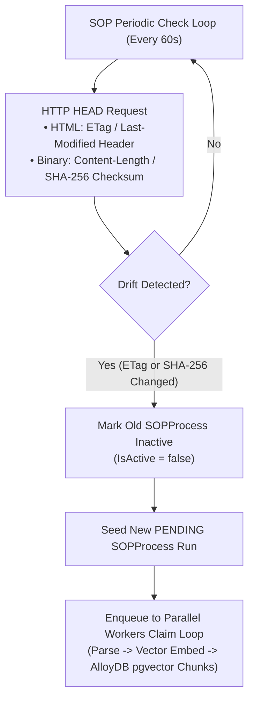

* **HTML Caching Audit:** Emits HTTP `HEAD` checks. Compares the returned HTTP `ETag` or `Last-Modified` headers against the values saved inside the `SOP.Metadata` JSONB column.
* **Binary Checksum Audit:** Compares HTTP `Content-Length`. If unchanged, emits a deep verification HTTP `GET` call, hashes the downloaded byte stream using SHA-256, and compares the resulting hex checksum against the saved fingerprint.
* **Refreshed Ingestion Trigger:** If a drift is detected:
  * The old GORM `SOPProcess` record is flagged as inactive (`IsActive = false`).
  * A new process tracking row is enqueued in GORM (`Status = 'IN_PROGRESS'`) locked under `DIRECT_INGEST` to guarantee atomic concurrency protection, preventing concurrent worker picking sweeps during active downloads.
  * The immediately-dispatched goroutine parses, semantic-chunks, extracts vector embeddings, and registers the new chunks in AlloyDB, completing execution by marking status to `COMPLETED`.

---

## 6. Administrative REST Controller Interface

The scheduler exposes JSON controllers mapped under [admin.go](../../pkg/api/admin.go) to provide cluster observability and direct manual controls:

### 1. Diagnostic Status Lookup
* **Route:** `GET /api/v1/admin/scheduler/status`
* **Response Body:** Returns a [SchedulerStatus](../../pkg/service/scheduler.go#L20-L29) diagnostic structure:
  ```json
  {
    "node_id": "node-484af84c",
    "is_leader": true,
    "active_workers": 2,
    "tasks_claimed": 142,
    "tasks_completed": 140,
    "tasks_failed": 2,
    "last_leader_election": "2026-05-22T10:08:00Z",
    "last_error": "advisory lock query failed..."
  }
  ```

### 2. Manual Sweep Trigger
* **Route:** `POST /api/v1/admin/scheduler/trigger`
* **Intent:** Bypasses standard cron time clocks. Instantly forces leader-only sweeps to compile calendar recurrence rules and materialize event workload checklists inside AlloyDB. Only accepted when executed against the active leader node.

---

## 7. Verification & Testing Mappings

Comprehensive testing configurations are registered inside [scheduler_test.go](../../pkg/service/scheduler_test.go) and [server_test.go](../../pkg/api/server_test.go):

* **Database-Independent locking Tests:** Mocks standard advisory lock bid connections and row-level skips programmatically using the mockable `sqlAdvisoryLockClient` interface inside test loops, allowing tests to run hermetically without requiring PostgreSQL pools.
* **GORM Dry-Run Connection Pools:** Leverages a custom mock `gorm.ConnPool` connection pool structure passed into GORM Configs in dry-run mode. This completely bypasses local host Postgres Port 5432 SASL authentication password checks, enabling test suites to run safely inside hermetic Bazel build sandboxes.
* **Watchdog & Watchdog Recovery Checks:** Verifies that stale progress locks recover to PENDING, increment the retry counter, and correctly route to the terminal `DEAD_LETTER` state queue upon exceeding limit checks. Also verifies that stalled background process runs are successfully retried or failed.

---

<a id="chapter-7-a2ui-architecture-engine"></a>
# Chapter 7: A2UI Architecture & Engine

## Agentic User Interface (A2UI) Architecture
## Multi-Platform Protocol, MCP Tool Integration & Dynamic Rendering Engines (v5.0)

> [!NOTE]
> This specification documents the **Agentic User Interface (A2UI)** protocol implementation within the Enterprise Task Engine. It details the JSON wire contracts, MCP tool integrations, Python ADK transpiler mechanisms, Go AST transformers, and multi-platform rendering engines across React and Android Jetpack Compose.

---

## 1. Architectural Intent & Design Philosophy

Traditional agentic chatbots return unstructured conversational markdown text, forcing users to parse raw numbers, copy IDs, and type manual confirmation phrases. **Agentic User Interface (A2UI)** elevates this interaction model into a **Server-Driven Dynamic UI Framework**:

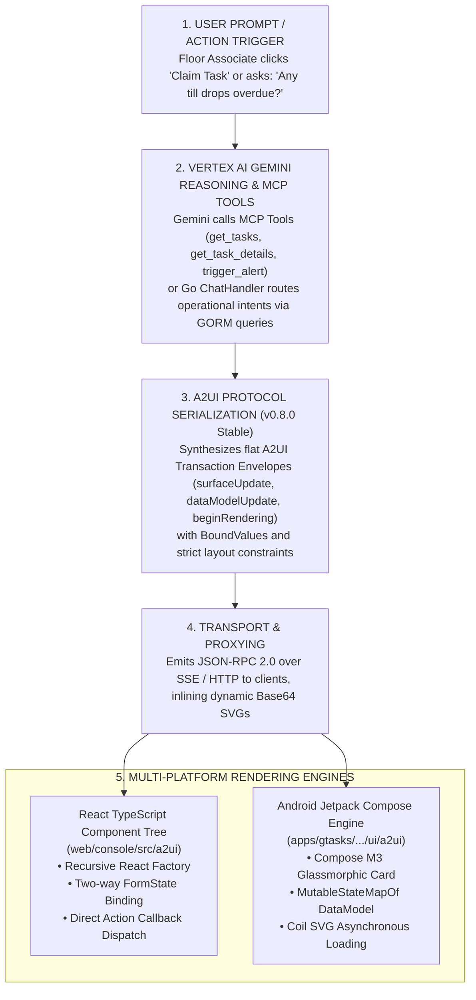

---

## 2. A2UI Protocol Wire Specification (v0.8.0 Stable)

The Enterprise Task Engine strictly standardizes on the **A2UI v0.8.0 Stable** wire schema.

### A. The A2UI Transaction Envelope

All A2UI payloads returned over JSON-RPC 2.0 or HTTP chat APIs are wrapped inside an `A2UITransaction` envelope consisting of three core blocks:

```json
{
  "surfaceUpdate": {
    "surfaceId": "surface_site_tasks",
    "components": [
      {
        "id": "card_root",
        "component": {
          "Card": {
            "title": "CASH VAULT DROP VERIFICATION",
            "child": "layout_col"
          }
        }
      },
      {
        "id": "layout_col",
        "component": {
          "Column": {
            "alignment": "stretch",
            "distribution": "start",
            "crossAxisAlignment": "Stretch",
            "mainAxisAlignment": "Start",
            "gap": 12,
            "children": {
              "explicitList": ["text_warning", "btn_override"]
            }
          }
        }
      }
    ]
  },
  "dataModelUpdate": {
    "surfaceId": "surface_site_tasks",
    "data": {
      "/store_switcher/selected": "44444444-4444-4444-4444-444444440001",
      "/form/justification": ""
    }
  },
  "beginRendering": {
    "surfaceId": "surface_site_tasks",
    "root": "card_root",
    "styles": {
      "--color-primary": "#0071ce",
      "--color-critical": "#ef4444"
    }
  }
}
```

1. **`surfaceUpdate`:** A flattened list of all UI components comprising the view hierarchy, each assigned a unique `id`.
2. **`dataModelUpdate` (Optional):** A key-value state store mapping JSON Pointer paths (e.g., `"/form/justification"`) to bound form inputs and reactive values.
3. **`beginRendering`:** Designates the root component identifier (`root: "card_root"`) to initiate rendering and injects CSS/design token theme variables.

### B. BoundValue Architecture

To decouple presentation layout from dynamic data binding, property values in A2UI v0.8 use polymorphic `BoundValue` structures:

```go
type BoundValue struct {
    LiteralString  *string  `json:"literalString,omitempty"`
    LiteralBoolean *bool    `json:"literalBoolean,omitempty"`
    LiteralNumber  *float64 `json:"literalNumber,omitempty"`
    Path           *string  `json:"path,omitempty"`
}
```

- **Literal Values:** Explicit static text (`{"literalString": "Submit"}`), numbers (`{"literalNumber": 42}`), or booleans (`{"literalBoolean": true}`).
- **Path Pointers:** Dynamic references into the `dataModelUpdate` pool (`{"path": "/store_switcher/selected"}`). When an input modifies the state, all components bound to that path re-evaluate reactively.

### C. Component Catalog Reference

| Component Type | Schema Wrapper | Key Properties | Operational Usage |
| :--- | :--- | :--- | :--- |
| **`Card`** | `{"Card": { ... }}` | `title`, `child`, `style` | Outer container card with glassmorphic border and optional title. Supports a single `child` container pointer. |
| **`Column`** | `{"Column": { ... }}` | `alignment`, `distribution`, `crossAxisAlignment`, `mainAxisAlignment`, `gap`, `children.explicitList` | Vertical flexbox container for stacking components sequentially. |
| **`Row`** | `{"Row": { ... }}` | `alignment`, `distribution`, `crossAxisAlignment`, `mainAxisAlignment`, `gap`, `children.explicitList` | Horizontal flexbox container for placing elements side-by-side. |
| **`Text`** | `{"Text": { ... }}` | `text` (BoundValue), `usageHint`, `style` | Typographic labels, headers, and descriptions. |
| **`Button`** | `{"Button": { ... }}` | `child` (Text ID), `label`, `primary`, `action` (`type`, `name`, `context`) | Interactive button triggering API callbacks or state submissions. |
| **`TextInput`** | `{"TextInput": { ... }}` | `label`, `required`, `dataBindingPath` | Single-line text input field bound to a state path. |
| **`CheckBox`** | `{"CheckBox": { ... }}` | `label` (BoundValue), `value` (BoundValue) | Boolean toggle checkbox bound to a state path. |
| **`Image`** | `{"Image": { ... }}` | `url` (BoundValue) | Dynamic vector floor plans or external media assets. |
| **`MultipleChoice`**| `{"MultipleChoice": { ... }}`| `options`, `selections` (BoundValue), `maxAllowedSelections` | Single-select or multi-select dropdown picker. |
| **`WebFrameSrcdoc`**| `{"WebFrameSrcdoc": { ... }}`| `htmlContent` (BoundValue), `height` | Sandboxed inline HTML/iframe container for rich widgets. |
| **`Divider`** | `{"Divider": {}}` | (empty struct) | Horizontal structural boundary separator. |

### D. Typographic & Alignment Normalization Rules

1. **Typographic Schema Normalization:** Valid `usageHint` values in A2UI v0.8 are strictly limited to `"h1"`, `"h2"`, `"h3"`, `"body"`, and `"caption"`. Invalid values (`"primary"`, `"secondary"`) are automatically mapped to `"body"` or `"caption"` by the Go and Python normalizers.
2. **Dual Alignment Population:** To ensure compatibility across web and mobile parsers, all Column and Row containers concurrently populate standard web properties (`alignment`, `distribution`) and Flutter-style properties (`crossAxisAlignment`, `mainAxisAlignment`).

---

## 3. Model Context Protocol (MCP) Server Integration (`pkg/api/mcp.go`)

The Go API Gateway exposes a fully featured Model Context Protocol (MCP) server over JSON-RPC 2.0 at `/api/v1/mcp` and `/api/v1/organizations/:orgId/sites/:siteId/users/:userId/sessions/shift/:shiftId/chat`.

### A. Registered MCP Tools Catalog

| Tool Name | Operational Functionality & Payload Return |
| :--- | :--- |
| **`get_tasks`** | Retrieves prioritized task executions for a site. Formats directly into A2UI card transactions. |
| **`get_task_details`** | Returns step-by-step checklist JSON for an individual task execution. |
| **`claim_task`** | Claims/assigns an active task execution to the current authenticated user. |
| **`update_task_status`** | Mutates status (`IN_PROGRESS`, `COMPLETED`), appending audit records. |
| **`override_asset`** | Submits an audited compliance override with supervisor justification. |
| **`propose_trade`** | Initiates a peer task trade proposal between store associates. |
| **`accept_trade`** | Accepts a pending peer task trade, reassigning execution ownership. |
| **`reject_trade`** | Denies an incoming peer task trade proposal. |
| **`query_sop`** | Vector cosine similarity search over `sop_chunks` using `pgvector`. |
| **`trigger_alert`** | Ingests ad-hoc streaming alerts (till drop, spill, call bell). |
| **`get_site_locations`** | Lists store fixtures, registers, and aisles with coordinate metadata. |
| **`get_weather`** | Fetches live NOAA METAR observations and wind statistics for the site airport code. |
| **`get_store_selector`** | Emits a store context switcher single-select A2UI card. |
| **`get_user_context`** | Returns user profile, active roles, and assigned storefront sites. |

### B. Direct-Return Card Update Pattern (Rate-Limit Mitigation)

In naive agent implementations, an action like "Claim Task" requires multiple sequential LLM turns:
1. Turn 1: User prompt $\rightarrow$ LLM invokes `claim_task`.
2. Turn 2: Tool returns string $\rightarrow$ LLM invokes `get_task_details`.
3. Turn 3: Tool returns details $\rightarrow$ LLM outputs formatted response.

In enterprise environments with API quota limits, this high request rate triggers `429 RESOURCE_EXHAUSTED` errors.

**The Solution:** The Enterprise Task Engine implements the **Direct-Return Card Update Pattern**:
- Tool handlers (`claim_task`, `update_task_status`) directly synthesize and return the updated A2UI details card (`[A2UI_CARD_TASK_DETAILS_CACHED]`) in the tool output payload.
- System prompts instruct Gemini that the card is pre-rendered and that subsequent tool calls are prohibited.
- This reduces LLM round-trips by 33%, eliminates 429 quota exhaustion, and cuts UI response latency from ~3.2s to ~1.1s.

---

## 4. Python ADK Task Agent Integration (`cmd/task_agent`)

The Python ADK service runs as an independent FastAPI service on port `:8081` (`Dockerfile.agent`), providing advanced A2UI transpilation and blueprint generation:

### A. Transpiler Architecture (`a2ui_transpiler.py`)
- **Monkeypatch Integration:** Intercepts outgoing A2A `SendMessageResponse` messages to ensure strict compliance with A2UI v0.8 schemas.
- **Markdown Interception:** Extracts uppercase ````JSON` and lowercase ````json` code blocks emitted by the LLM, parses the AST, and compiles them into flat A2UI component lists.
- **Dropdown Collapsing Pattern:** When the LLM outputs multiple consecutive buttons targeting context switching (such as `"SET_STORE"`), the transpiler automatically collapses them into a single-select `MultipleChoice` dropdown accompanied by a "Submit" button, preventing viewport clutter.

### B. Dynamic Blueprint Generation & Base64 Vector Inlining
- **Dynamic Endpoint:** Exposes `GET /api/v1/blueprint?layout=linear&x=175&y=25`, rendering SVG floor plans with pulsating beacon circles.
- **Mixed Content Resolution:** When served in HTTPS environments, referencing `http://` localhost images triggers browser Mixed Content blocks. The transpiler intercepts `canvas` nodes, renders the SVG in-memory, base64-encodes the bytes, and inlines a self-contained Data URI:
  ```json
  "url": {
    "literalString": "data:image/svg+xml;base64,PHN2ZyB4bWxucz0..."
  }
  ```

---

## 5. React Rendering Engine (`web/console/src/a2ui` & `web/agentic/src/a2ui`)

The web rendering engine implements a recursive component factory in TypeScript:

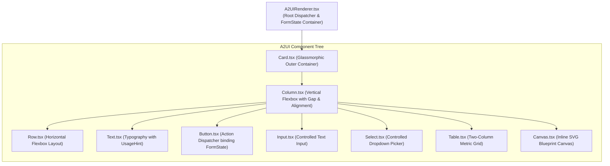

### Dynamic Form State Binding
`A2UIRenderer.tsx` maintains a central `formState: Record<string, any>` in local state. As users type into `Input` fields or make selections in `Select` dropdowns, the state updates reactively. When an associated `Button` is clicked, it packages the current `formState` alongside its configured `actionData` and dispatches through `onActionTrigger(action, data)`.

---

## 6. Android Jetpack Compose Rendering Engine (`apps/gtasks`)

Located in [`/apps/gtasks/.../ui/a2ui/A2UIRenderer.kt`](../../apps/gtasks/app/src/main/java/com/google/gtasks/ui/a2ui/A2UIRenderer.kt), the Android rendering engine maps A2UI transactions directly to native Compose UI elements:

```kotlin
@Composable
fun A2UIRenderer(
    transaction: A2UITransaction,
    modifier: Modifier = Modifier,
    onAction: (ButtonAction, Map<String, JsonElement>) -> Unit
) {
    // 1. Reactive Data Model State Pool
    val dataModel = remember(transaction) {
        mutableStateMapOf<String, JsonElement>().apply {
            transaction.dataModelUpdate?.data?.let { putAll(it) }
        }
    }

    // 2. Flattened Component Lookup Map
    val componentsMap = remember(transaction) {
        transaction.surfaceUpdate.components.associateBy { it.id }
    }

    // 3. Recursive Component Tree Traversal from Root ID
    Box(modifier = modifier.fillMaxWidth()) {
        RenderComponent(
            componentId = transaction.beginRendering.root,
            componentsMap = componentsMap,
            dataModel = dataModel,
            onAction = onAction
        )
    }
}
```

### Key Jetpack Compose Component Mappings
1. **`CardProps` $\rightarrow$ `Card`:** Styled with `.glassmorphic(elevation = 8.dp)` and Material 3 container colors.
2. **`ColumnProps` / `RowProps` $\rightarrow$ `Column` / `Row`:** Configured with `Arrangement.spacedBy(props.gap.dp)` and dynamic alignment mapping.
3. **`TextProps` $\rightarrow$ `Text`:** Resolves `BoundValue` pointers against `dataModel` and applies Material 3 typography styles (`titleMedium`, `labelSmall`, `bodyMedium`).
4. **`ButtonProps` $\rightarrow$ `Button` / `OutlinedButton`:** Dispatches `onAction(action, dataModel)` on click.
5. **`TextInputProps` $\rightarrow$ `OutlinedTextField`:** Two-way binding updates `dataModel[props.dataBindingPath]` as the user types.
6. **`ImageProps` $\rightarrow$ `AsyncImage`:** Uses Coil to load remote URLs, dynamic SVGs, and base64 data URIs.
7. **`MultipleChoiceProps` $\rightarrow$ `ExposedDropdownMenuBox`:** Native Material 3 dropdown selector updating bound state paths.

---

<a id="chapter-8-workspace-directory-store-mapping"></a>
# Chapter 8: Workspace Directory & Store Mapping

## Google Workspace Directory & Store Footprint Mapping Reference

This reference manual documents the internal sandbox Google Workspace directory, Organizational Unit (OU) topologies, store-level personnel matrix, role configurations, and regional footprints used within the **Enterprise Task Engine**.

---

## 1. Google Workspace Directory OU Structure

To test enterprise role-based access controls (RBAC), multi-store operational overlaps, and location-based document grounding (pgvector localized SOP filters), the local sandbox environment implements a fully structured Google Workspace tree. 

Parent and child OUs are organized operationally:

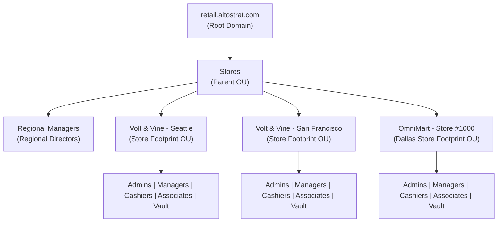

---

## 2. Active Test Personnel Identity Matrix

The sandbox Workspace directory has been provisioned to support **553 role profiles** spanning **109 physical storefront locations** and **4 regional managers**.

### User Account Naming Conventions
* **Store Level Users:** `{role_slug}-{store_slug}@retail.altostrat.com`
* **Regional Managers:** `regional-manager-{region_slug}@retail.altostrat.com`
* **Initial Passwords Registry:** All temporary credentials and initial login passwords are cataloged inside the secure, git-ignored file `passwords_registry.csv`.

### Active Regional Directors Mapping
Due to sandbox limitations, the **6 retail regions** are mapped to the **4 active regional profiles** inside the core Workspace directory to prevent authentication constraints:

| Retail Footprint Region | Active Workspace Manager Account | Scopes & Responsibilities |
| :--- | :--- | :--- |
| `northeast` | `regional-manager-northeast@retail.altostrat.com` | Northeast Footprint |
| `southeast` | `regional-manager-southeast@retail.altostrat.com` | Southeast Footprint |
| `northwest` | `regional-manager-west@retail.altostrat.com` | Pacific Northwest Footprint |
| `southwest` | `regional-manager-west@retail.altostrat.com` | Pacific Southwest Footprint |
| `northcentral` | `regional-manager-midwest@retail.altostrat.com` | Northcentral Footprint |
| `southcentral` | `regional-manager-midwest@retail.altostrat.com` | Southcentral Footprint |

---

## 3. Complete Store & Region Mapping Table

The complete lookup matrix below identifies all 109 physical store entities, their assigned regional directors, slugs, and unique ID prefixes:

| Region | Store ID Prefix | Physical Store Name | Store Slug | Mapped Regional Director |
| :--- | :--- | :--- | :--- | :--- |
| `northcentral` | `55555555...0009` | OmniMart - Store #1009 (Columbus) | `omnimart-store-1009-columbus` | `regional-manager-midwest` |
| `northcentral` | `55555555...000a` | OmniMart - Store #1010 (Indianapolis) | `omnimart-store-1010-indianapolis` | `regional-manager-midwest` |
| `northcentral` | `55555555...0013` | OmniMart - Store #1019 (Detroit) | `omnimart-store-1019-detroit` | `regional-manager-midwest` |
| `northcentral` | `55555555...001a` | OmniMart - Store #1026 (Milwaukee) | `omnimart-store-1026-milwaukee` | `regional-manager-midwest` |
| `northcentral` | `55555555...0029` | OmniMart - Store #1041 (Minneapolis) | `omnimart-store-1041-minneapolis` | `regional-manager-midwest` |
| `northcentral` | `55555555...0030` | OmniMart - Store #1048 (Cleveland) | `omnimart-store-1048-cleveland` | `regional-manager-midwest` |
| `northcentral` | `55555555...0031` | OmniMart - Store #1049 (Aurora) | `omnimart-store-1049-aurora` | `regional-manager-midwest` |
| `northcentral` | `55555555...0039` | OmniMart - Store #1057 (Stockton) | `omnimart-store-1057-stockton` | `regional-manager-midwest` |
| `northcentral` | `55555555...003a` | OmniMart - Store #1058 (Saint Paul) | `omnimart-store-1058-saint-paul` | `regional-manager-midwest` |
| `northcentral` | `55555555...003b` | OmniMart - Store #1059 (Cincinnati) | `omnimart-store-1059-cincinnati` | `regional-manager-midwest` |
| `northcentral` | `55555555...003f` | OmniMart - Store #1063 (Lincoln) | `omnimart-store-1063-lincoln` | `regional-manager-midwest` |
| `northcentral` | `55555555...0047` | OmniMart - Store #1071 (Toledo) | `omnimart-store-1071-toledo` | `regional-manager-midwest` |
| `northcentral` | `55555555...0048` | OmniMart - Store #1072 (Fort Wayne) | `omnimart-store-1072-fort-wayne` | `regional-manager-midwest` |
| `northcentral` | `55555555...004d` | OmniMart - Store #1077 (Madison) | `omnimart-store-1077-madison` | `regional-manager-midwest` |
| `northcentral` | `55555555...0060` | OmniMart - Store #1096 (Des Moines) | `omnimart-store-1096-des-moines` | `regional-manager-midwest` |
| `northcentral` | `44444444...0005` | Volt & Vine - Chicago | `volt-and-vine-chicago` | `regional-manager-midwest` |
| `northeast` | `55555555...0004` | OmniMart - Store #1004 (Philadelphia) | `omnimart-store-1004-philadelphia` | `regional-manager-northeast` |
| `northeast` | `55555555...000f` | OmniMart - Store #1015 (Washington) | `omnimart-store-1015-washington` | `regional-manager-northeast` |
| `northeast` | `55555555...0010` | OmniMart - Store #1016 (Boston) | `omnimart-store-1016-boston` | `regional-manager-northeast` |
| `northeast` | `55555555...0019` | OmniMart - Store #1025 (Baltimore) | `omnimart-store-1025-baltimore` | `regional-manager-northeast` |
| `northeast` | `55555555...0044` | OmniMart - Store #1068 (Newark) | `omnimart-store-1068-newark` | `regional-manager-northeast` |
| `northeast` | `55555555...004b` | OmniMart - Store #1075 (Jersey City) | `omnimart-store-1075-jersey-city` | `regional-manager-northeast` |
| `northeast` | `55555555...0051` | OmniMart - Store #1081 (Buffalo) | `omnimart-store-1081-buffalo` | `regional-manager-northeast` |
| `northeast` | `44444444...0008` | Volt & Vine - Boston | `volt-and-vine-boston` | `regional-manager-northeast` |
| `northeast` | `44444444...0007` | Volt & Vine - New York | `volt-and-vine-new-york` | `regional-manager-northeast` |
| `northwest` | `55555555...000d` | OmniMart - Store #1013 (Seattle) | `omnimart-store-1013-seattle` | `regional-manager-west` |
| `northwest` | `55555555...0015` | OmniMart - Store #1021 (Portland) | `omnimart-store-1021-portland` | `regional-manager-west` |
| `northwest` | `55555555...0040` | OmniMart - Store #1064 (Anchorage) | `omnimart-store-1064-anchorage` | `regional-manager-west` |
| `northwest` | `55555555...005d` | OmniMart - Store #1093 (Boise) | `omnimart-store-1093-boise` | `regional-manager-west` |
| `northwest` | `55555555...005f` | OmniMart - Store #1095 (Spokane) | `omnimart-store-1095-spokane` | `regional-manager-west` |
| `northwest` | `55555555...0061` | OmniMart - Store #1097 (Tacoma) | `omnimart-store-1097-tacoma` | `regional-manager-west` |
| `northwest` | `44444444...0000` | Volt & Vine - Seattle | `volt-and-vine-seattle` | `regional-manager-west` |
| `southcentral` | `55555555...0000` | OmniMart - Store #1000 (Dallas) | `omnimart-store-1000-dallas` | `regional-manager-midwest` |
| `southcentral` | `55555555...0001` | OmniMart - Store #1001 (Houston) | `omnimart-store-1001-houston` | `regional-manager-midwest` |
| `southcentral` | `55555555...0002` | OmniMart - Store #1002 (San Antonio) | `omnimart-store-1002-san-antonio` | `regional-manager-midwest` |
| `southcentral` | `55555555...0007` | OmniMart - Store #1007 (Austin) | `omnimart-store-1007-austin` | `regional-manager-midwest` |
| `southcentral` | `55555555...000e` | OmniMart - Store #1014 (Denver) | `omnimart-store-1014-denver` | `regional-manager-midwest` |
| `southcentral` | `55555555...0011` | OmniMart - Store #1017 (El Paso) | `omnimart-store-1017-el-paso` | `regional-manager-midwest` |
| `southcentral` | `55555555...0014` | OmniMart - Store #1020 (Oklahoma City) | `omnimart-store-1020-oklahoma-city` | `regional-manager-midwest` |
| `southcentral` | `55555555...0018` | OmniMart - Store #1024 (Louisville) | `omnimart-store-1024-louisville` | `regional-manager-midwest` |
| `southcentral` | `55555555...0020` | OmniMart - Store #1032 (Kansas City) | `omnimart-store-1032-kansas-city` | `regional-manager-midwest` |
| `southcentral` | `55555555...0022` | OmniMart - Store #1034 (Omaha) | `omnimart-store-1034-omaha` | `regional-manager-midwest` |
| `southcentral` | `55555555...0023` | OmniMart - Store #1035 (Colorado Springs) | `omnimart-store-1035-colorado-springs` | `regional-manager-midwest` |
| `southcentral` | `55555555...002a` | OmniMart - Store #1042 (Tulsa) | `omnimart-store-1042-tulsa` | `regional-manager-midwest` |
| `southcentral` | `55555555...002e` | OmniMart - Store #1046 (Wichita) | `omnimart-store-1046-wichita` | `regional-manager-midwest` |
| `southcentral` | `55555555...0033` | OmniMart - Store #1051 (Honolulu) | `omnimart-store-1051-honolulu` | `regional-manager-midwest` |
| `southcentral` | `55555555...0036` | OmniMart - Store #1054 (Corpus Christi) | `omnimart-store-1054-corpus-christi` | `regional-manager-midwest` |
| `southcentral` | `55555555...0037` | OmniMart - Store #1055 (Lexington) | `omnimart-store-1055-lexington` | `regional-manager-midwest` |
| `southcentral` | `55555555...003c` | OmniMart - Store #1060 (St. Louis) | `omnimart-store-1060-st-louis` | `regional-manager-midwest` |
| `southcentral` | `55555555...003d` | OmniMart - Store #1061 (Pittsburgh) | `omnimart-store-1061-pittsburgh` | `regional-manager-midwest` |
| `southcentral` | `55555555...0041` | OmniMart - Store #1065 (Plano) | `omnimart-store-1065-plano` | `regional-manager-midwest` |
| `southcentral` | `55555555...004a` | OmniMart - Store #1074 (Laredo) | `omnimart-store-1074-laredo` | `regional-manager-midwest` |
| `southcentral` | `55555555...004e` | OmniMart - Store #1078 (Lubbock) | `omnimart-store-1078-lubbock` | `regional-manager-midwest` |
| `southcentral` | `55555555...0055` | OmniMart - Store #1085 (Winston-Salem) | `omnimart-store-1085-winston-salem` | `regional-manager-midwest` |
| `southcentral` | `55555555...0059` | OmniMart - Store #1089 (Garland) | `omnimart-store-1089-garland` | `regional-manager-midwest` |
| `southcentral` | `55555555...005a` | OmniMart - Store #1090 (Irving) | `omnimart-store-1090-irving` | `regional-manager-midwest` |
| `southcentral` | `55555555...005c` | OmniMart - Store #1092 (Arvada) | `omnimart-store-1092-arvada` | `regional-manager-midwest` |
| `southcentral` | `55555555...0062` | OmniMart - Store #1098 (San Bernardino) | `omnimart-store-1098-san-bernardino` | `regional-manager-midwest` |
| `southcentral` | `44444444...0004` | Volt & Vine - Austin | `volt-and-vine-austin` | `regional-manager-midwest` |
| `southcentral` | `44444444...0003` | Volt & Vine - Denver | `volt-and-vine-denver` | `regional-manager-midwest` |
| `southeast` | `55555555...0008` | OmniMart - Store #1008 (Jacksonville) | `omnimart-store-1008-jacksonville` | `regional-manager-southeast` |
| `southeast` | `55555555...000b` | OmniMart - Store #1011 (Charlotte) | `omnimart-store-1011-charlotte` | `regional-manager-southeast` |
| `southeast` | `55555555...0012` | OmniMart - Store #1018 (Nashville) | `omnimart-store-1018-nashville` | `regional-manager-southeast` |
| `southeast` | `55555555...0017` | OmniMart - Store #1023 (Memphis) | `omnimart-store-1023-memphis` | `regional-manager-southeast` |
| `southeast` | `55555555...0021` | OmniMart - Store #1033 (Atlanta) | `omnimart-store-1033-atlanta` | `regional-manager-southeast` |
| `southeast` | `55555555...0024` | OmniMart - Store #1036 (Raleigh) | `omnimart-store-1036-raleigh` | `regional-manager-southeast` |
| `southeast` | `55555555...0026` | OmniMart - Store #1038 (Virginia Beach) | `omnimart-store-1038-virginia-beach` | `regional-manager-southeast` |
| `southeast` | `55555555...0027` | OmniMart - Store #1039 (Miami) | `omnimart-store-1039-miami` | `regional-manager-southeast` |
| `southeast` | `55555555...002b` | OmniMart - Store #1043 (Tampa) | `omnimart-store-1043-tampa` | `regional-manager-southeast` |
| `southeast` | `55555555...002c` | OmniMart - Store #1044 (Arlington) | `omnimart-store-1044-arlington` | `regional-manager-southeast` |
| `southeast` | `55555555...002d` | OmniMart - Store #1045 (New Orleans) | `omnimart-store-1045-new-orleans` | `regional-manager-southeast` |
| `southeast` | `55555555...003e` | OmniMart - Store #1062 (Greensboro) | `omnimart-store-1062-greensboro` | `regional-manager-southeast` |
| `southeast` | `55555555...0042` | OmniMart - Store #1066 (Orlando) | `omnimart-store-1066-orlando` | `regional-manager-southeast` |
| `southeast` | `55555555...0045` | OmniMart - Store #1069 (Durham) | `omnimart-store-1069-durham` | `regional-manager-southeast` |
| `southeast` | `55555555...0049` | OmniMart - Store #1073 (St. Petersburg) | `omnimart-store-1073-st-petersburg` | `regional-manager-southeast` |
| `southeast` | `55555555...0056` | OmniMart - Store #1086 (Chesapeake) | `omnimart-store-1086-chesapeake` | `regional-manager-southeast` |
| `southeast` | `55555555...0057` | OmniMart - Store #1087 (Norfolk) | `omnimart-store-1087-norfolk` | `regional-manager-southeast` |
| `southeast` | `55555555...005b` | OmniMart - Store #1091 (Hialeah) | `omnimart-store-1091-hialeah` | `regional-manager-southeast` |
| `southeast` | `55555555...005e` | OmniMart - Store #1094 (Richmond) | `omnimart-store-1094-richmond` | `regional-manager-southeast` |
| `southeast` | `44444444...0006` | Volt & Vine - Atlanta | `volt-and-vine-atlanta` | `regional-manager-southeast` |
| `southeast` | `44444444...0009` | Volt & Vine - Miami | `volt-and-vine-miami` | `regional-manager-southeast` |
| `southwest` | `55555555...0003` | OmniMart - Store #1003 (Phoenix) | `omnimart-store-1003-phoenix` | `regional-manager-west` |
| `southwest` | `55555555...0005` | OmniMart - Store #1005 (San Diego) | `omnimart-store-1005-san-diego` | `regional-manager-west` |
| `southwest` | `55555555...0006` | OmniMart - Store #1006 (San Jose) | `omnimart-store-1006-san-jose` | `regional-manager-west` |
| `southwest` | `55555555...000c` | OmniMart - Store #1012 (San Francisco) | `omnimart-store-1012-san-francisco` | `regional-manager-west` |
| `southwest` | `55555555...0016` | OmniMart - Store #1022 (Las Vegas) | `omnimart-store-1022-las-vegas` | `regional-manager-west` |
| `southwest` | `55555555...001b` | OmniMart - Store #1027 (Albuquerque) | `omnimart-store-1027-albuquerque` | `regional-manager-west` |
| `southwest` | `55555555...001c` | OmniMart - Store #1028 (Tucson) | `omnimart-store-1028-tucson` | `regional-manager-west` |
| `southwest` | `55555555...001d` | OmniMart - Store #1029 (Fresno) | `omnimart-store-1029-fresno` | `regional-manager-west` |
| `southwest` | `55555555...001e` | OmniMart - Store #1030 (Sacramento) | `omnimart-store-1030-sacramento` | `regional-manager-west` |
| `southwest` | `55555555...001f` | OmniMart - Store #1031 (Mesa) | `omnimart-store-1031-mesa` | `regional-manager-west` |
| `southwest` | `55555555...0025` | OmniMart - Store #1037 (Long Beach) | `omnimart-store-1037-long-beach` | `regional-manager-west` |
| `southwest` | `55555555...0028` | OmniMart - Store #1040 (Oakland) | `omnimart-store-1040-oakland` | `regional-manager-west` |
| `southwest` | `55555555...002f` | OmniMart - Store #1047 (Bakersfield) | `omnimart-store-1047-bakersfield` | `regional-manager-west` |
| `southwest` | `55555555...0032` | OmniMart - Store #1050 (Anaheim) | `omnimart-store-1050-anaheim` | `regional-manager-west` |
| `southwest` | `55555555...0034` | OmniMart - Store #1052 (Santa Ana) | `omnimart-store-1052-santa-ana` | `regional-manager-west` |
| `southwest` | `55555555...0035` | OmniMart - Store #1053 (Riverside) | `omnimart-store-1053-riverside` | `regional-manager-west` |
| `southwest` | `55555555...0038` | OmniMart - Store #1056 (Henderson) | `omnimart-store-1056-henderson` | `regional-manager-west` |
| `southwest` | `55555555...0043` | OmniMart - Store #1067 (Irvine) | `omnimart-store-1067-irvine` | `regional-manager-west` |
| `southwest` | `55555555...0046` | OmniMart - Store #1070 (Chula Vista) | `omnimart-store-1070-chula-vista` | `regional-manager-west` |
| `southwest` | `55555555...004c` | OmniMart - Store #1076 (Chandler) | `omnimart-store-1076-chandler` | `regional-manager-west` |
| `southwest` | `55555555...004f` | OmniMart - Store #1079 (Scottsdale) | `omnimart-store-1079-scottsdale` | `regional-manager-west` |
| `southwest` | `55555555...0050` | OmniMart - Store #1080 (Reno) | `omnimart-store-1080-reno` | `regional-manager-west` |
| `southwest` | `55555555...0052` | OmniMart - Store #1082 (Gilbert) | `omnimart-store-1082-gilbert` | `regional-manager-west` |
| `southwest` | `55555555...0053` | OmniMart - Store #1083 (Glendale) | `omnimart-store-1083-glendale` | `regional-manager-west` |
| `southwest` | `55555555...0054` | OmniMart - Store #1084 (North Las Vegas) | `omnimart-store-1084-north-las-vegas` | `regional-manager-west` |
| `southwest` | `55555555...0058` | OmniMart - Store #1088 (Fremont) | `omnimart-store-1088-fremont` | `regional-manager-west` |
| `southwest` | `55555555...0063` | OmniMart - Store #1099 (Modesto) | `omnimart-store-1099-modesto` | `regional-manager-west` |
| `southwest` | `44444444...0002` | Volt & Vine - Los Angeles | `volt-and-vine-los-angeles` | `regional-manager-west` |
| `southwest` | `44444444...0001` | Volt & Vine - San Francisco | `volt-and-vine-san-francisco` | `regional-manager-west` |

---

## 4. Directory Sub-OU Role Access Mapping
Inside each retail footprint OU, directory accounts are distributed under five standard sub-OUs mapped to private Relational Database GTE Role IDs:

| Directory Sub-OU | Role Slug | Typical Operational Job Title | internal GTE Database Role ID |
| :--- | :--- | :--- | :--- |
| `Admins` | `admin` | Store Systems Administrator | `ROLE_SITE_MANAGER` |
| `Managers` | `manager` | Store Operations Manager | `ROLE_SITE_MANAGER` |
| `Cashiers` | `cashier` | Store Cashier | `ROLE_SITE_ASSOCIATE` |
| `Associates` | `associate` | Customer Support Associate | `ROLE_SITE_ASSOCIATE` |
| `Vault` | `vault` | Vault Cash Custodian | `ROLE_SITE_ASSOCIATE` |

---

<a id="chapter-9-voice-speech-intelligence"></a>
# Chapter 9: Voice & Speech Intelligence

## Real-Time Voice Translation & Speech Intelligence Architecture
## Google Cloud Speech-to-Text, Neural Translation & Chirp 3 Voice Cloning (v5.0)

> [!NOTE]
> This specification documents the real-time voice translation, speech synthesis, and custom voice cloning pipeline implemented inside the Enterprise Task Engine under `pkg/service/translation.go` and `pkg/api/voice_translation.go`.

---

## 1. Operational Overview & Retail Business Use Case

In multi-regional retail storefronts (e.g., Dallas, Miami, San Francisco, Los Angeles), floor associates frequently interact with customers who speak different primary languages (Spanish, French, Mandarin, Vietnamese, Tagalog, German). 

The Enterprise Task Engine integrates a **bidirectional neural voice translation and speech synthesis pipeline** that bridges customer-associate communication in real time while maintaining brand dignity and personal identity:

```mermaid
flowchart TD
    subgraph TalkWorkflow["A. TRANSLATE TALK WORKFLOW (Associate Speaks -> Customer Listens)"]
        A_Voice["Associate Voice (e.g., English)"]
        A_STT["Speech-to-Text (LINEAR16 16kHz)"]
        A_Trans["Cloud Translation (English -> Spanish)"]
        A_TTS["Text-to-Speech (Chirp 3 Voice Clone)"]
        A_Out["Customer Hears Spanish Audio"]

        A_Voice --> A_STT --> A_Trans --> A_TTS --> A_Out
    end

    subgraph ListenWorkflow["B. TRANSLATE LISTEN WORKFLOW (Customer Speaks -> Associate Listens)"]
        C_Voice["Customer Voice (e.g., Spanish)"]
        C_STT["Speech-to-Text (LINEAR16 16kHz)"]
        C_Trans["Cloud Translation (Spanish -> English)"]
        C_TTS["Text-to-Speech (HD Studio Voice matched to user)"]
        C_Out["Associate Hears English Audio + Reads Screen"]

        C_Voice --> C_STT --> C_Trans --> C_TTS --> C_Out
    end
```

---

## 2. Platform Architecture & Google Cloud Services

The voice subsystem leverages four core Google Cloud Speech and AI APIs:

| Google Cloud Service | Technical Integration & Operational Role |
| :--- | :--- |
| **Cloud Speech-to-Text** (STT v1 API) | Transcribes 16-bit signed PCM (LINEAR16) 16kHz mono audio streams with enhanced noise-resilient models. |
| **Cloud Translation** (v3 API) | Translates transcriptions dynamically across any BCP-47 language pair (e.g., `en-US` $\leftrightarrow$ `es-ES`). |
| **Cloud Text-to-Speech** (TTS v1 / Journey / HD) | Synthesizes translated text into high-fidelity Studio, Journey, and Neural2 MP3 audio streams. |
| **Cloud Chirp 3 Instant Voice Cloning** (v1beta1) | Generates synthetic voice cloning keys from a short consent audio sample to speak in associate voice. |

---

## 3. Speech Processing & Signal Quality Diagnostics

Under [`pkg/service/translation.go`](../../pkg/service/translation.go), incoming audio payloads pass through diagnostic inspection before reaching the Google Cloud STT API:

### A. 16-Bit Linear PCM Sample Analysis
Audio recorded on mobile handsets (or emulators) is ingested as raw little-endian 16-bit signed PCM at 16,000 Hz. The server calculates peak amplitude and average signal strength across all samples:

```go
for i := 0; i < len(audioBytes)-1; i += 2 {
    val := int16(audioBytes[i]) | (int16(audioBytes[i+1]) << 8)
    absVal := val
    if absVal < 0 { absVal = -absVal }
    if absVal > maxVal { maxVal = absVal }
    sumAbs += int64(absVal)
    sampleCount++
}
```

### B. Heuristic Warnings & Silence Detection
- **Absolute Silence:** If `maxVal == 0`, the server logs a warning indicating that the payload is completely silent, alerting the developer to check Android emulator microphone permissions or audio routing.
- **Weak Signal Warning:** If `maxVal < 300` (on a 0 to 32,767 integer scale), the system warns that the signal is essentially background hiss, preventing false-positive transcription failures.

---

## 4. Google Cloud Chirp 3 Instant Custom Voice Cloning

To allow store associates to communicate with international customers using their **own natural vocal tone and timbre in a foreign language**, the system implements Google Cloud Chirp 3 Instant Custom Voice Cloning.

### A. Consent Verification Workflow
1. The associate records an official consent phrase in the mobile app (`TranslationScreen.kt`):
   > *"I am the owner of this voice and I consent to Google using this voice to create a synthetic voice model."*
2. The Go backend (`POST /api/v1/profile/:id/voice/clone`) validates that the consent recording matches the required language-specific verbatim script (English, Spanish, French, German, Italian, Japanese, Korean).
3. The server submits the reference audio and consent script to `https://texttospeech.googleapis.com/v1beta1/voices:generateVoiceCloningKey` using Application Default Credentials (ADC).
4. The generated `voiceCloningKey` is securely persisted in the associate's GORM `users.cloned_voice_key` column.

### B. Self-Healing Voice Fallback
When synthesizing translated speech, if a custom cloned voice key expires or fails to resolve, the service automatically detects the error and gracefully falls back to the associate's selected premium HD Studio voice (`resolveVoiceParams`), preventing failed customer interactions.

---

## 5. Voice & Translation REST API Reference

All voice translation endpoints fall under `/api/v1` and require authenticated user context:

| Route | HTTP Method | Operational Purpose |
| :--- | :--- | :--- |
| `/api/v1/profile/:id` | `GET` | Retrieves associate language and voice preferences. |
| `/api/v1/profile/:id` | `POST` | Initializes a new associate voice profile. |
| `/api/v1/profile/:id` | `PUT` | Updates preferred language, gender, and voice model. |
| `/api/v1/profile/:id/voice/clone` | `POST` | Uploads consent audio and registers a Chirp 3 voice cloning key. |
| `/api/v1/translate/talk` | `POST` | Ingests associate audio, transcribes, translates, and returns MP3 audio. |
| `/api/v1/translate/listen` | `POST` | Ingests customer audio, transcribes, translates, and returns MP3 audio. |
| `/api/v1/translate/voices` | `GET` | Lists available Google Cloud HD Studio, Journey, and Neural2 voices. |
| `/api/v1/translate/preview` | `POST` | Synthesizes preview audio snippet for a selected voice model. |

### Request & Response Headers
- **`X-Translated-Text`:** Both `/translate/talk` and `/translate/listen` emit a URL-encoded `X-Translated-Text` response header containing the raw text transcription, allowing mobile clients to display live captions alongside audio playback.
- **`Content-Type: audio/mpeg`:** Synthesized audio is streamed back as standard MP3 bytes for instant playback in Android `MediaPlayer` or HTML5 `<audio>` elements.

---

<a id="chapter-10-a2ui-development-lessons"></a>
# Chapter 10: A2UI Development Lessons

## A2UI Integration Lessons Learned & Technical Reference

This document compiles the development history, architectural patterns, and integration guidelines established when integrating the **Agent Development Kit (ADK)** with the **A2UI Protocol** for Google Chat/Gemini Enterprise.

---

## 1. Version Constraint: v0.8 Stable

Google Gemini Enterprise chat clients natively enforce **A2UI v0.8 stable** schemas for rendering UI cards returned by agents. Adherence to v0.8 specifications is strictly required.

> [!WARNING]
> Do not use v0.9 or newer development draft definitions (such as direct arrays on layout lists). Doing so will result in protocol validation exceptions (`15 validation errors for SendMessageResponse`), causing the client to reject the payload and display a raw traceback or generic error block in the UI.

### Key differences in v0.8 vs v0.9:
- **Layout Children Wrappers**: v0.9 allows plain lists for children of columns/rows. v0.8 requires structural lists to be explicitly wrapped in an `explicitList` object.
- **Image URL Values**: v0.9 accepts raw strings for image URLs. v0.8 requires a `BoundValue` structure (using `literalString` or `path` pointers).
- **Single-Child Cards**: Card components in v0.8 only support a singular `child` string pointing to another component ID. Multi-children arrays are not permitted directly on a card.

---

## 2. Card Layout Rules

To output a structured card containing multiple elements (e.g., headers, text details, images, and action buttons):

1. Define a singular **Card** component as the root.
2. Direct the Card's `child` property to the component ID of a layout container component (e.g., a **Column**).
3. Place all children components inside the layout container's `explicitList` array:

```json
{
  "card_root": {
    "component": {
      "Card": {
        "child": "layout_column"
      }
    }
  },
  "layout_column": {
    "component": {
      "Column": {
        "children": {
          "explicitList": ["element_1", "element_2", "element_3"]
        }
      }
    }
  }
}
```

---

## 3. Interactive Dropdown Collapsing (Site Picker Pattern)

When listing multiple actions or items (such as storefront sites/locations for a context switcher), outputting a flat list of buttons creates a poor user experience and clutters the chat viewport. 

To resolve this, the transpiler dynamically collapses lists of two or more buttons targeting context switching (such as buttons with action `"SET_STORE"`) into a single-select picker:
1. **MultipleChoice Component**: Configured with `maxAllowedSelections: 1` to act as a single-select dropdown.
2. **Submit Button**: Placed below the dropdown, referencing the selection path (e.g., `{"path": "/store_switcher/selected"}`) to retrieve the chosen location ID and trigger the action.

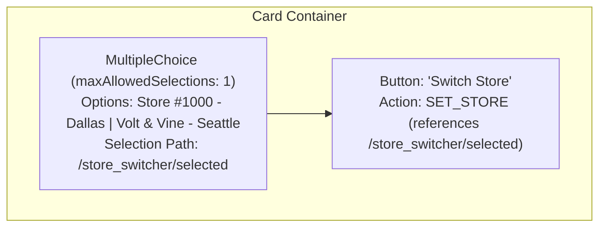

---

## 4. Markdown JSON Code Block Matching

When the agent model generates structured card JSON in response to a user request, it outputs standard markdown. The custom event converter interceptor on the FastAPI server extracts and parses this JSON structure before passing it to the A2A endpoint.

To prevent raw JSON block fallback in the client interface, match parameters are configured as:
- **Case-Insensitive Tags**: Matches must be case-insensitive to capture both uppercase ````JSON` (which Gemini Enterprise UI outputs by default for code blocks) and lowercase ````json`.
- **Optional Language Prefix**: The regex matches blocks with or without the language prefix (`r'```(?:json)?\s*(.*?)\s*```'`).
- **Whitespace Tolerance**: Newlines and surrounding text are stripped cleanly using `re.DOTALL` to ensure standard `json.loads` calls do not fail.

---

## 5. Image Component Specifications

The `Image` component in A2UI v0.8 requires its source URL to be passed as a bound literal structure.

### Correct v0.8 Image Schema
```json
{
  "id": "blueprint_map",
  "component": {
    "Image": {
      "url": {
        "literalString": "https://service.domain/api/v1/blueprint?layout=linear"
      }
    }
  }
}
```

> [!CAUTION]
> Specifying `"url": "https://..."` as a raw string is invalid and will trigger schema validation failures in the client.

---

## 6. Dynamic Server-Side Map Blueprints

A2UI v0.8 does not support dynamic client-side custom SVGs, inline canvas code, or interactive coordinate mapping. To overlay target coordinate beacons on digital twin floor blueprints, we leverage **server-side dynamic rendering**:

1. **Service Endpoint**: The task agent FastAPI app exposes a `GET /api/v1/blueprint` route.
2. **Request Parameters**: Accepts `layout` (e.g., `linear`, `boutique`, or `racetrack`) and coordinate parameters (`x`, `y`).
3. **SVG Generation**: The endpoint constructs the corresponding vector floor plan, overlays a pulsating beacon circle at the coordinate, and returns the response with MIME type `image/svg+xml`.
4. **Rendering**: The A2UI transpiler maps any `"canvas"` element in the model output to an `Image` component referencing this dynamic API URL, letting the client render the generated SVG floor plan natively.

---

## 7. Typographic Schema Normalization

A2UI v0.8 stable strictly enforces a small set of typographic values for the `usageHint` (and `style`) properties of text components.

> [!IMPORTANT]
> The only valid A2UI v0.8 typographic values are: `"h1"`, `"h2"`, `"h3"`, `"body"`, and `"caption"`.

Custom or legacy layout strings such as `"primary"` or `"secondary"` will fail v0.8 schema validation. When this happens, Google Chat's card validator silently rejects the component, dropping all affected labels and descriptions from the rendering.
To prevent this, the Go and Python A2UI generators must pass all text styles through a normalization function:
- `"primary"` $\rightarrow$ `"body"`
- `"secondary"` $\rightarrow$ `"caption"`
- Any other invalid style $\rightarrow$ `"body"`

---

## 8. Hermetic Base64 Vector Inlining (Mixed Content Resolution)

In secure Gemini Enterprise environments (hosted over HTTPS), referencing image endpoints over local HTTP (e.g. `http://localhost:8081/api/v1/blueprint`) triggers browser **Mixed Content blocking**, resulting in broken floor plans.

To resolve this, the transpiler intercepts canvas nodes and dynamic floor plan Image elements, generates the SVG vectors dynamically on the server side, base64-encodes them, and returns a self-contained **Base64 Data URI** directly in the card payload:
```
"url": {
  "literalString": "data:image/svg+xml;base64,PHN2ZyB4bWxucz0..."
}
```
This enables the client to render the floor plan instantly and hermetically without initiating any external network requests, bypassing browser Mixed Content blocks entirely.

---

## 9. Flutter-Style Alignment & Spacing

To align and distribute children inside Column and Row containers, A2UI v0.8 supports both standard and Flutter-style properties. Populating both sets concurrently guarantees perfect layout rendering regardless of the client-side A2UI parser version:
*   **Cross-Axis Alignment (`crossAxisAlignment`)**: Controls alignment perpendicular to the container's main axis (maps from `alignment`: `start` $\rightarrow$ `"Start"`, `center`/`middle` $\rightarrow$ `"Center"`, `stretch` $\rightarrow$ `"Stretch"`, `end` $\rightarrow$ `"End"`).
*   **Main-Axis Alignment (`mainAxisAlignment`)**: Controls children spacing and distribution along the container's main axis (maps from `distribution`: `start` $\rightarrow$ `"Start"`, `center` $\rightarrow$ `"Center"`, `space-between`/`spaceBetween` $\rightarrow$ `"SpaceBetween"`, `space-around` $\rightarrow$ `"SpaceAround"`, `space-evenly` $\rightarrow$ `"SpaceEvenly"`).

---

## 10. Sizing Constraints & Button Stretching

A2UI v0.8 buttons do not possess explicit width or styling properties (like `width` or `fullWidth`). Sizing is controlled entirely by parent layout containers.

### The Column Stretching Hack
To force a button to expand to the full width of the card or cell (e.g. full cell width):
1. Place the button inside a `Column` container.
2. Set the Column's cross-axis alignment to `"stretch"` (`"crossAxisAlignment": "Stretch"`).
3. If the button is wrapped inside a `Row`, it will only occupy its content width. For single-button states (such as `"View Details"`, `"Start Step"`, or `"Complete Task"`), **omit the Row wrapper** and append the button directly as a child of the parent Column to trigger full-width stretching.

---

## 11. Direct-Return Tool Output (429 Rate-Limit Mitigation)

In A2UI card execution flows, a single user click (such as starting a step) can trigger multiple sequential LLM calls in rapid succession (e.g. Initial turn $\rightarrow$ `update_task_status` tool call $\rightarrow$ `get_task_details` tool call $\rightarrow$ final token response). In low-quota projects, this high requests-per-minute (RPM) rate triggers `429 RESOURCE_EXHAUSTED` rate-limit errors.

To mitigate this, implement a **direct-return card update** pattern:
1. **Tool Refactoring**: Optimize backend tool handlers (e.g. `claim_task`, `update_task_status`) to directly invoke and return the updated A2UI details card (`[A2UI_CARD_TASK_DETAILS_CACHED]`) in their tool response, rather than returning a generic success text string.
2. **LLM Prompt Instruction**: Instruct the model that these tools return the updated details card directly, and that it **must not** make a separate, sequential `get_task_details` call.
This cuts the LLM round-trip count per click from 3 down to 2, reduces card refresh latency by ~33%, and completely eliminates 429 quota exhaustion risks.

---

## 12. Resilient A2UI Error Card Fallbacks

Unhandled server exceptions (e.g. database timeouts, OIDC validation failures, or rate-limit drops) normally bubble up as a `500 Internal Server Error`, causing the Gemini Enterprise client to freeze or display a generic error.

To deliver a premium, resilient experience, wrap the A2A HTTP gateway execution in a global try-except middleware:
1. Intercept all request processing exceptions.
2. Extract the request's JSON-RPC `id` to preserve protocol compliance.
3. Synthesize a friendly A2UI Error Card displaying custom instructions based on the error type (429 Rate Limits, Database Connection resets, 401 Session Expirations) along with a collapsible typographic `caption` containing the full technical stack trace for debugging.
4. Return a `200 OK` response containing the error card parts, ensuring the client renders a graceful, themed error state.

---

<a id="chapter-11-governance-licensing"></a>
# Chapter 11: Governance & Licensing

## Governance, Licensing, Authorship & Architectural Decisions
## Enterprise Task Engine: Engineering Charter & Nuance Specifications (v5.0)

> [!NOTE]
> This document specifies the project governance, legal licensing, authorship, architectural decision rationale, and failure domain nuances governing the Enterprise Task Engine codebase.

---

## 1. Project Authorship & Maintainers

- **Engineering Organization:** Google LLC
- **Project Lead & Architecture:** Task Engine Engineering Team / Ryan McGuinness
- **Repository:** `gemini_task_engine` (Google Solutions Engineering)

---

## 2. Licensing & Legal Attributions

The Enterprise Task Engine is distributed under the **Apache License, Version 2.0**.

### A. License Summary
```text
Copyright 2026 Google LLC

Licensed under the Apache License, Version 2.0 (the "License");
you may not use this file except in compliance with the License.
You may obtain a copy of the License at

    http://www.apache.org/licenses/LICENSE-2.0

Unless required by applicable law or agreed to in writing, software
distributed under the License is distributed on an "AS IS" BASIS,
WITHOUT WARRANTIES OR CONDITIONS OF ANY KIND, either express or implied.
See the License for the specific language governing permissions and
limitations under the License.
```

### B. Third-Party Software Notices ([`NOTICE`](../../NOTICE))
This product includes software developed at Google LLC (https://www.google.com/) and incorporates open-source libraries under compliant licenses (MIT, Apache 2.0, BSD-3-Clause):
- **Go Ecosystem:** Gin Web Framework, GORM ORM, pgvector-go, OpenTelemetry Go SDK, Google Cloud Client Libraries, modenv.
- **Python Ecosystem:** FastAPI, Uvicorn, Google Agent Development Kit (ADK), Google GenAI SDK, pg8000, httpx.
- **Node/React Ecosystem:** React 19, TypeScript, Vite, Tailwind CSS, Material 3 Theme Provider, Lucide Icons.
- **Android Ecosystem:** Android Jetpack Compose, Material 3, Retrofit 2, OkHttp, Coil SVG, Google MediaPipe Tasks GenAI.

---

## 3. Architectural Design Decisions & Trade-Off Analysis

The architecture of the Enterprise Task Engine was engineered to maximize deployment simplicity, operational throughput, and data consistency while minimizing external infrastructure dependencies.

| Decision Domain | Selected Approach | Rationale & Trade-Off Analysis |
| :--- | :--- | :--- |
| **Distributed State & Leader Election** | PostgreSQL Advisory Locks (`key: 5555`) pinned to `sql.Conn` | Eliminates the operational overhead and failure modes of dedicated ZooKeeper/Redis clusters. Self-heals on crash. |
| **Task Queue & Workload Dispatch** | Transactional GORM `FOR UPDATE SKIP LOCKED` row locking | Provides ACID guarantees and prevents duplicate task claims without requiring separate Kafka/RabbitMQ message brokers. |
| **Grounded AI & SOP Vector Search** | In-Database `pgvector` with HNSW Cosine Index inside AlloyDB | Eliminates dual-write sync drift between SQL DB and external vector DBs (Pinecone, Milvus). |
| **User Interface Framework** | Server-Driven A2UI Protocol (v0.8.0) over MCP JSON-RPC 2.0 | Enables dynamic card layouts, real-time forms, and actions without deploying new client releases to App Stores. |
| **Mobile On-Device Resilience** | Dual-Engine LLM: Remote Gemini + Local Gemma 2B MediaPipe | Guarantees operational uptime for floor associates inside shielded retail basements. |
| **Monorepo Build Automation** | Hermetic Bazel 8 with Bzlmod (`MODULE.bazel`) | Fast incremental compilation, reproducible container builds, and unified cross-language CI. |

---

## 4. Comprehensive Technical Nuances & Failure Domain Handling

### A. Advisory Lock TCP Connection Pinning (`sql.Conn`)
- **The Problem:** Standard connection pools (e.g., GORM's default database pool) recycle TCP sockets across queries. Session-bound PostgreSQL advisory locks (`pg_try_advisory_lock`) are bound strictly to the physical TCP connection. If the pool switches connections, the lock is silently lost, causing split-brain leader elections.
- **The Solution:** In [`scheduler.go`](../../pkg/service/scheduler.go), the scheduler explicitly allocates and holds a single, dedicated connection socket (`sqlDB.Conn(ctx)`). All lock attempts, heartbeats, and release checks execute over this pinned socket.

### B. SKIP LOCKED Worker Claiming & Lock Tagging
- **The Problem:** Multiple horizontal worker nodes polling a centralized SQL table encounter deadlock contention or race conditions if using naive `SELECT ... WHERE status = 'PENDING'` queries.
- **The Solution:** Workers execute `SELECT ... FOR UPDATE SKIP LOCKED LIMIT 5` inside an atomic GORM transaction, tagging claimed rows with `locked_at = NOW()` and `locked_by = node-ID`. Concurrent workers skip locked rows with zero wait time.

### C. Watchdog Dead-Letter Recovery Loops
- **The Problem:** If a worker node crashes mid-execution (OOM kill, network disconnect), rows remain locked in `IN_PROGRESS` indefinitely.
- **The Solution:** The Leader node runs a watchdog loop every 30 seconds scanning for tasks where `locked_at < NOW() - 5m`. If `retry_count < max_retries`, the watchdog resets locks to `PENDING` and increments the retry count. If retries exceed 3, the task is routed to `DEAD_LETTER` status to alert operational supervisors.

### D. SOP Document Drift Detection (ETag & SHA-256 Checksums)
- **The Problem:** Standard Operating Procedures (SOPs) hosted on external URLs or web storage may change without notification, resulting in stale vector embeddings.
- **The Solution:** The Leader node issues periodic HTTP `HEAD` requests. If `ETag` or `Last-Modified` headers have changed, or if a binary file's SHA-256 fingerprint has drifted, the old `SOPProcess` is deactivated and a new background re-indexing pipeline is launched automatically.

### E. Hermetic Base64 Vector Inlining for Mixed Content
- **The Problem:** In secure production environments hosted over HTTPS, embedding dynamic blueprint SVG images from local HTTP routes (e.g., `http://localhost:8081/api/v1/blueprint`) triggers browser Mixed Content blocking, causing floor plans to disappear.
- **The Solution:** The A2UI transpiler dynamically renders the SVG in-memory, base64-encodes the content, and outputs a self-contained Data URI (`data:image/svg+xml;base64,...`) directly in the card envelope.

### F. Degraded Offline Mode & Mock Database Fallback
- **The Problem:** In local developer environments or during CI runs without a running PostgreSQL instance, server bootstrap fails on connection dial.
- **The Solution:** If PostgreSQL is unreachable on boot, `persistence.InitDB` logs a warning and initializes `persistence.NewOfflineDB`, allowing the Gin API server to start in degraded mode. The frontend console renders an `OfflineOverlay` visual indicator alerting developers.

---

<a id="chapter-12-contributing-guide"></a>
# Chapter 12: Contributing Guide

## Contributing to Enterprise Task Engine

We want to make contributing to this project as easy and transparent as possible, whether it's:

- Reporting a bug
- Discussing the current state of the code
- Submitting a fix
- Proposing new features
- Becoming a maintainer

---

## Contributor License Agreement (CLA)

Contributions to this project must be accompanied by a **Contributor License Agreement (CLA)**. You (or your employer) retain the copyright to your contribution; this simply gives us permission to use and redistribute your contributions as part of the project.

- Head over to **[cla.developers.google.com](https://cla.developers.google.com/)** to see your current agreements on file or to sign a new one.
- You generally only need to submit a CLA once, so if you've already submitted one (even if it was for a different Google open source project), you probably don't need to do it again.

---

## Code of Conduct

This project has adopted the **[Google Open Source Community Guidelines](https://opensource.google/conduct/)**. By participating in this project and its communications, you agree to abide by its terms.

If you observe unacceptable behavior, please report it to the project owners listed in **[owners.txt](file:///Users/rmcguinness/Projects/internal/gemini_task_engine/owners.txt)** or via official Google Open Source channels.

---

## Contribution Workflow

### 1. Source Code Licensing Header
Every new or modified source file must include the standard Apache License Version 2.0 header at the top of the file:

```text
Copyright 2026 Google LLC

Licensed under the Apache License, Version 2.0 (the "License");
you may not use this file except in compliance with the License.
You may obtain a copy of the License at

    http://www.apache.org/licenses/LICENSE-2.0

Unless required by applicable law or agreed to in writing, software
distributed under the License is distributed on an "AS IS" BASIS,
WITHOUT WARRANTIES OR CONDITIONS OF ANY KIND, either express or implied.
See the License for the specific language governing permissions and
limitations under the License.
```
*(Use `//` for Go/TS/JS/Kotlin/Java, `#` for Python/Shell/Bazel/Terraform, `--` for SQL, and `<!-- -->` for HTML).*

### 2. Code Style & Engineering Standards
All code must adhere to **[Google Style Guides](https://google.github.io/styleguide/)**:
- **Go (`/cmd`, `/pkg`)**: Follow Go idiomatic practices, static linting via `golangci-lint`, and format with `gofmt` / `gofumpt`.
- **Python (`/cmd/task_agent`)**: Managed via `uv`, linted and formatted with `Ruff`, requiring strict PEP 484 type annotations on all signatures.
- **TypeScript & React (`/web`)**: Modern React functional components with arrow syntax, Material 3 baseline, and strict TypeScript compilation.
- **Kotlin & Android (`/apps/gtasks`)**: M3 Jetpack Compose UI patterns, repository/domain layer isolation, and Gradle Kotlin DSL formatting.

### 3. Testing Requirements
- Ensure all automated unit and integration tests pass before submitting a pull request:
  ```bash
  bazel test //...
  ```
- Any new business logic, agent tools, or A2UI component rendering must be covered by comprehensive unit tests or end-to-end verification scripts (`scripts/e2e_test.py`).

### 4. Pull Request Review & Approval
1. Fork or branch from `main` using descriptive branch names (`feature/...`, `fix/...`, `docs/...`).
2. Write concise, imperative-mood commit messages explaining the problem and solution.
3. Submit your pull request for review by project maintainers defined in **[owners.txt](file:///Users/rmcguinness/Projects/internal/gemini_task_engine/owners.txt)**.
4. Once CLA checks, Bazel CI builds, and owner code reviews pass, your changes will be merged.

---

## End of Specification
*Enterprise Task Engine monorepo master specification compiled automatically.*